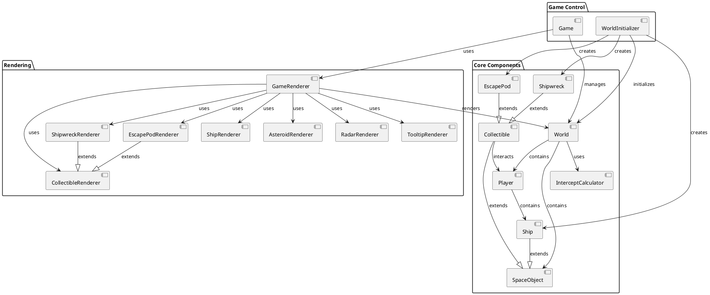

# Spacewars: Ironcore

This project is an experimental project, mainly focusing on trying out vibe coding in a technology that I hardly know.

Goal is to create a 2D space exploration game with a toroidal world, featuring collectable objects, interception mechanics, and a radar system.

## Overview

Spacewars is a browser-based game where the player navigates a spaceship in a 2D toroidal world (the edges wrap around). The player can collect various objects such as shipwrecks and escape pods, and the game includes a sophisticated interception algorithm for targeting moving objects.

## Technical Stack

- **TypeScript**: Strongly-typed JavaScript for better development experience
- **Vite**: Modern, fast build tool and development server
- **Jest**: For unit testing
- **HTML5 Canvas**: For rendering the game

## Architecture

The game follows a component-based architecture, with clear separation of concerns:

### Core Components

- **World**: Manages the game world, including space objects, collision detection, and world boundaries.
- **Player**: Handles player state, inventory, and scoring.
- **SpaceObject**: Base class for all objects in the game world.
- **Ship**: Represents the player's ship with movement controls.
- **Collectible**: Abstract base class for all collectible items.
  - **Shipwreck**: Collectible with different salvage types (fuel, weapons, tech).
  - **EscapePod**: Collectible with survivors that can be rescued.
- **InterceptCalculator**: Handles trajectory calculations for interception.

### Rendering Components

- **GameRenderer**: Main renderer that coordinates all rendering activities.
- **ShipRenderer**: Renders the player's ship.
- **AsteroidRenderer**: Renders asteroids.
- **CollectibleRenderer**: Base renderer for collectibles.
  - **ShipwreckRenderer**: Renders shipwreck collectibles.
  - **EscapePodRenderer**: Renders escape pod collectibles.
- **RadarRenderer**: Renders the radar display.
- **TooltipRenderer**: Renders tooltips for objects.

### Game Initialization

- **WorldInitializer**: Creates and initializes the game world.
- **Game**: Main game class that ties everything together.

## Component Dependencies

The following diagram shows the dependencies between key components:



## Game Mechanics

### Movement

The ship can move in any direction using mouse clicks. The ship's angle determines its direction of travel.

### Interception

The game includes a sophisticated interception system that can calculate the angle needed to intercept moving objects, taking into account both the target's and the ship's velocity.

### Collectibles

- **Shipwrecks**: Provide salvage of different types:
  - Fuel: Increases ship speed
  - Weapons: (Placeholder for future functionality)
  - Tech: (Placeholder for future functionality)
  - Generic: Basic points
  
- **Escape Pods**: Contain survivors that can be rescued for points.

### World Wrapping

The game world is toroidal, meaning objects that move off one edge of the screen will reappear on the opposite edge.

### Radar System

A radar display shows the positions of objects relative to the ship, helping with navigation.

## HUD (Heads Up Display)

The game includes a HUD that displays:
- Ship status (speed, coordinates)
- Score
- Last collected item
- Inventory of collected items

## Getting Started

1. Clone the repository
2. Install dependencies with `npm install`
3. Start the development server with `npm start`
4. Use mouse clicks to navigate the ship
5. Collect objects by moving near them

## Development

### Prerequisites

- Node.js (v14+)
- npm (v6+)

### Building the Project

```bash
npm install
npm run build
```

This will create optimized files in the `dist` directory.

### Running in Development Mode

```bash
npm install
npm start
```

This starts the Vite development server with hot module replacement (HMR) enabled.

### Running Tests

```bash
npm test
```

### Type Checking

```bash
npx tsc --noEmit
```

This runs the TypeScript compiler to check for type errors without emitting any files.