# PostgreSQL Migration Plan für Spacewars3 Tests

## Übersicht

**Ziel**: Migration der gesamten Testinfrastruktur von SQLite zu PostgreSQL  
**Strategie**: Schrittweise Migration mit parallelem Betrieb und messbaren Zwischenzielen  
**Zeitrahmen**: 3-4 Wochen

---

## Migration-Roadmap

### Phase 1: Foundation (Woche 1)

**Ziel**: PostgreSQL-Infrastruktur etablieren und Datenbankschicht abstrahieren

#### Zwischenziele:

1. **PostgreSQL Docker-Setup funktional**
   - Metriken: `docker-compose up db -d` startet erfolgreich, Port 5432 erreichbar
   - Messbar durch: Connection-Test mit `psql -h localhost -U spacewars -d spacewars -c '\l'`

2. **DatabaseAdapter Interface implementiert**
   - Metriken: Alle DB-Operationen gehen durch einheitliche Schnittstelle
   - Messbar durch: 100% der `db.query()` Aufrufe verwenden neues Interface

3. **Schema-Konvertierung abgeschlossen**
   - Metriken: PostgreSQL-kompatible CREATE TABLE Statements
   - Messbar durch: Erfolgreiche Schema-Erstellung in PostgreSQL

**Deliverables:**

```
├── docker/
│   └── postgres/
│       ├── init.sql
│       └── Dockerfile
├── src/lib/server/
│   ├── database/
│   │   ├── DatabaseAdapter.ts
│   │   ├── PostgreSQLAdapter.ts
│   │   └── SQLiteAdapter.ts
│   ├── schema-postgres.ts
│   └── migrations-postgres.ts
```

**Exit-Kriterien:**

- [ ] PostgreSQL Container startet und ist erreichbar
- [ ] Schema wird erfolgreich in PostgreSQL erstellt
- [ ] Erste einfache Tests (ohne Caches) laufen gegen PostgreSQL

### Phase 2: Test Infrastructure (Woche 2)

**Ziel**: Test-Setup auf PostgreSQL umstellen mit Fallback-Mechanismus

#### Zwischenziele:

1. **Testdatenbank-Initialization PostgreSQL-ready**
   - Metriken: Tests können wahlweise SQLite oder PostgreSQL verwenden
   - Messbar durch: Environment Variable `TEST_DB=postgres|sqlite`

2. **Cache-System PostgreSQL-kompatibel**
   - Metriken: Alle Cache-Operationen funktionieren mit PostgreSQL
   - Messbar durch: Integration Tests bestehen mit beiden DB-Types

3. **Paralleler Betrieb etabliert**
   - Metriken: CI läuft Tests gegen beide Datenbanken
   - Messbar durch: Grüne CI-Pipeline für beide Konfigurationen

**Deliverables:**

```
├── src/__tests__/
│   ├── helpers/
│   │   ├── testDatabase-postgres.ts
│   │   └── testServer-postgres.ts
│   └── setup-postgres.ts
├── .github/workflows/
│   ├── test-sqlite.yml
│   └── test-postgres.yml
└── scripts/
    └── setup-test-db.sh
```

**Exit-Kriterien:**

- [ ] 50% der Repository-Tests laufen erfolgreich gegen PostgreSQL
- [ ] Cache-Initialisierung funktioniert mit PostgreSQL
- [ ] Test-Isolation zwischen PostgreSQL-Tests gewährleistet

### Phase 3: Test Migration (Woche 3)

**Ziel**: Schrittweise Migration aller Test-Kategorien zu PostgreSQL

#### Zwischenziele:

1. **Repository Tests vollständig migriert**
   - Metriken: Alle `*Repo.test.ts` bestehen mit PostgreSQL
   - Messbar durch: 100% Repository-Tests grün in PostgreSQL-CI

2. **Integration Tests migriert**
   - Metriken: Cache-Integration-Tests bestehen mit PostgreSQL
   - Messbar durch: Battlecache, MessageCache, UserCache Tests grün

3. **API Tests migriert**
   - Metriken: HTTP-Layer-Tests bestehen mit PostgreSQL
   - Messbar durch: Alle `/api/*` Tests grün mit PostgreSQL-Backend

**Test-Migration-Reihenfolge:**


**Exit-Kriterien:**

- [ ] 90% aller Tests bestehen mit PostgreSQL
- [ ] Performance-Regression < 50% vs. SQLite
- [ ] Keine Race Conditions in PostgreSQL-Tests

### Phase 4: Finalization (Woche 4)

**Ziel**: PostgreSQL als Standard etablieren und SQLite-Unterstützung entfernen

#### Zwischenziele:

1. **Performance-Optimierung**
   - Metriken: PostgreSQL-Tests ≤ 60s (vs. aktuell 39s SQLite)
   - Messbar durch: CI-Pipeline Timing-Reports

2. **SQLite-Deprecation**
   - Metriken: Alle SQLite-spezifischen Code-Pfade entfernt
   - Messbar durch: Keine `sqlite3` Imports mehr im Code

3. **Dokumentation aktualisiert**
   - Metriken: Alle Dokumentation referenziert PostgreSQL
   - Messbar durch: Manuelle Review + Automated Link-Checks

**Exit-Kriterien:**

- [ ] 100% der Tests bestehen nur mit PostgreSQL
- [ ] CI/CD Pipeline verwendet nur PostgreSQL
- [ ] Entwickler-Dokumentation vollständig aktualisiert

---

## Technische Implementation Details

### Database Adapter Interface

```typescript
interface DatabaseConnection {
  query<T = any>(sql: string, params?: any[]): Promise<T[]>;
  transaction<T>(fn: (tx: Transaction) => Promise<T>): Promise<T>;
  close(): Promise<void>;
}

interface Transaction {
  query<T = any>(sql: string, params?: any[]): Promise<T[]>;
  rollback(): Promise<void>;
  commit(): Promise<void>;
}
```

### Schema-Konvertierung

| SQLite                              | PostgreSQL                 | Migration        |
| ----------------------------------- | -------------------------- | ---------------- |
| `INTEGER PRIMARY KEY AUTOINCREMENT` | `SERIAL PRIMARY KEY`       | Automatisch      |
| `TEXT`                              | `VARCHAR(255)` oder `TEXT` | Längen-Analyse   |
| `REAL`                              | `NUMERIC` oder `FLOAT8`    | Präzisions-Check |
| `datetime('now')`                   | `NOW()`                    | Function-Mapping |

### Test-Konfiguration

```typescript
// Environment-basierte DB-Auswahl
const DATABASE_TYPE = process.env.TEST_DATABASE || "postgres";

async function getTestDatabase(): Promise<DatabaseConnection> {
  if (DATABASE_TYPE === "sqlite") {
    return new SQLiteAdapter(":memory:");
  } else {
    return new PostgreSQLAdapter({
      host: "localhost",
      port: 5433,
      database: "spacewars_test",
      user: "spacewars",
      password: "spacewars",
    });
  }
}
```

---

## Metriken und Monitoring

### Success Metrics pro Phase

| Phase       | KPI                    | Zielwert        | Messmethode                  |
| ----------- | ---------------------- | --------------- | ---------------------------- |
| **Phase 1** | Schema-Kompatibilität  | 100%            | Automatische SQL-Validierung |
| **Phase 2** | Test-Isolation         | 0 Interferenzen | Race-Condition-Detection     |
| **Phase 3** | Test-Migration-Rate    | 90% bestehen    | CI Success Rate              |
| **Phase 4** | Performance-Regression | <50% Slowdown   | Benchmark-Vergleich          |

### Quality Gates

```plantuml
@startuml
!theme plain
title Quality Gates pro Phase

|Phase 1|
start
:PostgreSQL Container läuft;
if (Schema Creation OK?) then (✅)
  :Weiter zu Phase 2;
else (❌)
  :Fix Schema Issues;
  stop
endif

|Phase 2|
:Test Infrastructure Setup;
if (50% Tests bestehen?) then (✅)
  if (No Race Conditions?) then (✅)
    :Weiter zu Phase 3;
  else (❌)
    :Fix Cache Issues;
    stop
  endif
else (❌)
  :Fix DB Adapter;
  stop
endif

|Phase 3|
:Test Migration;
if (90% Tests bestehen?) then (✅)
  if (Performance OK?) then (✅)
    :Weiter zu Phase 4;
  else (❌)
    :Optimize Queries;
    stop
  endif
else (❌)
  :Fix Test Issues;
  stop
endif

|Phase 4|
:Finalization;
if (100% PostgreSQL?) then (✅)
  :Migration Complete! 🎉;
else (❌)
  :Remove SQLite Remnants;
  stop
endif

stop
@enduml
```



### Performance Benchmarks

```bash
# Baseline (SQLite)
npm run test:benchmark > baseline-sqlite.json

# Target (PostgreSQL)
TEST_DATABASE=postgres npm run test:benchmark > target-postgres.json

# Regression Analysis
node scripts/compare-performance.js baseline-sqlite.json target-postgres.json
```

**Akzeptable Performance-Ziele:**

- Gesamtlaufzeit: ≤60s (aktuell 39s SQLite)
- Setup-Zeit: ≤8s (aktuell 4s SQLite)
- Einzeltest: ≤200ms Average
- DB-Queries: ≤50ms P95

---

## Risikomanagement

### Risiko-Mitigation

| Risiko                        | Wahrscheinlichkeit | Impact | Mitigation-Strategie                   |
| ----------------------------- | ------------------ | ------ | -------------------------------------- |
| **Performance-Regression**    | Hoch               | Mittel | Connection Pooling, Query-Optimierung  |
| **Test-Flakiness**            | Mittel             | Hoch   | Transaktions-Isolation, Better Cleanup |
| **Schema-Inkompatibilitäten** | Mittel             | Hoch   | Schrittweise Migration, Rollback-Plan  |
| **CI-Instabilität**           | Niedrig            | Hoch   | Docker Health Checks, Retry-Logic      |

### Rollback-Strategie


---

## Deliverables und Timelines

### Woche 1: Foundation

```
Mo-Di: PostgreSQL Docker Setup + Schema Conversion
Mi-Do: DatabaseAdapter Interface + Implementation
Fr: Testing + Quality Gate 1
```

### Woche 2: Infrastructure

```
Mo-Di: Test Database Infrastructure
Mi-Do: Cache System Compatibility
Fr: Parallel Testing Setup + Quality Gate 2
```

### Woche 3: Migration

```
Mo: Repository Tests (15 tests)
Mi: Integration Tests (25 tests)
Fr: API Tests (30 tests) + Quality Gate 3
```

### Woche 4: Finalization

```
Mo-Di: Performance Optimization
Mi: SQLite Removal + Documentation
Do-Fr: Final Testing + Quality Gate 4
```

---

## Success Definition

**Migration erfolgreich, wenn:**

- [ ] Alle 403 Tests bestehen mit PostgreSQL
- [ ] Test-Laufzeit ≤60s
- [ ] 0% SQLite-Code im Repository
- [ ] CI/CD vollständig auf PostgreSQL
- [ ] Entwickler-Dokumentation aktualisiert
- [ ] Performance-Regression ≤50%

**Go-Live Kriterien:**

- 2 Wochen stabile PostgreSQL-Tests
- Performance-Benchmarks bestehen
- Team-Approval für SQLite-Entfernung
- Rollback-Plan dokumentiert und getestet

Dieser Plan bietet einen strukturierten, messbaren Ansatz für die PostgreSQL-Migration mit klaren Zwischenzielen und Rollback-Optionen.
