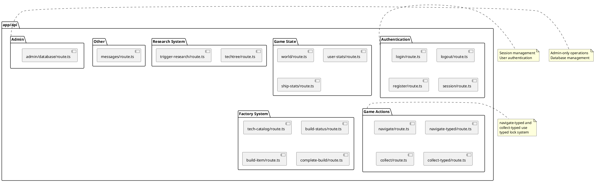

# app/api Package

## Overview
Contains all Next.js API routes that handle HTTP requests from the client. Implements the server-side API layer using Next.js App Router conventions. Each route handles specific game functionality (authentication, navigation, collection, research, factory) with proper error handling, session management, and typed lock concurrency control.

## Responsibilities
- Handle HTTP requests (GET, POST) from client
- Implement authentication endpoints (login, logout, register, session)
- Provide game state endpoints (world, user stats, ship stats)
- Handle game mutations (navigate, collect)
- Manage research system endpoints
- Provide factory/build system endpoints
- Admin functionality (database operations)
- Use typed locks for concurrency control
- Return JSON responses with proper error handling
- Validate authentication and authorization

## Decomposition



### API Routes

**Authentication:**
- [login/route.ts](../src/app/api/login/route.ts) - `POST /api/login` - User login
- [logout/route.ts](../src/app/api/logout/route.ts) - `POST /api/logout` - User logout
- [register/route.ts](../src/app/api/register/route.ts) - `POST /api/register` - User registration
- [session/route.ts](../src/app/api/session/route.ts) - `GET /api/session` - Session check

**Game State:**
- [world/route.ts](../src/app/api/world/route.ts) - `GET /api/world` - World data
- [user-stats/route.ts](../src/app/api/user-stats/route.ts) - `GET /api/user-stats` - User stats
- [ship-stats/route.ts](../src/app/api/ship-stats/route.ts) - `GET /api/ship-stats` - Ship stats

**Game Actions:**
- [navigate/route.ts](../src/app/api/navigate/route.ts) - `POST /api/navigate` - Ship navigation
- [navigate-typed/route.ts](../src/app/api/navigate-typed/route.ts) - `POST /api/navigate-typed` - Navigation with typed locks
- [collect/route.ts](../src/app/api/collect/route.ts) - `POST /api/collect` - Collect object
- [collect-typed/route.ts](../src/app/api/collect-typed/route.ts) - `POST /api/collect-typed` - Collection with typed locks

**Research System:**
- [techtree/route.ts](../src/app/api/techtree/route.ts) - `GET /api/techtree` - Tech tree state
- [trigger-research/route.ts](../src/app/api/trigger-research/route.ts) - `POST /api/trigger-research` - Start research

**Factory System:**
- [tech-catalog/route.ts](../src/app/api/tech-catalog/route.ts) - `GET /api/tech-catalog` - Available tech
- [build-status/route.ts](../src/app/api/build-status/route.ts) - `GET /api/build-status` - Build queue
- [build-item/route.ts](../src/app/api/build-item/route.ts) - `POST /api/build-item` - Build item
- [complete-build/route.ts](../src/app/api/complete-build/route.ts) - `POST /api/complete-build` - Complete build (cheat)

**Other:**
- [messages/route.ts](../src/app/api/messages/route.ts) - `GET/POST /api/messages` - Messages

**Admin:**
- [admin/database/route.ts](../src/app/api/admin/database/route.ts) - `GET /api/admin/database` - Database info

## Rationale
Next.js App Router API routes provide:
- **File-based routing**: Route structure mirrors URL structure
- **Server-side execution**: Business logic on server
- **Type safety**: Full TypeScript support
- **Colocation**: Routes near related code
- **Standard HTTP**: RESTful conventions
- **Easy deployment**: Vercel, Render, etc.

**Architectural Patterns:**
- **Repository pattern**: Routes use repositories for data access
- **Domain model pattern**: Routes use domain objects (User, World)
- **Typed locks**: Concurrency control with compile-time safety
- **Session management**: iron-session for authentication
- **Error handling**: Consistent JSON error responses

## Constraints, Assumptions, Consequences, Known Issues

**Assumptions:**
- Routes run in Node.js environment
- SQLite database available
- Session cookies work (not blocked)
- CORS handled by Next.js
- JSON request/response bodies

**Consequences:**
- All game logic must be server-side
- Client polls for updates (no WebSockets currently)
- Database is performance bottleneck
- Typed locks require strict ordering

**Constraints:**
- Must handle concurrent requests safely
- Must validate all inputs
- Must check authentication for protected routes
- Must return proper HTTP status codes

**Known Issues:**
- Some routes have both regular and -typed versions (migration in progress)
- No rate limiting implemented
- No request validation middleware (done per-route)

## Details

### Authentication Routes

**login/route.ts**
- **Method:** POST
- **Body:** `{ username: string, password: string }`
- **Response:** `{ success: boolean, error?: string }`
- **Logic:** Verify credentials, create session, return success
- **Top collaborations:** userRepo, session management, bcrypt

**logout/route.ts**
- **Method:** POST
- **Response:** `{ success: boolean }`
- **Logic:** Destroy session cookie
- **Top collaborations:** iron-session

**register/route.ts**
- **Method:** POST
- **Body:** `{ username: string, password: string }`
- **Response:** `{ success: boolean, error?: string }`
- **Logic:** Create user, hash password, create session
- **Top collaborations:** userRepo, bcrypt, session management

**session/route.ts**
- **Method:** GET
- **Response:** `{ loggedIn: boolean, username?: string, shipId?: number }`
- **Logic:** Check session, return auth state
- **Top collaborations:** iron-session, userRepo

---

### Game State Routes

**world/route.ts**
- **Method:** GET
- **Auth:** Required
- **Response:** `WorldData` - all space objects and positions
- **Logic:** Load objects from DB, return current world state
- **Top collaborations:** worldRepo, typedLocks (GameLock)

**user-stats/route.ts**
- **Method:** GET
- **Auth:** Required
- **Response:** `{ iron: number, ironPerSecond: number }`
- **Logic:** Load user, update stats, return iron data
- **Top collaborations:** userRepo, User domain class, typedLocks (UserLock)

**ship-stats/route.ts**
- **Method:** GET
- **Auth:** Required
- **Response:** `{ defenseValues: DefenseValues }`
- **Logic:** Load tech counts, calculate defense values
- **Top collaborations:** techRepo, TechFactory, typedLocks (TechLock)

---

### Game Action Routes

**navigate/route.ts**
- **Method:** POST
- **Auth:** Required
- **Body:** `{ angle: number, speed: number }`
- **Response:** `{ success: boolean }`
- **Logic:** Update ship angle/speed, save to DB
- **Top collaborations:** worldRepo, userRepo
- **Note:** Being replaced by navigate-typed

**navigate-typed/route.ts**
- **Method:** POST
- **Auth:** Required
- **Body:** `{ angle: number, speed: number }`
- **Response:** `{ success: boolean }`
- **Logic:** Same as navigate but uses typed locks
- **Top collaborations:** worldRepo, userRepo, typedLocks (GameLock, UserLock)
- **Lock order:** GameLock → UserLock (enforced at compile time)

**collect/route.ts**
- **Method:** POST
- **Auth:** Required
- **Body:** `{ objectId: number }`
- **Response:** `{ success: boolean, iron?: number, error?: string }`
- **Logic:** Validate distance, add iron, delete object
- **Top collaborations:** worldRepo, userRepo, world physics
- **Note:** Being replaced by collect-typed

**collect-typed/route.ts**
- **Method:** POST
- **Auth:** Required
- **Body:** `{ objectId: number }`
- **Response:** `{ success: boolean, iron?: number, error?: string }`
- **Logic:** Same as collect but uses typed locks
- **Top collaborations:** worldRepo, userRepo, world physics, typedLocks
- **Lock order:** GameLock → UserLock (enforced at compile time)

---

### Research System Routes

**techtree/route.ts**
- **Method:** GET
- **Auth:** Required
- **Response:** `{ techTree: TechTree, availableResearch: ResearchDefinition[] }`
- **Logic:** Load user tech tree, return state and available research
- **Top collaborations:** userRepo, techtree module, typedLocks (UserLock)

**trigger-research/route.ts**
- **Method:** POST
- **Auth:** Required
- **Body:** `{ researchType: ResearchType }`
- **Response:** `{ success: boolean, error?: string }`
- **Logic:** Validate cost, deduct iron, start research
- **Top collaborations:** userRepo, techtree module, typedLocks (UserLock)

---

### Factory System Routes

**tech-catalog/route.ts**
- **Method:** GET
- **Auth:** Required
- **Response:** `{ weapons: WeaponSpec[], defenses: DefenseSpec[] }`
- **Logic:** Return available weapons and defenses from TechFactory
- **Top collaborations:** TechFactory
- **Note:** No database access, static data

**build-status/route.ts**
- **Method:** GET
- **Auth:** Required
- **Response:** `{ techCounts: TechCounts, buildQueue: BuildQueueItem[] }`
- **Logic:** Load tech counts and build queue for user
- **Top collaborations:** techRepo, typedLocks (TechLock)

**build-item/route.ts**
- **Method:** POST
- **Auth:** Required
- **Body:** `{ itemId: string }`
- **Response:** `{ success: boolean, error?: string }`
- **Logic:** Validate cost, deduct iron, add to build queue
- **Top collaborations:** techRepo, userRepo, TechFactory, typedLocks (UserLock, TechLock)

**complete-build/route.ts**
- **Method:** POST
- **Auth:** Required
- **Response:** `{ success: boolean }`
- **Logic:** Complete first item in build queue (cheat for testing)
- **Top collaborations:** techRepo, typedLocks (TechLock)

---

### Other Routes

**messages/route.ts**
- **Method:** GET, POST
- **Auth:** Required
- **GET Response:** `Message[]`
- **POST Body:** `{ content: string }`
- **Logic:** Get user messages or create new message
- **Top collaborations:** messagesRepo

---

### Admin Routes

**admin/database/route.ts**
- **Method:** GET
- **Auth:** Required (admin only)
- **Response:** Database statistics and info
- **Logic:** Check admin status, return DB info
- **Top collaborations:** database module, userRepo
- **Security:** Only users 'a' and 'q' have access

## Common Patterns

### Error Handling
```typescript
try {
  // Route logic
  return NextResponse.json({ success: true });
} catch (error) {
  console.error('Error:', error);
  return NextResponse.json(
    { error: 'Error message' },
    { status: 500 }
  );
}
```

### Authentication Check
```typescript
const auth = await getServerAuthState(request);
if (!auth.isLoggedIn || !auth.userId) {
  return NextResponse.json(
    { error: 'Unauthorized' },
    { status: 401 }
  );
}
```

### Typed Lock Usage
```typescript
return withLocks(['GameLock', 'UserLock'] as const, async () => {
  // Protected logic with compile-time ordered locks
  const user = await userRepo.findById(userId);
  const world = await worldRepo.getWorldData();
  // ... mutations ...
  return NextResponse.json({ success: true });
});
```

### Session Management
```typescript
const session = await getIronSession(cookies(), sessionOptions);
session.userId = user.id;
session.username = user.username;
await session.save();
```

## Migration Notes
- Routes with `-typed` suffix use the new typed lock system
- Original routes (without suffix) use older locking mechanism
- Gradual migration to typed lock system in progress
- Both versions maintained during transition for backwards compatibility
