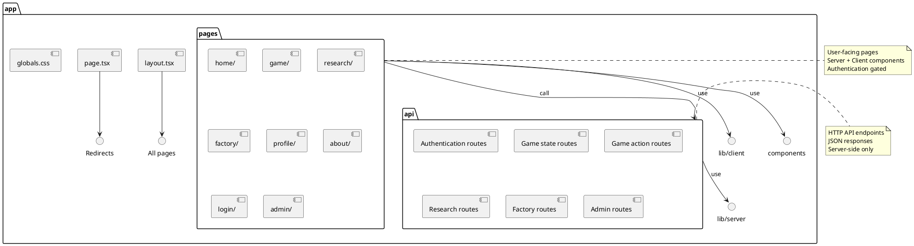

# app Package

## Overview
Contains the Next.js App Router structure with all pages, layouts, and API routes. This is the presentation and routing layer that builds on top of the lib package, providing the user-facing application and backend API endpoints.

## Responsibilities
- Define application routes and pages
- Implement Next.js API endpoints
- Handle server-side rendering (SSR)
- Manage authentication flow and redirects
- Provide consistent layouts and navigation
- Coordinate between UI components and business logic
- Handle static asset serving
- Implement error boundaries and loading states

## Decomposition



### Sub-Packages

**See detailed documentation:**
- [api/](app-api.md) - API routes (19 endpoints)
- [Pages](app-pages.md) - User-facing pages (8 pages)

### Directory Structure
```
app/
├── page.tsx              # Root redirect
├── layout.tsx            # Root layout
├── globals.css           # Global styles
├── api/                  # API routes
│   ├── login/
│   ├── logout/
│   ├── register/
│   ├── session/
│   ├── world/
│   ├── user-stats/
│   ├── ship-stats/
│   ├── navigate/
│   ├── navigate-typed/
│   ├── collect/
│   ├── collect-typed/
│   ├── techtree/
│   ├── trigger-research/
│   ├── tech-catalog/
│   ├── build-status/
│   ├── build-item/
│   ├── complete-build/
│   ├── messages/
│   └── admin/
│       └── database/
├── home/                 # Home page
│   ├── page.tsx
│   ├── HomePageClient.tsx
│   └── HomePage.css
├── game/                 # Game page
│   ├── page.tsx
│   ├── GamePageClient.tsx
│   └── GamePage.css
├── research/             # Research page
│   ├── page.tsx
│   ├── ResearchPageClient.tsx
│   └── ResearchPage.css
├── factory/              # Factory page
│   ├── page.tsx
│   ├── FactoryPageClient.tsx
│   └── FactoryPage.css
├── profile/              # Profile page
│   ├── page.tsx
│   ├── ProfilePageClient.tsx
│   └── ProfilePage.css
├── about/                # About page
│   ├── page.tsx
│   ├── AboutPageClient.tsx
│   └── AboutPage.css
├── login/                # Login page
│   ├── page.tsx
│   └── LoginPage.css
└── admin/                # Admin page
    ├── page.tsx
    └── AdminPage.css
```

## Rationale

**Next.js App Router:**
- File-based routing (intuitive structure)
- Server and client component separation
- Built-in API routes (no separate backend)
- Streaming and Suspense support
- Optimized bundling and code splitting

**Page Pattern:**
- Server component for auth check
- Client component for interactivity
- Styles colocated with components
- Clear separation of concerns

**API Route Organization:**
- Organized by feature/domain
- RESTful conventions
- Consistent error handling
- Type-safe request/response

## Constraints, Assumptions, Consequences, Known Issues

**Assumptions:**
- Next.js 15 App Router
- React 18+ with Server Components
- Node.js server environment
- File-based routing conventions

**Consequences:**
- Must follow Next.js conventions
- Server components cannot use hooks
- Client components need 'use client' directive
- File structure determines routes

**Constraints:**
- Cannot mix server and client code arbitrarily
- Route naming follows Next.js rules
- Must handle streaming and hydration
- SEO considerations for server rendering

**Known Issues:**
- Some legacy page_new.tsx files may exist
- Both regular and -typed API routes during migration

## Routing Structure

### URL Pattern
```
/ (root)
├── /login
├── /home (or /)
├── /game
├── /research
├── /factory
├── /profile
├── /about
└── /admin

/api/
├── /login
├── /logout
├── /register
├── /session
├── /world
├── /user-stats
├── /ship-stats
├── /navigate
├── /navigate-typed
├── /collect
├── /collect-typed
├── /techtree
├── /trigger-research
├── /tech-catalog
├── /build-status
├── /build-item
├── /complete-build
├── /messages
└── /admin/database
```

## Authentication Flow

### Protected Pages
1. User navigates to protected route
2. Server component checks auth (getServerAuthState)
3. If not authenticated, redirect to /login
4. If authenticated, render PageClient with auth state

### API Authentication
1. Client calls API endpoint
2. API route checks session
3. If not authenticated, return 401
4. If authenticated, process request

## Data Flow

### Page Rendering
```
1. User requests page
2. Next.js server renders page.tsx
3. Auth check happens server-side
4. PageClient hydrates on client
5. Client hooks fetch data
6. UI updates with data
```

### API Request
```
1. Client action triggers API call
2. Service function makes HTTP request
3. Next.js routes to API handler
4. API route validates auth
5. Business logic executes
6. Database updated
7. JSON response returned
8. Client updates state
```

## Integration Points

### App ↔ lib/client
```typescript
// Pages use hooks from lib/client
import { useAuth, useIron } from '@/lib/client/hooks';

// Pages use game engine
import { Game } from '@/lib/client/game';

// Pages use services
import { authService } from '@/lib/client/services';
```

### App ↔ lib/server
```typescript
// API routes use repositories
import { userRepo } from '@/lib/server/userRepo';

// API routes use domain models
import { User } from '@/lib/server/user';

// API routes use typed locks
import { withLocks } from '@/lib/server/typedLocks';
```

### App ↔ components
```typescript
// Pages use shared components
import { Navigation } from '@/components/Navigation';
import { AuthenticatedLayout } from '@/components/Layout';
```

## Performance Optimizations

**Server Components:**
- Zero client-side JavaScript for non-interactive parts
- SEO-friendly server rendering
- Faster initial page load

**Code Splitting:**
- Automatic splitting by route
- Dynamic imports for heavy components
- Reduced bundle size

**Caching:**
- Next.js automatic caching
- API response caching
- Static asset optimization

## Development Experience

**Hot Module Replacement:**
- Fast refresh during development
- Preserves state across edits
- Shows errors inline

**TypeScript:**
- Type safety across all routes
- IntelliSense for imports
- Compile-time error detection

**File Organization:**
- Routes match URLs
- Related files colocated
- Clear where to add new features

## Deployment

**Build Output:**
- Static pages: /, /about, /login
- Dynamic pages: /game, /research, /factory, /profile
- API routes: All /api/* endpoints
- Optimized bundles: ~100kB first load

**Environment:**
- Works on Vercel (optimized)
- Works on Render (Docker)
- Works locally (npm run dev)

## Testing

**API Routes:**
- Import routes directly in tests
- Test with mocked database
- Verify request/response
- Test error cases

**Pages:**
- Server component testing
- Client component testing with jsdom
- Integration tests with test API

## Security

**Pages:**
- Server-side auth checks
- Automatic redirects for unauthenticated
- No sensitive data in client bundles

**API Routes:**
- Authentication required
- Authorization checks (admin)
- Input validation
- SQL injection prevention (parameterized queries)

## Future Enhancements

**Potential Additions:**
- Streaming SSR for better performance
- Parallel routes for complex layouts
- Intercepting routes for modals
- Route groups for organization
- Middleware for auth (currently per-route)

## Best Practices

1. **Server Components by Default:**
   - Only use 'use client' when needed
   - Reduces bundle size
   - Better performance

2. **Colocation:**
   - Keep related files together
   - Page, client component, styles in same folder
   - Easy to find and modify

3. **Type Safety:**
   - Define interfaces for all API responses
   - Use TypeScript for all files
   - Leverage Next.js TypeScript support

4. **Error Handling:**
   - Graceful error boundaries
   - User-friendly error messages
   - Logging for debugging

5. **Loading States:**
   - Show loading indicators
   - Prevent multiple submissions
   - Handle network failures
