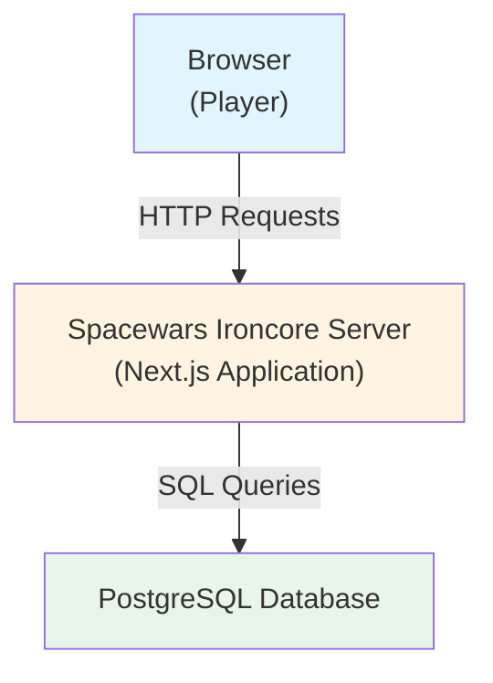
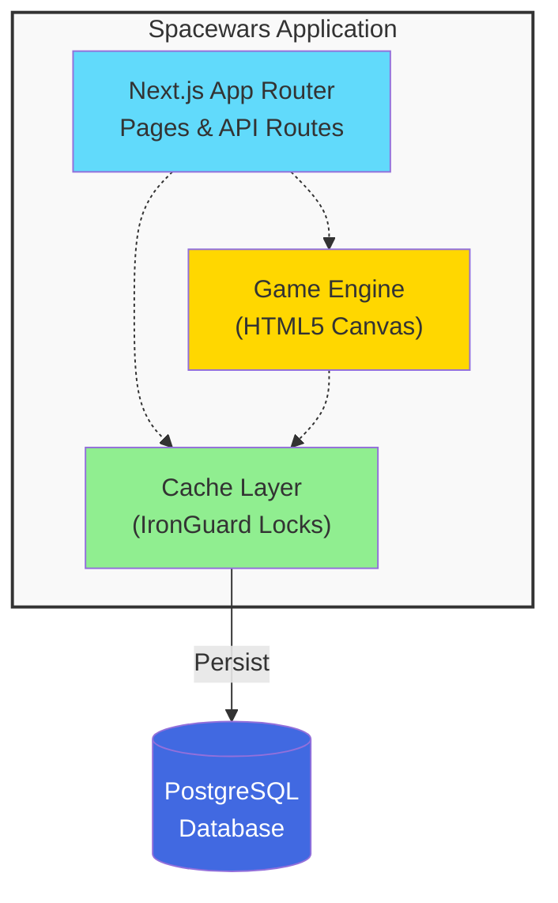
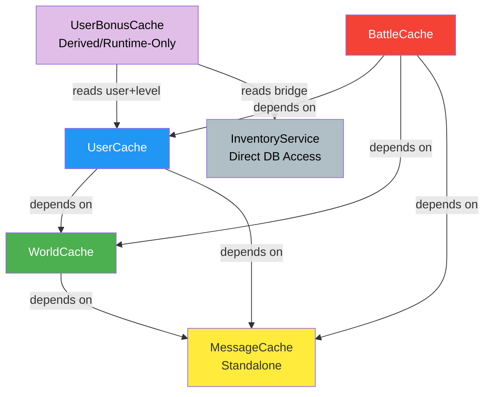
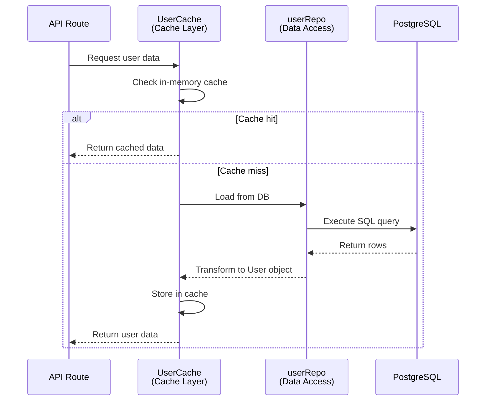
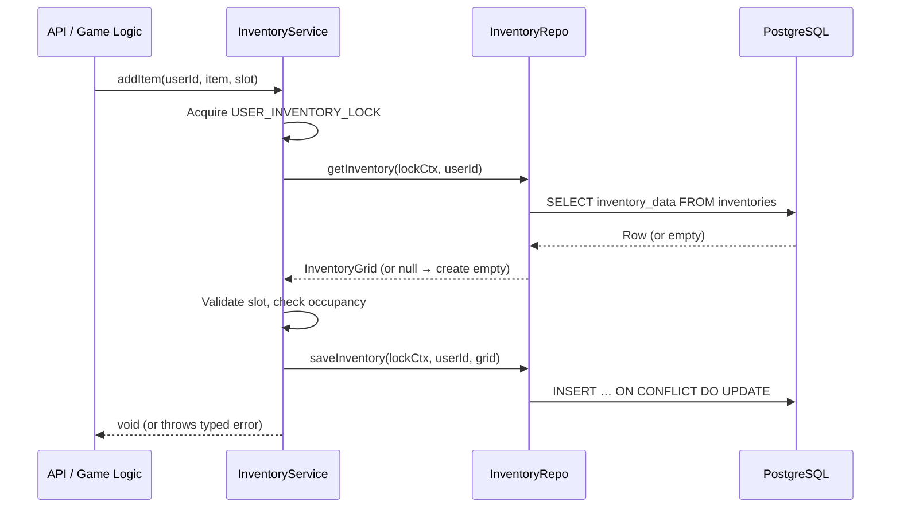
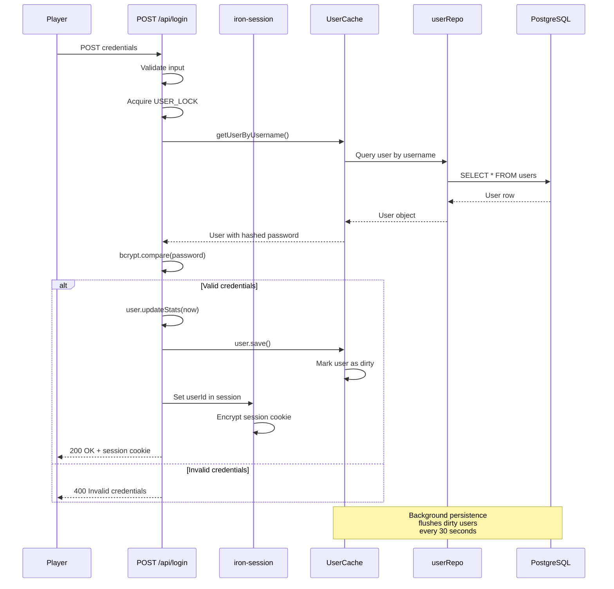
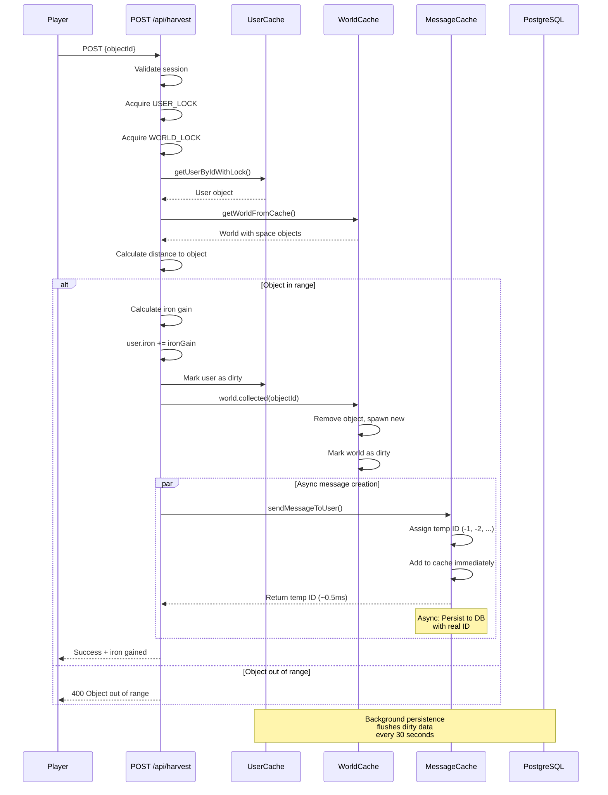
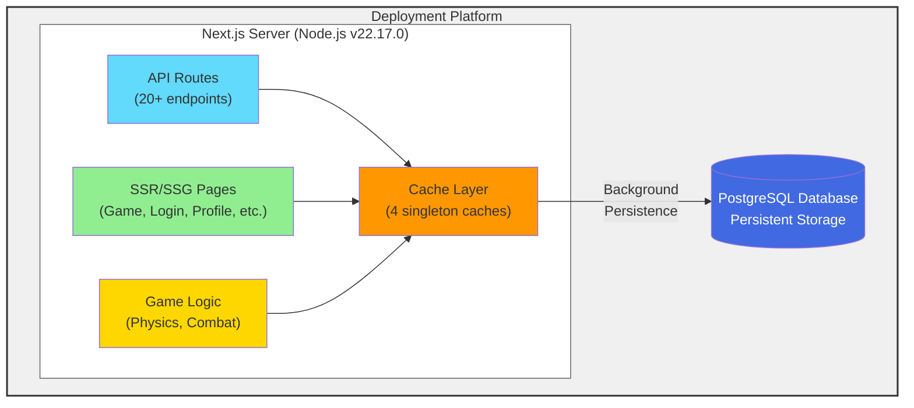
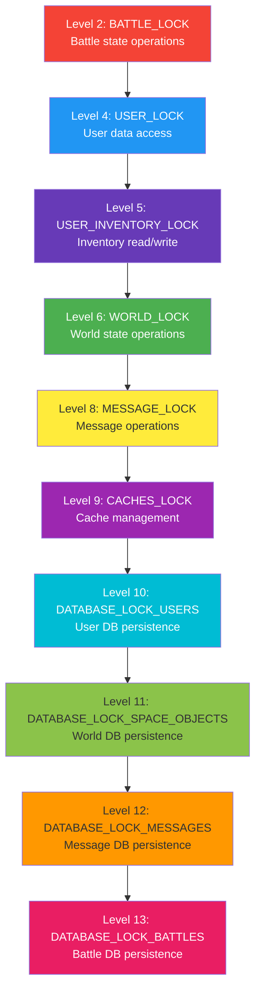

# Architecture Documentation (arc42)

**Spacewars Ironcore**

Version: 1.0  
Date: October 24, 2025  
Status: Work in Progress

---

## Table of Contents

1. [Introduction and Goals](#1-introduction-and-goals)
2. [Constraints](#2-constraints)
3. [Context and Scope](#3-context-and-scope)
4. [Solution Strategy](#4-solution-strategy)
5. [Building Block View](#5-building-block-view)
6. [Runtime View](#6-runtime-view)
7. [Deployment View](#7-deployment-view)
8. [Crosscutting Concepts](#8-crosscutting-concepts)
9. [Architecture Decisions](#9-architecture-decisions)
10. [Quality Requirements](#10-quality-requirements)
11. [Risks and Technical Debt](#11-risks-and-technical-debt)
12. [Glossary](#12-glossary)

---

## 1. Introduction and Goals

### 1.1 Requirements Overview

Spacewars Ironcore is a 2D space exploration game built with Next.js 15, TypeScript, and React. Players navigate space, collect resources, upgrade their ships through a technology tree, and engage in battles.

**Key Features:**

- Real-time space navigation with HTML5 Canvas rendering
- Resource collection (iron) from asteroids, shipwrecks, and escape pods
- Technology research system with resource costs and build times
- Ship defense systems (hull, armor, shields) with regeneration
- Turn-based battle system between players
- Message notification system for game events
- Player inventory system (10×10 grid) with typed items (Commander)

### 1.2 Quality Goals

| Priority | Quality Goal        | Scenario                                                                 |
| -------- | ------------------- | ------------------------------------------------------------------------ |
| 1        | **Correctness**     | No race conditions or data corruption in concurrent operations           |
| 2        | **Performance**     | Sub-100ms response times for game actions; async message creation ~0.5ms |
| 3        | **Maintainability** | Clear separation of concerns; compile-time lock validation               |
| 4        | **Scalability**     | Efficient caching to minimize database load                              |

### 1.3 Stakeholders

| Role                 | Goal                                 | Contact          |
| -------------------- | ------------------------------------ | ---------------- |
| Game Developer       | Implement features without deadlocks | Development team |
| Players              | Smooth gameplay experience           | End users        |
| System Administrator | Monitor and maintain deployment      | Ops team         |

---

## 2. Constraints

### 2.1 Technical Constraints

- **Platform:** Next.js 15 with App Router
- **Language:** TypeScript (strict mode)
- **Database:** PostgreSQL (relational, ACID-compliant)
- **Lock System:** IronGuard TypeScript Locks for compile-time deadlock prevention
- **Runtime:** Node.js v22.17.0
- **Deployment:** Docker, Vercel, Render (see configuration files)

### 2.2 Organizational Constraints

- Single-developer project
- Open-source development model
- Git-based version control (GitHub)

---

## 3. Context and Scope

### 3.1 Business Context



### 3.2 Technical Context

- **Frontend:** React Server Components + Client Components
- **API:** Next.js API Routes (`/api/*`)
- **Rendering:** HTML5 Canvas for game visualization
- **State Management:** Server-side with cookie-based sessions (iron-session)

---

## 4. Solution Strategy

### 4.1 Core Architectural Decisions

1. **Compile-Time Deadlock Prevention:** Using IronGuard lock system to enforce strict lock ordering at compile time
2. **Four-Layer Caching:** Separate cache managers for different data domains with explicit dependency injection
3. **Repository Pattern:** Data access layer (repos) separate from business logic and caching
4. **Async-First Design:** Message creation is asynchronous with temporary IDs for immediate availability
5. **Session-Based Authentication:** HTTP-only cookies with iron-session for security

### 4.2 Technology Stack

| Layer          | Technology            | Purpose             |
| -------------- | --------------------- | ------------------- |
| Frontend       | React 19 + Next.js 15 | UI framework        |
| Backend        | Next.js API Routes    | RESTful endpoints   |
| Database       | PostgreSQL            | Persistent storage  |
| Lock System    | IronGuard             | Deadlock prevention |
| Canvas         | HTML5 Canvas API      | Game rendering      |
| Authentication | iron-session          | Secure sessions     |

### 4.3 Responsive Navigation Strategy

**Context:** The application requires efficient navigation across multiple game pages (Home, Game, Factory, Research, Ship, Profile) while maintaining mobile-first design principles and providing contextual shortcuts for content-heavy pages.

**Solution:** A dual-navigation system that adapts to screen size and page context:

#### Desktop Navigation (>1280px)

- **Top Bar Navigation:** Traditional horizontal navbar with full page names and admin access
- **Implementation:** `Navigation.tsx` with responsive CSS media queries
- **Benefits:** Familiar desktop UX, full feature access, clear visual hierarchy

#### Mobile Navigation (≤1280px)

- **Bottom Tab Bar:** Fixed bottom navigation with icon-based shortcuts to main pages
- **Contextual Shortcut Bar:** Page-specific shortcuts above the bottom bar for quick access to scrollable sections
- **Implementation:** Conditional rendering based on `pathname` with smooth scrolling via `scrollIntoView()`

**Page-Specific Shortcuts:**

| Page     | Shortcuts                                 | Purpose                       |
| -------- | ----------------------------------------- | ----------------------------- |
| Home     | Battle, Messages, Progress, Defense, Tech | Dashboard sections navigation |
| Factory  | Queue, Defense, Projectile, Energy        | Build categories quick access |
| Research | Projectile, Energy, Defense, Ship, Spies  | Research tree navigation      |

**Key Design Decisions:**

1. **Progressive Enhancement:** Desktop gets full navigation; mobile gets optimized touch-friendly interface
2. **Context Awareness:** Shortcuts only appear on pages with scrollable content, reducing UI clutter
3. **Performance:** Hidden by default, conditionally rendered only on relevant pages
4. **Accessibility:** Smooth scrolling with `behavior: 'smooth'`, proper ARIA labels, keyboard navigation support
5. **Consistency:** Shared styling system with green accent colors matching the game's theme

**Benefits:**

- **Mobile UX:** Thumb-friendly bottom navigation with contextual shortcuts reduces scrolling fatigue
- **Desktop UX:** Traditional navigation maintains familiarity for larger screens
- **Scalability:** Easy to extend shortcuts to additional pages without affecting existing navigation
- **Maintainability:** Centralized in `Navigation.tsx` component with clear separation of concerns

## 5. Building Block View

See [Building Blocks - Cache Systems](./building-blocks-cache-systems.md) for detailed documentation of the cache managers.

### 5.1 Level 1: System Overview



### 5.2 Level 2: Cache and Repository Architecture

The application employs a layered architecture separating caching, business logic, and data access:

#### 5.2.1 Cache Layer (Four Independent Caches + One Derived Cache)

Five cache managers handle different data domains. Four are persistent singletons with explicit dependency injection; one is a runtime-only derived cache:

**UserBonusCache** (`src/lib/server/bonus/UserBonusCache.ts`)

- **Responsibility:** Pre-computed bonus multipliers derived from player level, commanders, and research
- **Storage:** Map<userId, UserBonuses> (runtime-only, no DB persistence)
- **Lock Hierarchy:** No lock needed — `invalidate()` is synchronous Map.delete in single-threaded JS
- **Initialization:** Lazy per user; rebuilt on first `getBonuses()` call after invalidation
- **Key Features:** Sub-microsecond reads; invalidated on level-up, research completion, and bridge changes; lost on server restart (rebuilt lazily); depends on UserCache + InventoryService for recalculation


**UserCache** (`src/lib/server/user/userCache.ts`)

- **Responsibility:** User data and username-to-ID mappings
- **Storage:** Map<userId, User> + Map<username, userId>
- **Lock Hierarchy:** USER_LOCK (3) → DATABASE_LOCK (4)
- **Initialization:** Explicit via `intialize2()` during server startup
- **Key Features:** Coordinates with WorldCache and MessageCache; dirty tracking for background persistence

**WorldCache** (`src/lib/server/world/worldCache.ts`)

- **Responsibility:** Authoritative game world state (space objects, boundaries)
- **Storage:** Single World instance
- **Lock Hierarchy:** WORLD_LOCK (2) → DATABASE_LOCK (10)
- **Initialization:** Explicit via `initializeWithWorld()` or `initializeFromDb()`
- **Key Features:** Save callback for dirty marking; delegates to worldRepo for persistence

**MessageCache** (`src/lib/server/messages/MessageCache.ts`)

- **Responsibility:** User messages and notifications
- **Storage:** Map<userId, Message[]>
- **Lock Hierarchy:** MESSAGE_LOCK (8) → DATABASE_LOCK_MESSAGES (12)
- **Initialization:** Auto-initialize on first access (lightweight)
- **Key Features:** Async message creation with temporary negative IDs (~0.5ms); uses MessagesRepo for all DB operations

**BattleCache** (`src/lib/server/battle/BattleCache.ts`)

- **Responsibility:** Active battle state and combat data
- **Storage:** Map<battleId, Battle> + Map<userId, battleId>
- **Lock Hierarchy:** BATTLE_LOCK (2) → DATABASE_LOCK_BATTLES (13)
- **Initialization:** Explicit via `initialize()` during server startup
- **Key Features:** Starts battle scheduler; uses battleRepo for persistence

**Dependency Graph:**



**Initialization Order (in main.ts):**

1. PostgreSQL connection established
2. World loaded from database
3. MessageCache initialized (standalone)
4. WorldCache initialized with world instance
5. UserCache initialized with WorldCache and MessageCache dependencies
6. BattleCache initialized with all cache dependencies

All caches are wired together explicitly during server startup (`main.ts`) via dependency injection. This enables:

- Clean separation of concerns (caching vs business logic)
- Testability (mock dependencies easily)
- Proper initialization order

#### 5.2.2 Repository Pattern (Data Access Layer)

Repositories provide a clean separation between caching/business logic and database operations:

**Purpose:**

- Single responsibility: Handle all direct database interactions for a specific domain
- SQL query execution and data transformation
- Type-safe database operations with lock context verification

**Repository Implementations:**

- **userRepo** (`src/lib/server/user/userRepo.ts`): User CRUD operations
- **worldRepo** (`src/lib/server/world/worldRepo.ts`): World state persistence
- **messagesRepo** (`src/lib/server/messages/messagesRepo.ts`): Message database operations
- **battleRepo** (`src/lib/server/battle/battleRepo.ts`): Battle state persistence
- **InventoryRepo** (`src/lib/server/inventory/InventoryRepo.ts`): Inventory grid persistence (upsert)

**Design Principles:**

- Cache-backed repos are called ONLY by their corresponding cache
- `InventoryRepo` is called ONLY by `InventoryService` (no cache layer – see §5.2.4)
- No business logic in repos (pure data access)
- Lock context passed via type parameters for compile-time safety
- Stateless (no instance state, mostly static methods or simple classes)

**Example Flow:**



#### 5.2.4 Direct-Access Services (No Cache Layer)

Not all server-side subsystems require caching. Where data volumes are small, access frequency is low, or strong consistency is more important than latency, a **Service → Repo → DB** pattern without a cache is used.

**InventoryService** (`src/lib/server/inventory/InventoryService.ts`)

- **Responsibility:** Player item inventories – add, move, remove items; lazy initialisation
- **Storage:** `inventories` table (`user_id PK`, `inventory_data JSONB`, FK → `users`)
- **Lock:** `USER_INVENTORY_LOCK` (LOCK_5) – acquired internally by every public method
- **Repo:** `InventoryRepo` (upsert via `ON CONFLICT DO UPDATE`)
- **No cache:** reads and writes go directly to the database on every call
- **Error types:** `InventorySlotOccupiedError`, `InventorySlotEmptyError`, `InventorySlotInvalidError`, `InventoryFullError`
- **Access rule:** All callers use `InventoryService` exclusively; direct `InventoryRepo` calls are forbidden outside the service



---

#### 5.2.5 Shared Patterns

All cache-backed services follow consistent patterns:

1. **Singleton Pattern:** Global instances stored in `globalThis`
2. **Write-Behind Persistence:** Updates modify cache immediately, background timer (30s) flushes dirty data
3. **Dirty Tracking:** Separate tracking per entity (users, world, battles, messages)
4. **IronGuard Locks:** Compile-time deadlock prevention through strict lock hierarchy
5. **Graceful Shutdown:** Stop timers, flush dirty data, wait for pending operations

**Design Rationale:**

- Separation ensures message/battle operations don't block user/world updates
- Different initialization strategies: heavy caches (User, World, Battle) initialized explicitly at startup; lightweight cache (Message) auto-initializes
- Repository pattern keeps database logic separate and testable

---

## 6. Runtime View

### 6.1 User Login Flow



### 6.2 Resource Collection Flow



---

## 7. Deployment View



**Deployment Options:**

- **Docker**: Full containerization with docker-compose.yml (includes PostgreSQL)
- **Vercel**: Serverless deployment with external PostgreSQL (requires connection pooling)
- **Render**: Container-based deployment with managed PostgreSQL
- **Self-hosted**: Any Node.js host with PostgreSQL access

---

## 8. Crosscutting Concepts

### 8.1 Lock Ordering (IronGuard)

**Global Lock Hierarchy:**



**Lock Acquisition Rule:** Locks must be acquired in ascending order (2 → 4 → 6 → 8 → ...). IronGuard enforces this at compile time through TypeScript's type system. Attempting to acquire locks out of order results in a compilation error.

**Common Lock Patterns:**

- **User operations**: USER_LOCK → DATABASE_LOCK_USERS
- **World updates**: WORLD_LOCK → DATABASE_LOCK_SPACE_OBJECTS
- **Message creation**: MESSAGE_LOCK → DATABASE_LOCK_MESSAGES
- **Battle actions**: BATTLE_LOCK → USER_LOCK → DATABASE_LOCK_BATTLES
- **Harvest flow**: USER_LOCK → WORLD_LOCK → MESSAGE_LOCK (async)
- **Inventory operations**: USER_INVENTORY_LOCK (standalone – no other lock needed)

### 8.2 Caching Strategy

- **Write-Through:** Updates go to cache immediately, marked as dirty
- **Write-Behind:** Background persistence flushes dirty data every 30s
- **Cache Invalidation:** Clear cache on schema changes or manual flush
- **TTL:** No time-based expiration (session-based lifecycle)
- **No-Cache (Direct DB):** Inventory data is read and written directly on every operation via `InventoryService → InventoryRepo`. No in-memory cache is maintained because inventory access frequency is low and strong consistency is preferred over latency.

### 8.3 Error Handling

- Database errors: Logged and propagated to API layer
- Lock acquisition: Guaranteed by IronGuard (no deadlocks)
- Async failures: Message creation errors logged, message removed from cache

### 8.4 Time Multiplier (Turbo Mode)

**Purpose:** Admin/debug feature to accelerate all game-time-based calculations for rapid end-game testing without affecting real-time timestamps.

**Architecture:**

```mermaid
graph TB
    Admin["Admin Page UI<br/>(Preset & Custom Controls)"]
    API["Admin API Endpoint<br/>/api/admin/time-multiplier"]
    Service["TimeMultiplierService<br/>(In-Memory Singleton)"]
    Server["Server-Side Game Logic<br/>(Iron, Research, Builds,<br/>Defense, Battles, Physics)"]
    UserStats["/api/user-stats<br/>(Polling 5s)"]
    Client["Client-Side Hooks<br/>(Iron, Defense, Physics)"]

    Admin -->|POST multiplier + duration| API
    API -->|setMultiplier()| Service
    Service -->|getMultiplier()| Server
    Service -->|getStatus()| UserStats
    UserStats -->|timeMultiplier field| Client
    Client -->|Apply to predictions| Client

    style Admin fill:#e1f5ff
    style API fill:#fff4e1
    style Service fill:#ffcccc
    style Server fill:#ccffcc
    style UserStats fill:#ffffcc
    style Client fill:#e1f5ff
```

**Key Design Decisions:**

1. **Delta Multiplication Pattern:** Multiplies elapsed time deltas rather than creating a "virtual clock"

   ```typescript
   // Server: Multiply elapsed time before calculations
   const elapsed = now - this.last_updated;
   const gameElapsed =
     elapsed * TimeMultiplierService.getInstance().getMultiplier();
   // Use gameElapsed for calculations, update this.last_updated = now (real time)
   ```

2. **Two Time-Calculation Patterns:**
   - **Delta-based (iron, research, defense):** `gameElapsed = elapsed × multiplier`
   - **Absolute-timestamp (build queue):** `effectiveTime = duration / multiplier`

3. **Real Timestamps Preserved:** Database timestamps (`last_updated`, `defenseLastRegen`, `buildStartSec`) remain in real time for synchronization anchoring

4. **In-Memory Only:** No database persistence - multiplier state is ephemeral, resets on server restart

5. **Auto-Expiration:** Multiplier automatically resets to 1 after configured duration

6. **Client Synchronization:** Piggybacked on existing `/api/user-stats` polling (5s interval) to avoid additional API calls

7. **Module-Level State (Client):** Simple module-level variable instead of React Context to avoid complexity and re-render cascades

**Integration Points:**

- **User Stats:** `User.updateStats()`, `User.updateDefenseValues()` - Iron production, research progression, defense regeneration
- **Build Queue:** `TechService.processCompletedBuilds()`, `TechService.getBuildQueue()` - Build completion and time estimates
- **Battle System:** `battleScheduler.fireWeapon()` - Weapon cooldown calculations
- **Physics:** `updateObjectPosition()` and variants in `shared/physics.ts` - Object movement speed
- **Admin API:** `/api/admin/time-multiplier` (GET/POST) - Status retrieval and activation (admin-only: users 'a' and 'q')
- **Client Hooks:** `useIron`, `useDefenseValues`, `useWorldData` - Client-side prediction and interpolation

**Behavioral Characteristics:**

- **Mid-Change Discontinuities:** Activating/deactivating multiplier during active operations (e.g., mid-build) causes instant completion or slowdown - documented as acceptable for admin/debug feature
- **Consistency:** All game systems accelerate uniformly - no selective acceleration
- **Backward Compatible:** Default parameter values ensure zero breaking changes for existing code

**Admin Access Control:**

- Restricted to developer accounts (username 'a' or 'q')
- Uses IronGuard LOCK_4 (USER_LOCK) for user lookup and authorization
- Authentication via iron-session
- Input validation: multiplier ≥ 1, duration > 0

**Implementation:**

- Service: `src/lib/server/timeMultiplier.ts` (138 lines)
- Admin API: `src/app/api/admin/time-multiplier/route.ts` (195 lines)
- Client Module: `src/lib/client/timeMultiplier.ts` (38 lines)
- Admin UI: `src/app/admin/page.tsx` (Time Multiplier section)
- Test Coverage: 113 new tests across all integration points

---

## 9. Architecture Decisions

### 9.1 ADR-001: Separate Message Cache

**Context:** Initial design had messages in UserCache, causing lock contention.

**Decision:** Extract MessageCache as independent singleton.

**Consequences:**

- ✅ Message operations don't block user/world updates
- ✅ Simpler lock hierarchy for each domain
- ✅ Async message creation without affecting game performance
- ⚠️ Need to coordinate shutdown/flush between caches

### 9.2 ADR-002: IronGuard Lock System

**Context:** Custom lock system was error-prone and lacked compile-time validation.

**Decision:** Migrate to IronGuard for compile-time deadlock prevention.

**Consequences:**

- ✅ Impossible to create deadlocks (compile-time enforcement)
- ✅ Clear lock hierarchy documented in types
- ✅ Better IDE support with type hints
- ⚠️ Learning curve for lock context patterns

### 9.3 ADR-003: Async Message Creation

**Context:** Synchronous DB writes caused ~5-10ms delays per message.

**Decision:** Use temporary negative IDs with async persistence.

**Consequences:**

- ✅ ~0.5ms message creation time (10-20x faster)
- ✅ Messages immediately available in cache
- ⚠️ Need to handle ID mapping and race conditions
- ⚠️ Shutdown must wait for pending writes

### 9.5 ADR-005: Inventory Direct DB Access (No Cache)

**Context:** The inventory system stores per-player item grids that are rarely accessed (only when a player explicitly views or interacts with their inventory). Caching this data would add complexity without a meaningful latency benefit.

**Decision:** Use a `Service → Repo → DB` pattern without a cache layer. `InventoryService` acquires `USER_INVENTORY_LOCK` internally, reads and writes the `inventories` table directly via `InventoryRepo` on every call.

**Consequences:**

- ✅ Simple implementation – no dirty tracking, no background timer, no shutdown logic
- ✅ Always consistent – no risk of stale reads after a server restart
- ✅ Testable with a mock repo (no DB required for unit tests)
- ⚠️ Higher per-request DB latency (~5–15ms) compared to a cached path – acceptable given low access frequency

---

### 9.6 ADR-006: Cache Derived Bonus Values in UserBonusCache

**Context:** Game bonuses (derived from player level, commanders, and research) are needed frequently across multiple API endpoints (navigate, ship-stats, battle, harvest, etc.). Recalculating them on every request requires reading from UserCache and InventoryService, introducing unnecessary lock contention and latency. The bonus values are pure functions of existing source data — they contain no novel state that requires persistence.

**Decision:** Cache derived bonus values in a runtime-only `UserBonusCache` (`src/lib/server/bonus/UserBonusCache.ts`). The cache is:

- **Lazily initialised** per user — computed on first `getBonuses(userId)` call after invalidation or server start
- **Invalidated synchronously** on source data changes (level-up, research completion, bridge item changes) via `invalidateBonuses(userId)` — a plain `Map.delete()`, no lock needed in single-threaded JS
- **Not persisted** — purely runtime, lost on server restart (rebuilt lazily from existing source data)
- **Combination formula** — all bonus sources multiply: `finalValue = researchEffect × levelMultiplier × commanderMultiplier`

**Consequences:**

- ✅ Sub-microsecond reads after first computation (simple Map lookup)
- ✅ No new lock level needed — recalculation reuses existing `USER_LOCK` (LOCK_4) and `USER_INVENTORY_LOCK` (LOCK_5) in valid order
- ✅ No schema changes — purely in-memory
- ✅ Stale for at most one request after an invalidating event (lazy rebuild on next read)
- ⚠️ Lost on server restart — users experience one slightly slower request while bonuses are rebuilt
- ⚠️ Stats without a `CommanderStatKey` (iron capacity, iron rate, defense regen) receive only level × research multiplier; no commander bonus

---


### 9.4 ADR-004: Transaction-Based Test Isolation

**Context:** Tests were interfering with each other due to shared database state. Manual cleanup in `initializeIntegrationTestServer()` was brittle and masked issues with background persistence escaping transaction boundaries.

**Decision:**

1. Wrap all integration tests in database transactions using `withTransaction()` helper
2. Automatic ROLLBACK after each test provides perfect isolation
3. Disable background persistence in test mode (synchronous persistence instead)
4. Use AsyncLocalStorage to propagate transaction context throughout test execution

**Implementation:**

- `withTransaction()` helper in `src/__tests__/helpers/transactionHelper.ts`
- AsyncLocalStorage for transaction context propagation
- `getDatabasePool()` export used by transaction helper to create isolated clients
- `TestAwareAdapter` in `database.ts` dynamically switches between global pool and active transaction client, ensuring singletons respect test isolation
- Cache modifications detect test mode and persist immediately instead of using timers
- Timer-based background persistence disabled when `NODE_ENV === 'test'`

**Consequences:**

- ✅ Perfect test isolation - no data pollution between tests
- ✅ No manual cleanup needed - automatic ROLLBACK handles everything
- ✅ Enables parallel test execution (future improvement)
- ✅ Tests are deterministic and reproducible
- ✅ Catches bugs where background persistence escapes transaction scope
- ⚠️ Test mode has slightly different code path (synchronous vs async persistence)
- ⚠️ Tests must use `withTransaction()` wrapper for proper isolation
- ⚠️ Seeded test data must be visible within transaction (handled by database initialization)

---

## 10. Quality Requirements

### 10.1 Performance

| Metric                | Target  | Actual                     |
| --------------------- | ------- | -------------------------- |
| Message creation      | < 1ms   | ~0.5ms                     |
| User data load        | < 50ms  | ~10-20ms (cache hit: ~1ms) |
| Game action (harvest) | < 100ms | ~30-50ms                   |

### 10.2 Reliability

- Zero deadlocks (guaranteed by IronGuard)
- Graceful degradation on DB errors
- Data consistency through dirty tracking

---

## 11. Risks and Technical Debt

See [TechnicalDebt.md](../../TechnicalDebt.md) for current issues.

**Key Risks:**

1. **Cache Invalidation:** No distributed cache invalidation strategy
2. **Session Storage:** In-memory sessions don't survive restarts

---

## 12. Glossary

| Term                      | Definition                                                                                       |
| ------------------------- | ------------------------------------------------------------------------------------------------ |
| **IronGuard**             | TypeScript lock library with compile-time deadlock prevention                                    |
| **Dirty Tracking**        | Marking cached data as modified for background persistence                                       |
| **Temporary ID**          | Negative ID assigned to messages before DB insertion                                             |
| **Lock Hierarchy**        | Ordered sequence of locks that must be acquired in ascending order                               |
| **Commander**             | An inventory item that grants percentage-based bonuses to one to three ship stats                |
| **Inventory**             | A player's 10×10 item grid stored as JSONB in the `inventories` table                            |
| **Direct-Access Service** | A service that reads/writes the DB on every call with no in-memory cache (e.g. InventoryService) |
