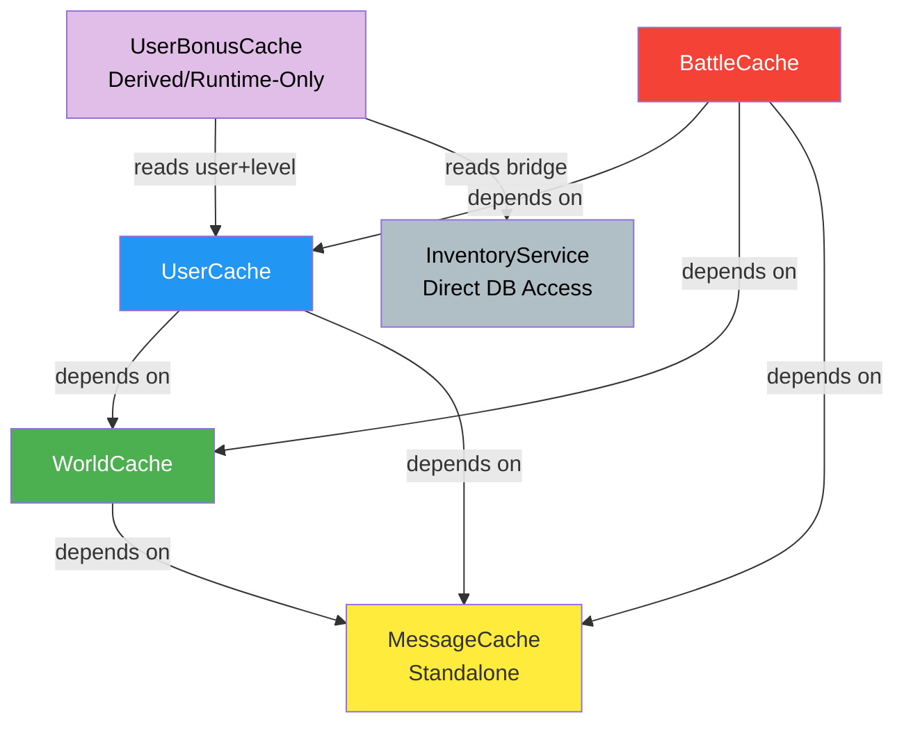
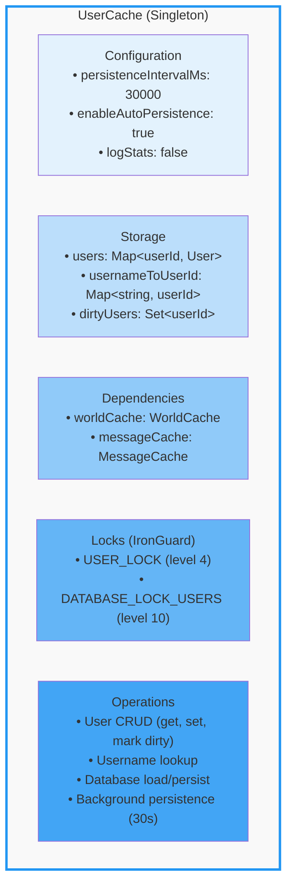
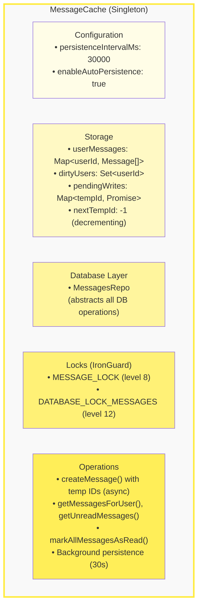
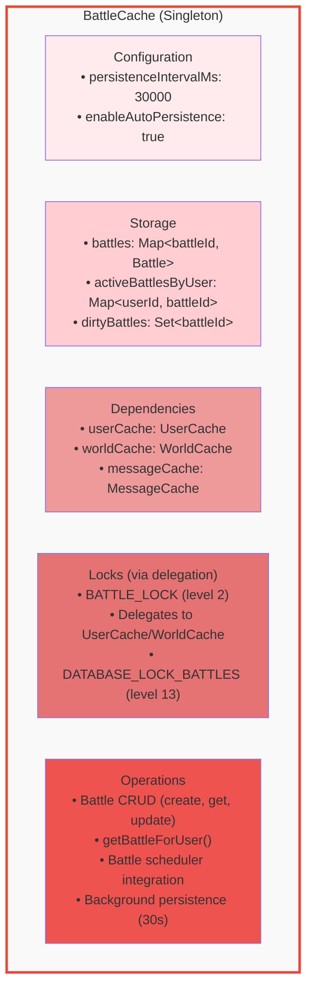
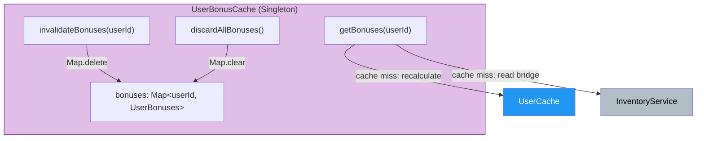

# Building Blocks - Cache Systems

**Part of:** Spacewars Ironcore Architecture Documentation

---

## Overview

The Spacewars application uses four persistent cache managers and one runtime-only derived cache to optimize database access and ensure data consistency. The four persistent caches use the IronGuard lock system for compile-time deadlock prevention and are wired together explicitly during server startup. The derived cache (`UserBonusCache`) is a lightweight companion that computes and stores pre-calculated bonus multipliers.

---

## Cache Manager Comparison

| Aspect | UserCache | WorldCache | MessageCache | BattleCache | UserBonusCache |
|--------|-----------|-----------|--------------|-------------|----------------|
| **Primary Purpose** | User data, username mappings, coordination | Authoritative world state | User messages and notifications | Battle state and combat data | Pre-computed bonus multipliers |
| **Data Scope** | Multi-entity (Users + indices) | Single-entity (World) | Single-entity (Messages) | Single-entity (Battles) | Per-user derived values |
| **DB Abstraction** | Direct DB operations | Direct DB operations | MessagesRepo layer | Direct DB operations | None — runtime only |
| **Lock System** | Pure IronGuard | Pure IronGuard | Pure IronGuard | Pure IronGuard via delegation | None (sync Map ops) |
| **Lock Hierarchy** | 4 levels (CACHE→WORLD→USER→DB) | WORLD + DB locks | 2 levels (CACHE→DATA) | 4 levels (via UserCache + BATTLE) | Reuses USER_LOCK + USER_INVENTORY_LOCK during recalc |
| **Async Operations** | Background persistence | Background persistence | Async creation + background persistence | Background persistence | None |
| **Temporary IDs** | No | No | Yes (negative IDs) | No | No |
| **Cache Structure** | Map<userId, User> | Single World instance | Map<userId, Message[]> | Map<battleId, Battle> + user→battle index | Map<userId, UserBonuses> |
| **Singleton Pattern** | Yes | Yes | Yes | Yes | Yes |
| **Initialization** | Idempotent, coordinates WorldCache | Eager (startup) or lazy fallback | Idempotent auto-init | Mixed strategy (sync + async) | Lazy per user |
| **Statistics Tracking** | Cache hits/misses per entity type | Cache hits/misses + dirty flag | Cache hits/misses + pending writes | No statistics | No |
| **Background Timer** | 30s persistence interval | 30s persistence interval | 30s persistence interval | 30s persistence interval | None |
| **DB Persistence** | Yes | Yes | Yes | Yes | **No — runtime only** |

### Dependency Graph & Injection

The persistent caches receive each other as explicit dependencies to simplify testing and avoid hidden singleton lookups. `UserBonusCache` depends on `UserCache` and `InventoryService` for recalculation:



- `main.ts` is responsible for creating the real cache instances and wiring them together via the new `configureDependencies(...)` helpers before regular initialization runs.
- Each cache throws a descriptive error if it attempts to use a dependency that has not been configured. For test scenarios, mocks or lightweight substitutes can be provided through the same configuration surface.
- To preserve backward compatibility, `UserCache` can still bootstrap a `WorldCache` + `MessageCache` on-demand if no dependency was supplied. Production code **should** inject the shared instances instead of relying on this fallback.

---

## UserCache

**Location:** `src/lib/server/user/userCache.ts`

### Architecture



### Key Features

**Pure IronGuard Lock System:**
- Direct lock context acquisition with explicit `dispose()` in try-finally blocks
- Compile-time deadlock prevention through type system
- No callback-based wrappers

**Multi-Entity Caching:**
- Caches user objects and username mappings while delegating world state to `WorldCache`
- Separate dirty tracking per entity type (users locally, world via dependency)

**Internal Auto-Initialization:**
- Public methods auto-initialize on first access
- Initialization loads world data from database (~100-200ms first call, <1ms subsequent)
- Starts background persistence and battle scheduler on first init

**Usage Example:**
```typescript
// High-level API - auto-initializes if needed
const cacheManager = UserCache.getInstance2();
const user = await cacheManager.loadUserIfNeeded(userId);

// Direct lock acquisition pattern
const ctx = createLockContext();
const worldCtx = await cacheManager.acquireWorldWrite(ctx);
try {
  const userCtx = await cacheManager.acquireUserLock(worldCtx);
  try {
    const user = cacheManager.getUserUnsafe(userId, userCtx);
    manager.updateUserUnsafe(user, userCtx);
  } finally {
    userCtx.dispose();
  }
} finally {
  worldCtx.dispose();
}
```

### Persistence Strategy

**Write-Behind Caching:**
1. Updates immediately modify in-memory cache
2. Entity marked as "dirty" (`dirtyUsers` set or `worldDirty` flag)
3. Background timer (30s) flushes dirty data to database
4. Shutdown performs final flush

**Database Operations:**
- `persistUserToDb()`: Updates user fields (iron, tech_tree, defense values)
- `persistDirtyWorld()`: Calls `saveWorldToDb(world)`

---

## MessageCache

**Location:** `src/lib/server/MessageCache.ts`

### Architecture



### Key Features

**Pure IronGuard Implementation:**
- All operations use `createLockContext()` and `acquireWrite()`/`acquireRead()`
- Lock contexts passed to internal methods

**Async Message Creation:**
```typescript
async createMessage(userId: number, text: string): Promise<number> {
  // 1. Generate temporary negative ID
  const tempId = this.nextTempId--;
  // 2. Add to cache immediately with tempId
  const message = { id: tempId, ..., isPending: true };
  // 3. Start async DB write (non-blocking)
  this.persistMessageAsync(userId, tempId, message);
  // 4. Return tempId immediately (~0.5ms, 10-20x faster than sync)
  return tempId;
}
```

**Race Condition Handling:**
- Messages can be marked as read while DB insertion is in progress
- `persistMessageAsync()` preserves current read status
- If status changed during insertion, user marked as dirty for background update

**Pending Write Tracking:**
- `pendingWrites: Map<number, Promise<void>>` tracks temp IDs being written
- `waitForPendingWrites()` ensures all async writes complete before shutdown

**Usage Example:**
```typescript
// Fast message creation
const msgId = await messageCache.createMessage(userId, "Hello!");
// Returns immediately with tempId (-1), DB write happens in background

// Get unread messages
const unread = await messageCache.getUnreadMessages(userId);

// Mark messages as read
const markedCount = await messageCache.markAllMessagesAsRead(userId);

// Graceful shutdown
await messageCache.waitForPendingWrites(); // Wait for async writes
await messageCache.flushToDatabase();       // Flush read status updates
await messageCache.shutdown();
```

### Persistence Strategy

**Dual Persistence Mechanisms:**

1. **Pending Writes (New Messages):**
   - Async DB insertion via MessagesRepo after cache update
   - Tracked in `pendingWrites` map
   - Must complete before shutdown

2. **Dirty Users (Read Status):**
   - Background timer persists read status changes via MessagesRepo
   - Uses `MessagesRepo.updateMultipleReadStatuses()` for batch updates
   - Skips messages with `isPending: true`

---

## BattleCache

**Location:** `src/lib/server/BattleCache.ts`

### Architecture



### Key Features

**Mixed Initialization Strategy:**
Provides dual API for backward compatibility with database callbacks:

```typescript
// Synchronous for callback contexts
static getInstance(): BattleCache {
  if (!BattleCache.instance) {
    BattleCache.instance = new BattleCache();
  }
  return BattleCache.instance; // May not be fully initialized
}

// Async with auto-initialization
static async getInitializedInstance(): Promise<BattleCache> {
  if (BattleCache.instance?.initialized) {
    return BattleCache.instance;
  }
  if (!BattleCache.initializationPromise) {
    BattleCache.initializationPromise = (async () => {
      const instance = BattleCache.getInstance();
      await instance.initialize(await getDatabase());
      return instance;
    })();
  }
  return BattleCache.initializationPromise;
}
```

**Lock Delegation Pattern:**
Delegates database operations to UserCache instead of implementing own locks:

```typescript
async loadBattleIfNeeded(battleId: number): Promise<Battle | null> {
  await this.ensureInitializedAsync();
  const userCache = UserCache.getInstance2();
  const ctx = createLockContext();
  const dbCtx = await userCache.acquireDatabaseRead(ctx);
  try {
    const battle = await this.loadBattleFromDb(battleId);
    return battle;
  } finally {
    dbCtx.dispose();
  }
}
```

**Usage Examples:**
```typescript
// Pattern 1: High-level operations (auto-init)
const activeBattles = await battleCache.getActiveBattles();

// Pattern 2: Database callbacks (pre-init)
export async function createBattle(...) {
  await getBattleCacheInitialized(); // Pre-initialize
  db.run("INSERT INTO battles...", [], function(err) {
    if (!err) {
      getBattleCache().setBattleUnsafe(battle); // Safe - pre-initialized
    }
  });
}
```

### Persistence Strategy

**Write-Behind with Delegation:**
1. Updates modify in-memory cache immediately
2. Battle marked as "dirty" (added to `dirtyBattles`)
3. Background timer (30s) flushes via UserCache locks
4. Shutdown performs final flush

---

## Shared Architecture Patterns

All four cache managers share these core patterns:

### 1. Singleton Pattern
```typescript
private static instance: CacheManager | null = null;
static getInstance(config?: Config): CacheManager
static resetInstance(): void  // For testing
```

### 2. IronGuard Lock System
- Compile-time deadlock prevention through TypeScript types
- Strict lock hierarchy enforcement
- Context-based lock acquisition with explicit `dispose()` in try-finally blocks

### 3. Initialization
- **UserCache & MessageCache:** Internal auto-init with idempotent guards
- **BattleCache:** Mixed strategy (sync + async) for callback compatibility
- First call expensive (~10-200ms), subsequent calls instant (<1ms)

### 4. Background Persistence
- Default 30-second interval (configurable via `persistenceIntervalMs`)
- Automatic start on initialization
- Stop and final flush on shutdown

### 5. Dirty Tracking
```typescript
// UserCache & BattleCache
private dirtyUsers: Set<number> = new Set();
private dirtyBattles: Set<number> = new Set();

// MessageCache adds pending write tracking
private dirtyUsers: Set<number> = new Set();
private pendingWrites: Map<number, Promise<void>> = new Map();
```

### 6. Statistics Tracking
- **UserCache & MessageCache:** Cache hits/misses, pending operations
- **BattleCache:** No statistics (simple cache)

### 7. Database Integration
- PostgreSQL with async/await Promise-based API
- **UserCache & BattleCache & WorldCache:** Direct database operations via repos
- **MessageCache:** Uses MessagesRepo for database abstraction layer
- All managers use the shared database connection pool

---

## Key Differences

### Database Abstraction
- **MessageCache:** Uses MessagesRepo for all database operations (clean separation)
- **UserCache & BattleCache:** Direct database operations via repos

### Lock Implementation
- **UserCache:** Direct IronGuard usage with 4-level hierarchy
- **MessageCache:** Direct IronGuard usage with 2-level hierarchy  
- **BattleCache:** Delegates to UserCache for locks

### Data Complexity
- **UserCache:** Multi-entity (User + World + username index)
- **MessageCache:** Single-entity (Messages per user)
- **BattleCache:** Single-entity (Battles + user→battle index)

### Async Operations
- **MessageCache only:** Creates messages with temporary IDs for non-blocking operation (~0.5ms vs ~5-10ms)
- **Others:** Synchronous updates with background persistence
- **UserBonusCache:** No async operations — synchronous Map reads; async recalculation only on cache miss

### Initialization Strategy
- **UserCache & MessageCache:** Internal auto-init pattern in all public methods
- **BattleCache:** Dual API (sync `getInstance()` + async `getInitializedInstance()`) for database callback compatibility
- **UserBonusCache:** Fully lazy — computed on first `getBonuses()` call per user after invalidation or server start

---

## UserBonusCache

**Location:** `src/lib/server/bonus/UserBonusCache.ts`

**Design Pattern: Runtime-Only Derived Cache**

Unlike the four persistent caches, `UserBonusCache` is a *derived cache* — it stores computed values that can always be reconstructed from existing source data (UserCache + InventoryService). There is no novel state to persist; on server restart, bonuses are rebuilt lazily on first access.



### Responsibilities

- Store a `UserBonuses` record per user containing pre-multiplied bonus factors for all stat types
- Provide `getBonuses(userId): Promise<UserBonuses>` — returns cached entry or computes on cache miss
- Provide `invalidateBonuses(userId): void` — synchronous Map.delete; called by level-up, research completion, and bridge change handlers
- Provide `discardAllBonuses(): void` — synchronous Map.clear; called on server shutdown or full cache reset

### UserBonuses Shape

```typescript
interface UserBonuses {
  // Multiplicative factors (1.0 = no bonus)
  ironRechargeRate: number;       // IronHarvesting research × level
  ironCapacity: number;           // IronCapacity research × level
  maxShipSpeed: number;           // ShipSpeed research × afterburner × level × commander
  projectileWeaponReloadFactor: number; // ProjectileReloadRate × level × commander
  energyWeaponReloadFactor: number;     // EnergyReloadRate × level × commander
  projectileWeaponAccuracy: number;     // ProjectileAccuracy × level × commander
  energyWeaponAccuracy: number;         // EnergyAccuracy × level × commander
  hullRepairRate: number;         // base × level (no commander key)
  armorRepairRate: number;        // ArmorRepair × level × commander
  shieldRechargeRate: number;     // ShieldRecharge × level × commander (if applicable)
  defenseRegen: number;           // base × level (no commander key)
  levelMultiplier: number;        // 1.15^(level - 1) — convenience field
}
```

### Bonus Combination Formula

All sources combine **multiplicatively**:

```
finalValue = researchEffect × levelMultiplier × commanderMultiplier
```

Where:
- `researchEffect` = `getResearchEffectFromTree(techTree, researchType)` (e.g. 1.1 for 10% bonus)
- `levelMultiplier` = `1.15^(level - 1)` (level 1 → 1.0, level 2 → 1.15, …)
- `commanderMultiplier` = derived from `Commander.calculateBonuses()` for stats with a matching `CommanderStatKey`; 1.0 for stats without a `CommanderStatKey`

### Lock Strategy

- **No new lock level** — recalculation acquires `USER_LOCK` (LOCK_4) to read user data and then `USER_INVENTORY_LOCK` (LOCK_5) to read bridge data; lock ordering 4 → 5 is valid in the IronGuard hierarchy
- **Invalidation is lock-free** — `Map.delete()` is atomic in single-threaded Node.js; no lock needed
- **Callers hold USER_LOCK** when calling `getBonuses()` during a tick; the cache handles the additional `USER_INVENTORY_LOCK` acquisition internally on cache miss

### Invalidation Trigger Points

| Event | Trigger Function | Reason |
|-------|-----------------|--------|
| Level-up | `invalidateBonuses(userId)` | `levelMultiplier` changes |
| Research completion | `invalidateBonuses(userId)` | `researchEffect` changes |
| Bridge item add/remove/move | `invalidateBonuses(userId)` | `commanderMultiplier` changes |
| Server shutdown | `discardAllBonuses()` | Clean reset |

---


### Known Issues

**TechRepo bypassing UserCache:**
- **Problem:** `TechRepo` directly reads/writes user data (iron, tech_counts, defense values)
- **Impact:** UserCache can have stale cached data
- **Affected routes:** `/api/build-item`, `/api/build-status`, `/api/complete-build`
- **Recommended fix:** Make TechRepo coordinate with UserCache for cached fields

**Status:**
- ✅ Message operations: All go through MessageCache
- ✅ Battle operations: All go through BattleCache
- ✅ User/World operations: Only accessed via UserCache
- ❌ Tech operations: TechRepo needs cache coordination

---

## Summary

## Summary

All five cache managers share the goal of fast, consistent access to game data. The four persistent caches (UserCache, WorldCache, MessageCache, BattleCache) use the IronGuard lock system for type-safe, deadlock-free concurrent access, and share core patterns (singleton, write-behind caching, dirty tracking, background persistence) while differing in complexity, initialization strategy, and async operation support.

`UserBonusCache` is a fifth, lighter-weight member: a **runtime-only derived cache** that stores pre-computed bonus multipliers. It has no lock of its own, no DB persistence, and no background timer — it simply memoises the result of an expensive recalculation and clears that memo on source data changes.

**Key characteristics:**
- **UserCache:** Central multi-entity cache with 4-level lock hierarchy
- **MessageCache:** Fast async message creation with temporary IDs, uses MessagesRepo for DB abstraction
- **BattleCache:** Simple delegation pattern for lock management
- **WorldCache:** Authoritative world state with save callback pattern
- **UserBonusCache:** Runtime-only derived cache; lazy per-user computation; no lock, no DB, no timer

The separation ensures message operations don't block game updates, battle operations don't interfere with user/world caching, and bonus lookups are sub-microsecond on the hot path.
