# Balancing & Progression Documentation

## Overview

This document provides in-depth analysis of game balance, progression mechanics, and strategic considerations for Spacewars Ironstrike. It includes progression curves, battle requirements, and balance comparisons between different research paths.

---

## Battle Progression: XP Requirements

### Level System Basics

- **XP Formula**: Cumulative XP required for level N is `sum(k=1 to N-1) of [(k*(k+1)/2) * 1000]`
- **Level Increment**: Each level requires increasingly more XP following triangular numbers
- **Example thresholds**:
  - Level 2: 1,000 XP
  - Level 5: 20,000 XP
  - Level 10: 165,000 XP

### Battle XP Rewards

**Base XP Calculation**:

- `baseXp = opponent_level × 200`

**Modifiers by Level Difference**:

- **Same level**: Full baseXp (1.0×)
- **Beating stronger opponent** (opponent level > your level): `baseXp × 1.3^(level_diff)` — Bonus multiplier increases with each level advantage
- **Beating weaker opponent** (opponent level < your level): `baseXp × 0.7^(level_diff)` — Penalty multiplier increases with each level disadvantage

**Battle Legal Range**: Players can only battle opponents within **±3 levels** of their own level.

### Battles Required for Level Progression (Levels 1-10)

#### Comprehensive Battle Requirements Table

| Level   | XP Needed | Lv-3 | Lv-2 | Lv-1 | Same Lv | Lv+1 | Lv+2 | Lv+3 |
| ------- | --------- | ---- | ---- | ---- | ------- | ---- | ---- | ---- |
| 1 → 2   | 1,000     | N/A  | N/A  | N/A  | **5**   | 2    | 1    | 1    |
| 2 → 3   | 3,000     | N/A  | N/A  | 22   | **8**   | 4    | 3    | 2    |
| 3 → 4   | 6,000     | N/A  | 62   | 22   | **10**  | 6    | 4    | 3    |
| 4 → 5   | 10,000    | 148  | 52   | 24   | **13**  | 8    | 5    | 4    |
| 5 → 6   | 15,000    | 110  | 52   | 27   | **15**  | 10   | 7    | 5    |
| 6 → 7   | 21,000    | 103  | 54   | 30   | **18**  | 12   | 8    | 6    |
| 7 → 8   | 28,000    | 103  | 58   | 34   | **20**  | 14   | 10   | 7    |
| 8 → 9   | 36,000    | 106  | 62   | 37   | **23**  | 16   | 11   | 8    |
| 9 → 10  | 45,000    | 110  | 66   | 41   | **25**  | 18   | 13   | 9    |
| 10 → 11 | 55,000    | 115  | 71   | 44   | **28**  | 20   | 14   | 10   |

**Legend**:

- **Bold** (Same Level): Recommended baseline progression strategy
- **Lv±1, ±2, ±3**: Harder/easier opponents with corresponding battle count adjustments
- **Lv+3**: Strongest available opponents (fewest battles, highest difficulty)
- **Lv-3**: Weakest available opponents (most battles, lowest difficulty)
- **N/A**: Opponent level is outside legal battle range (±3 level limit)

### Key Insights

1. **Scaling Difficulty**: Battle requirements grow significantly at higher levels:
   - Levels 1-2: Just 5 battles at same level
   - Levels 9-10: 25 battles at same level
   - Progression roughly increases 5× from level 1 to level 10

2. **Difficulty Spectrum**:
   - **Same-level battles** (Lv±0): Reliable, moderate pace (5-28 battles per level)
   - **One level difference** (Lv±1):
     - Lv+1 (harder): 2-3× fewer battles (2-20 battles)
     - Lv-1 (easier): 2-5× more battles (22-71 battles)
   - **Two level difference** (Lv±2):
     - Lv+2 (harder): 3-4× fewer battles (1-14 battles)
     - Lv-2 (easier): 4-8× more battles (52-115 battles)
   - **Three level difference** (Lv±3):
     - Lv+3 (hardest): 4-7× fewer battles (1-10 battles)
     - Lv-3 (easiest): 20-100× more battles (103-148 battles at mid-levels)

3. **Strategic Implications**:
   - **Early levels (1-3)**: Grinding against Lv+3 opponents is viable (only 1-2 battles)
     - Risk: Very difficult, high chance of loss
     - Reward: Fastest progression possible
   - **Mid levels (4-7)**: Same-level battles are most efficient and balanced (13-18 battles)
     - Risk: Moderate, 50/50 win chance
     - Reward: Consistent progression
   - **High levels (8-10)**: Players must choose between grinding strategies
     - Safe farming (Lv-3): 110-115 battles (very slow)
     - Efficiency (Same Lv): 23-28 battles (steady)
     - Challenge run (Lv+3): 8-10 battles (very risky)

4. **Skill-Based Progression Acceleration**:
   - Players skilled at combat can accelerate progression significantly
   - **Example scenarios**:
     - Level 5 → 6: Same-level = 15 battles, Lv+1 = 10 battles (**33% faster**)
     - Level 5 → 6: Same-level = 15 battles, Lv+2 = 7 battles (**53% faster**)
     - Level 5 → 6: Same-level = 15 battles, Lv+3 = 5 battles (**67% faster**)
   - High-skill players can effectively "skip" levels by farming stronger opponents

5. **Risk vs. Reward Trade-offs**:
   - **Conservative farming** (Lv-3): Maximum safety, exponential battle scaling (110-148 battles)
   - **Moderate farming** (Lv-1 to Same): Balanced approach (15-41 battles)
   - **Aggressive farming** (Lv+1 to Lv+3): Minimal battles but maximum risk (1-20 battles)
   - **Optimal path for average players**: Same-level battles for steady progression with acceptable win rates

---

## Research Progression Charts

All research progression curves are visualized in auto-generated SVG charts. See [doc/balancing/CHART-INDEX.md](./balancing/CHART-INDEX.md) for a complete index.

### Individual Research Charts

Charts showing effect progression for each of the 23 implemented researches (levels 1-30):

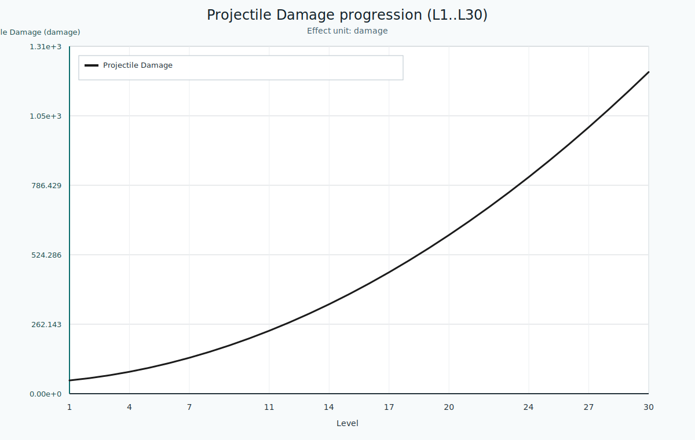

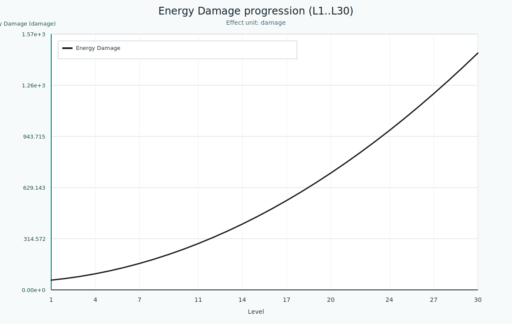

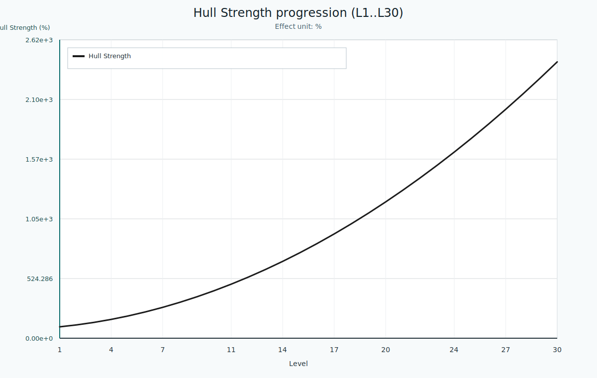

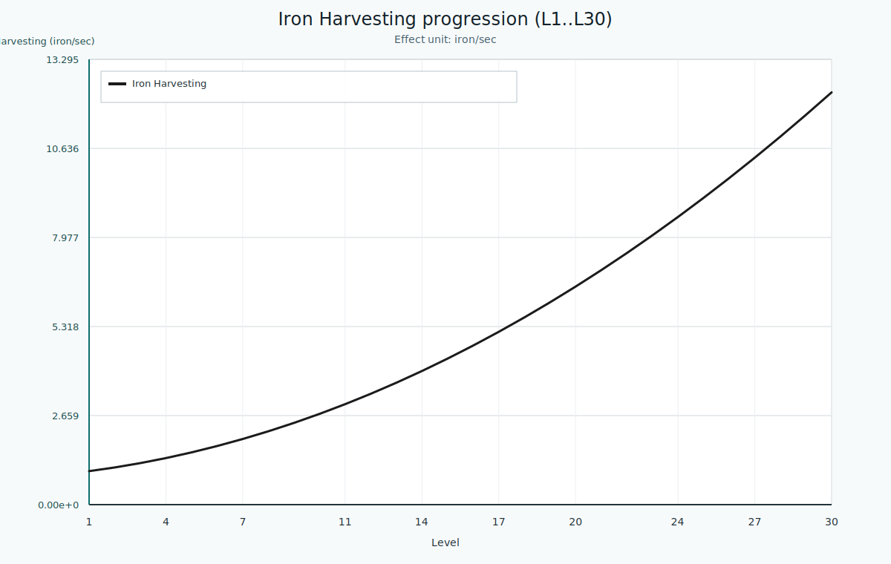

### Key Comparison Charts

#### Weapons Balance

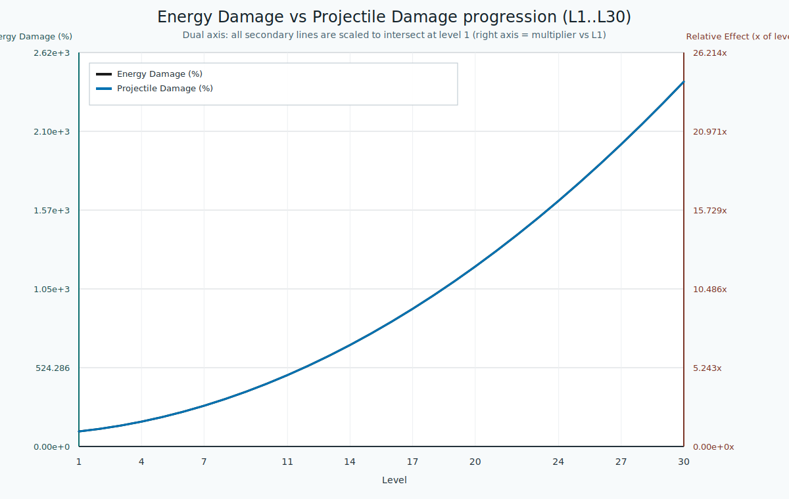

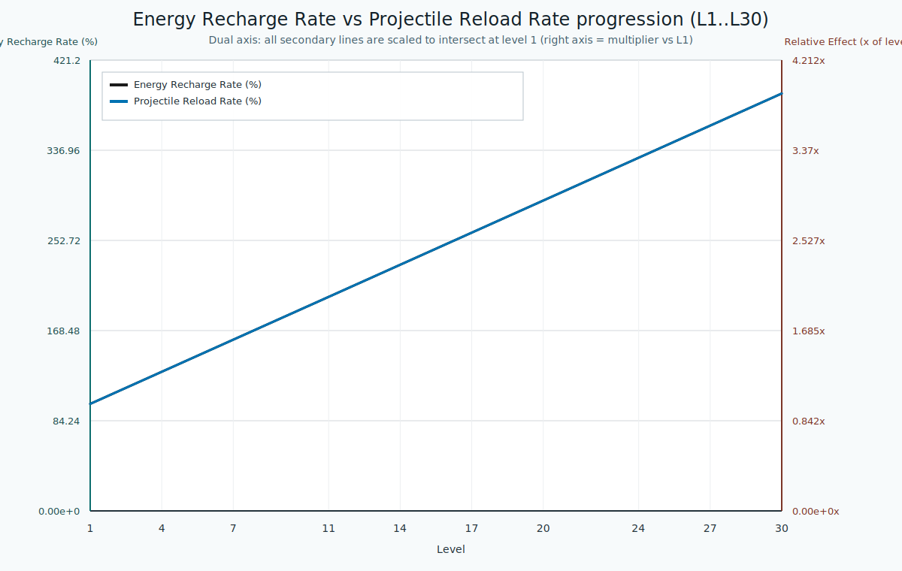

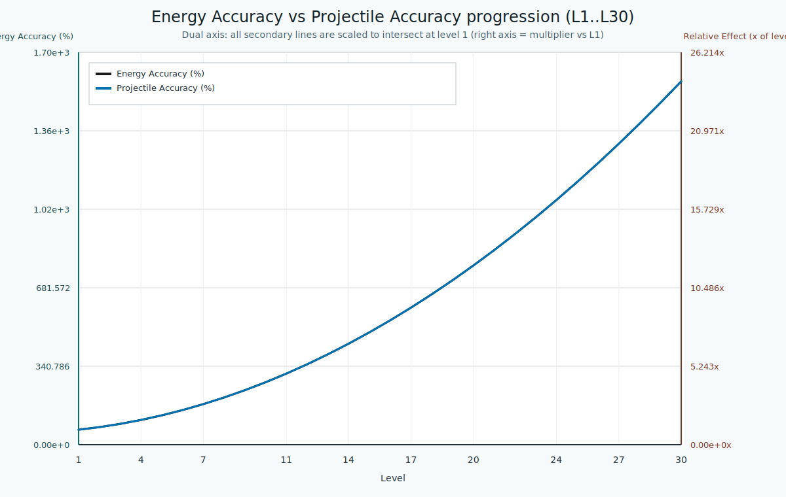

#### Defense Balance

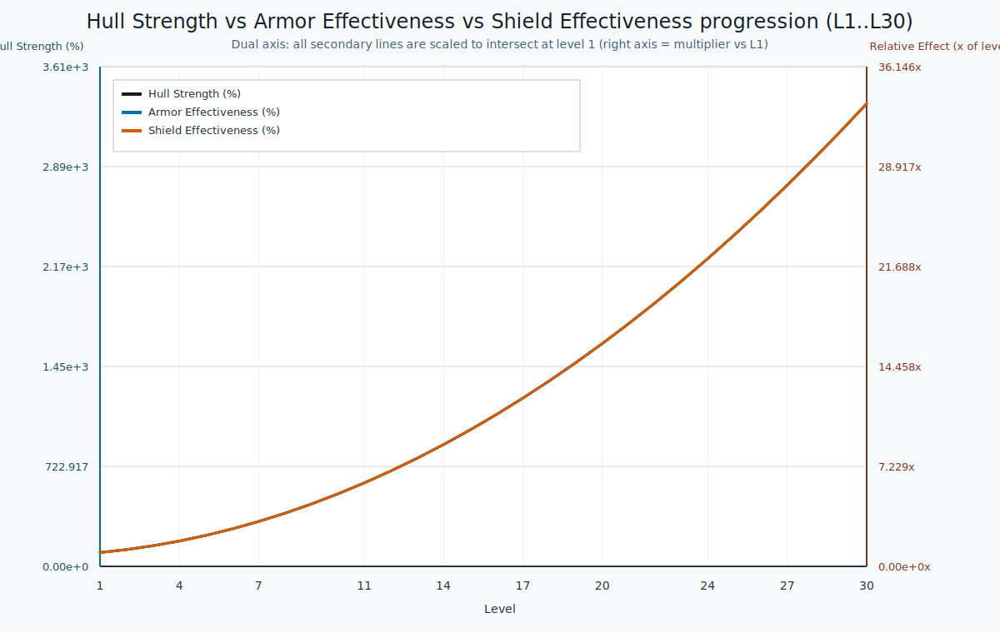

- Shows Hull, Armor, and Shield effectiveness growth
- Helps identify if one defense type dominates

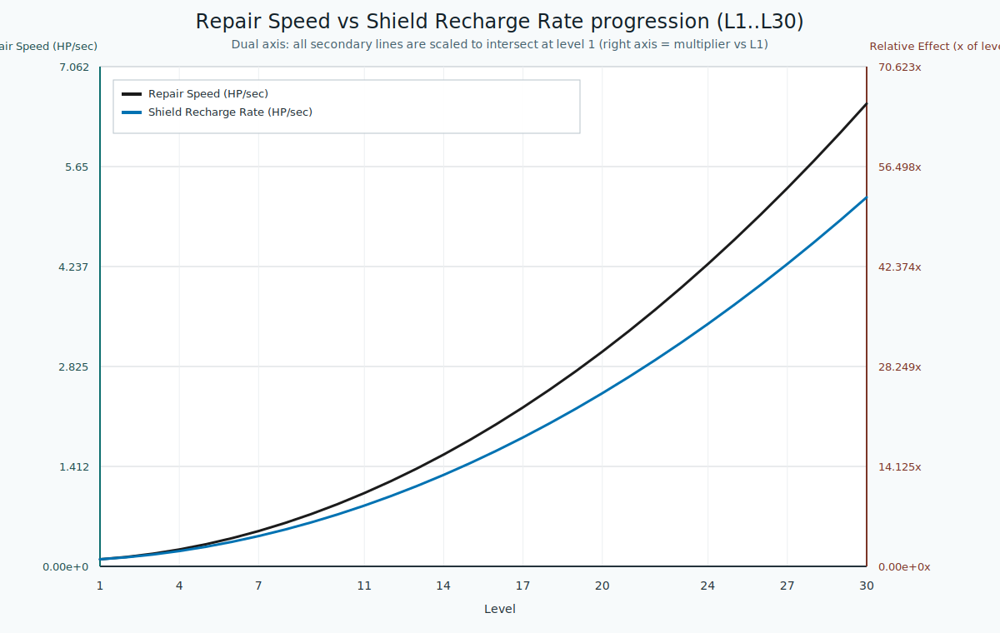

- Repair Speed (hull & armor, out-of-combat only)
- Shield Recharge Rate (continuous, including combat)

#### Offensive vs Defensive

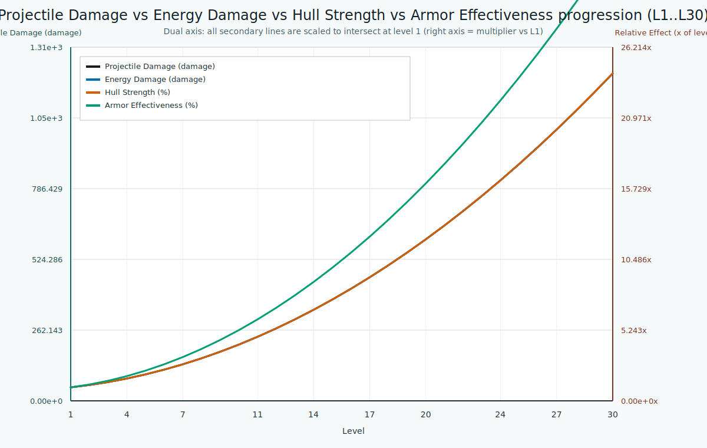

- Compares offensive damage output against defensive scaling
- Critical for assessing overall game balance

#### Economy

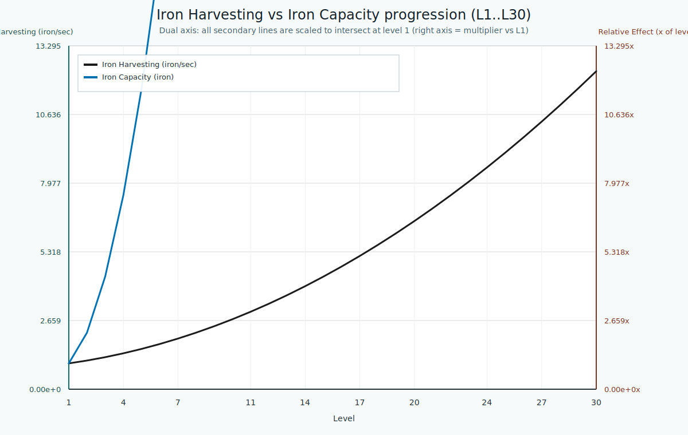

- Shows balance between iron generation and storage limits
- Identifies progression pacing and resource bottlenecks

#### Mobility

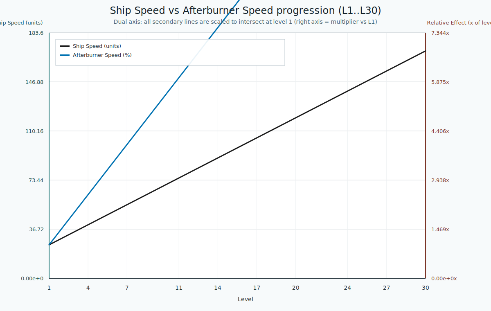

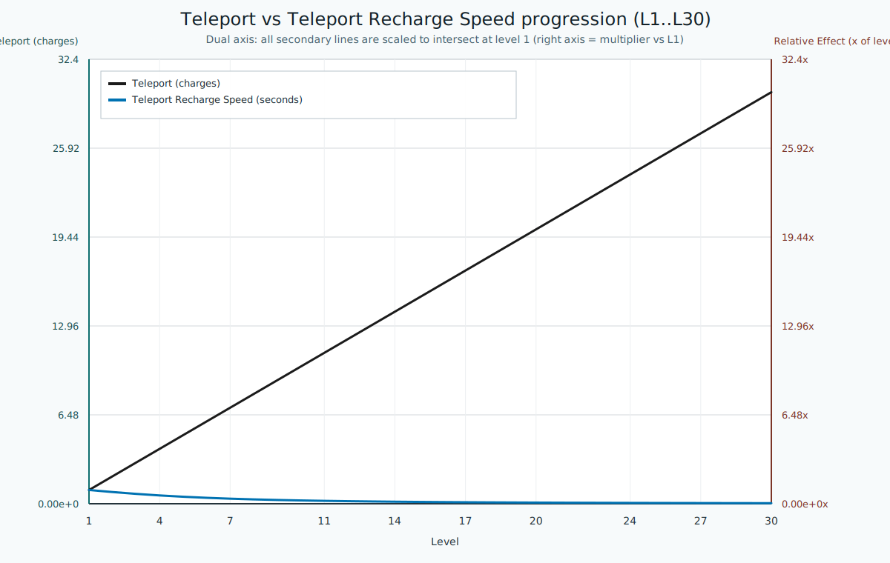

---

## Balancing Analysis Topics

### Dual-Axis Charts

When comparing two different researches, charts use dual-axis scaling to show relative growth patterns:

- **Primary line** (left axis): Direct effect value
- **Secondary lines** (right axis): Scaled to intersect at level 1 for easy comparison
- This reveals whether technologies scale at similar rates or diverge over time

### Progression Pacing

The XP requirements per level show how quickly players advance:

- **Early game** (Levels 1-3): Rapid progression (1-6K XP/level)
- **Mid game** (Levels 4-7): Moderate pacing (10-21K XP/level)
- **Late game** (Levels 8+): Slower progression (28+ K XP/level)

Strategic research investments should account for when they become available and how long they take to acquire.

### Research Synergies

Certain research combinations create multiplicative effects:

- **Damage Stacking**: ProjectileDamage × Accuracy × ReloadRate
- **Defense Stacking**: HullStrength × ArmorEffectiveness × ShieldEffectiveness + RepairSpeed/RechargeRate
- **Economy Loops**: IronHarvesting × IronCapacity allows faster research cycles

---

## Data Generation

To regenerate all balancing charts and data:

```bash
npm run balancing-charts
```

To generate charts for specific research:

```bash
npm run techtree-chart -- --research ShipSpeed --research ProjectileDamage --min 1 --max 30
```

To calculate battle progression for different level ranges:

```bash
npx tsx scripts/calculate-battle-progression.ts
```

---

## References

- [Cap11: Balancing & Progression](../functional-requirements.md#cap11-balancing--progression)
- [Cap06: Research & Technology Tree](../functional-requirements.md#cap06-research--technology-tree)
- [Cap05: Combat System](../functional-requirements.md#cap05-combat-system)
- [Chart Index](./balancing/CHART-INDEX.md)
