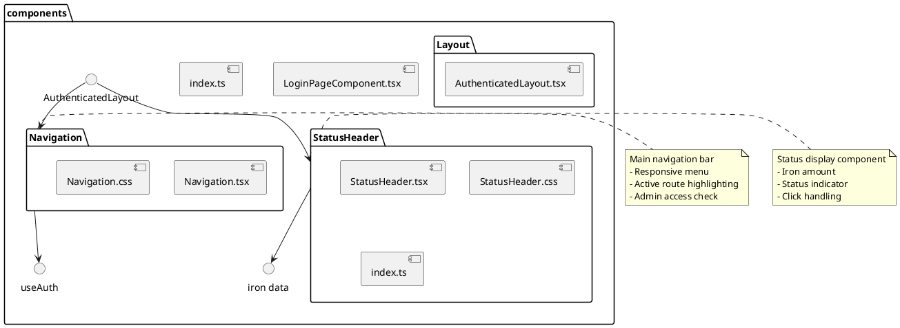

# components Package

## Overview
Contains reusable React UI components used across multiple pages. These components handle navigation, authentication layout, status display, and common UI patterns. Built with React and Next.js App Router patterns.

## Responsibilities
- Provide reusable UI components for the application
- Handle navigation and routing UI
- Display game status information (iron, research)
- Provide layout wrapper for authenticated pages
- Manage responsive design patterns
- Integrate with authentication and game state hooks

## Decomposition



### Package Structure
- **Navigation/** - Main navigation component
- **StatusHeader/** - Status display component  
- **Layout/** - Layout wrappers
- Root level: Shared components

### Source Files
- [Navigation/Navigation.tsx](../src/components/Navigation/Navigation.tsx) - Navigation bar
- [Navigation/Navigation.css](../src/components/Navigation/Navigation.css) - Navigation styles
- [StatusHeader/StatusHeader.tsx](../src/components/StatusHeader/StatusHeader.tsx) - Status header
- [StatusHeader/StatusHeader.css](../src/components/StatusHeader/StatusHeader.css) - Status styles
- [StatusHeader/index.ts](../src/components/StatusHeader/index.ts) - Barrel export
- [Layout/AuthenticatedLayout.tsx](../src/components/Layout/AuthenticatedLayout.tsx) - Auth layout wrapper
- [LoginPageComponent.tsx](../src/components/LoginPageComponent.tsx) - Login form component
- [index.ts](../src/components/index.ts) - Package barrel export

## Rationale
Organizing components by feature/function provides:
- **Reusability**: Components used across multiple pages
- **Maintainability**: Each component has single, clear purpose
- **Consistency**: Common UI patterns centralized
- **Colocation**: Related files (component + styles) grouped together
- **Testability**: Components can be tested in isolation
- **Scalability**: Easy to add new components

## Constraints, Assumptions, Consequences, Known Issues

**Assumptions:**
- Components are client-side ('use client' directive)
- React Hooks available (useState, useEffect, etc.)
- Next.js routing (usePathname, Link)
- Authentication context available via useAuth hook
- CSS modules or global CSS for styling

**Consequences:**
- Components cannot be server components (client-side state)
- Must handle loading and error states
- Must be responsive across device sizes

**Known Issues:**
- n/a

## Details

### Navigation/Navigation.tsx
**Role:** Main navigation bar with responsive menu, active route highlighting, and logout functionality.

**Features:**
- Responsive hamburger menu for mobile
- Active route highlighting
- Conditional rendering based on authentication
- Admin-only menu items (for users 'a' and 'q')
- Logout handler

**Menu Items:**
- Home
- Game
- Research
- Factory
- Profile
- About
- Admin (conditional)
- Logout button

**Top 5 Collaborations:**
1. **useAuth hook** (`hooks/useAuth.ts`) - Get auth state and username
2. **Next.js Link** - Navigation routing
3. **usePathname** - Active route detection
4. **Layout** (`app/layout.tsx`) - Rendered in root layout
5. **Navigation.css** - Styling

**State:**
- `isMenuOpen: boolean` - Mobile menu toggle state

**Props:**
- `onLogout: () => void` - Logout callback

**Responsive Design:**
- Desktop: Horizontal navigation bar
- Mobile: Hamburger menu with slide-out drawer

---

### StatusHeader/StatusHeader.tsx
**Role:** Displays game status information including iron amount and a color-coded status indicator.

**Features:**
- Iron amount display with number formatting
- Color-coded status indicator (grey/yellow/green/red)
- Optional loading state
- Optional click handler for status
- Tooltip support

**Props:**
- `ironAmount: number` - Current iron amount
- `statusIndicator: StatusIndicator` - Status color
- `isLoading?: boolean` - Loading state
- `onStatusClick?: () => void` - Click handler
- `statusTooltip?: string` - Tooltip text
- `isClickable?: boolean` - Enable click interaction

**Status Indicators:**
- Grey: Neutral/default state
- Yellow: Warning/attention needed
- Green: Active/success
- Red: Error/critical

**Top 5 Collaborations:**
1. **useIron hook** (`hooks/useIron.ts`) - Iron amount data
2. **Page components** - Rendered on authenticated pages
3. **AuthenticatedLayout** - Included in layout
4. **StatusHeader.css** - Styling
5. **Number formatting** - toLocaleString for readability

**Usage Example:**
```tsx
<StatusHeader
  ironAmount={1234}
  statusIndicator="green"
  statusTooltip="Research active"
  onStatusClick={handleStatusClick}
  isClickable={true}
/>
```

---

### StatusHeader/index.ts
**Role:** Barrel export for StatusHeader component.

**Exports:**
- StatusHeader component
- StatusIndicator type

---

### Layout/AuthenticatedLayout.tsx
**Role:** Layout wrapper for authenticated pages, providing consistent navigation and status header.

**Features:**
- Wraps page content with navigation and status header
- Provides consistent layout structure
- Handles iron data fetching
- Manages research status
- Integrates with authentication

**Top 5 Collaborations:**
1. **Navigation component** - Renders navigation bar
2. **StatusHeader component** - Renders status header
3. **useAuth hook** - Check authentication
4. **useIron hook** - Fetch iron data
5. **useResearchStatus hook** - Get research status

**Layout Structure:**
```
<div>
  <Navigation />
  <StatusHeader />
  <main>
    {children}
  </main>
</div>
```

**Props:**
- `children: React.ReactNode` - Page content

---

### LoginPageComponent.tsx
**Role:** Login/register form component with input validation and error handling.

**Features:**
- Username/password inputs
- Login/register mode toggle
- Form validation
- Error message display
- Loading states
- Accessible form controls

**Top 5 Collaborations:**
1. **useAuth hook** - Login/register operations
2. **authService** - API calls
3. **Login page** (`app/login/page.tsx`) - Rendered by page
4. **Next.js router** - Redirect after login
5. **Form validation** - Client-side validation

**State:**
- `username: string` - Username input
- `password: string` - Password input
- `isRegistering: boolean` - Mode toggle
- `error: string | null` - Error message
- `isLoading: boolean` - Loading state

---

### index.ts
**Role:** Main package barrel export.

**Exports:**
- Navigation component
- StatusHeader component
- AuthenticatedLayout component
- LoginPageComponent component

**Usage:**
```typescript
import { Navigation, StatusHeader } from '@/components';
```

## Sub-Packages

### Navigation Package
See [Navigation details above](#navigationnavigationtsx)

**Files:**
- Navigation.tsx - Component
- Navigation.css - Styles

**Responsibilities:**
- Navigation UI
- Responsive menu
- Active route highlighting
- Admin access control

---

### StatusHeader Package
See [StatusHeader details above](#statusheaderstatusheadertsx)

**Files:**
- StatusHeader.tsx - Component
- StatusHeader.css - Styles
- index.ts - Exports

**Responsibilities:**
- Status display
- Iron amount formatting
- Status indicator visualization
- Interactive status handling

---

### Layout Package
See [Layout details above](#layoutauthenticatedlayouttsx)

**Files:**
- AuthenticatedLayout.tsx - Layout component

**Responsibilities:**
- Authenticated page layout
- Navigation integration
- Status header integration
- Consistent page structure
