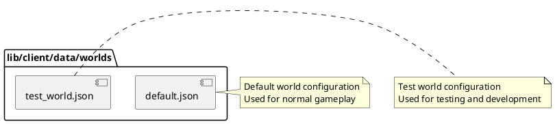

# lib/client/data/worlds Package

## Overview
Contains JSON configuration files that define different world/map configurations for the game. These files specify initial game world states, including world dimensions and starting object placements.

## Responsibilities
- Store world configuration data as JSON files
- Define initial world size and boundaries
- Configure starting positions for game objects
- Support multiple world configurations (default, test)
- Provide static data for world initialization

## Decomposition



### Data Files
- [default.json](../src/lib/client/data/worlds/default.json) - Default world configuration
- [test_world.json](../src/lib/client/data/worlds/test_world.json) - Test world configuration

## Rationale
Storing world configurations as JSON files provides:
- Easy modification without code changes
- Clear separation of data from logic
- Support for multiple world types/levels
- Simple configuration management
- Version control for world designs

## Constraints, Assumptions, Consequences, Known Issues
**Assumptions:**
- World configurations are loaded at runtime
- JSON structure matches expected world data format
- World sizes are specified in game units
- Files are bundled with the client application

**Consequences:**
- Adding new worlds requires creating new JSON files
- Changes to world format require updating all JSON files
- World data is static (not dynamically generated)

**Known Issues:**
- n/a

## Details

### default.json
**Role:** Defines the default world configuration used for normal gameplay.

**Expected Structure** (based on WorldData type):
```json
{
  "worldSize": {
    "width": number,
    "height": number
  },
  "spaceObjects": [
    {
      "id": number,
      "type": "asteroid" | "shipwreck" | "escape_pod",
      "x": number,
      "y": number,
      "speed": number,
      "angle": number,
      "value": number
    }
  ]
}
```

**Top 5 Collaborations:**
1. **World class** (`src/lib/client/game/World.ts`) - Loads this configuration
2. **Game initialization** (`src/lib/client/game/Game.ts`) - Uses for world setup
3. **Test setup** - May use for integration tests
4. **World API** (`src/app/api/world/route.ts`) - May reference for initial state
5. **seedData** (`src/lib/server/seedData.ts`) - May sync with server-side initialization

**Purpose:** Provides the standard playing field for the game

---

### test_world.json
**Role:** Defines a world configuration optimized for testing and development.

**Expected Structure:** Same as default.json

**Characteristics:**
- Likely smaller world size for faster testing
- Possibly fewer or specific objects for predictable testing
- May have objects in known positions for test assertions

**Top 5 Collaborations:**
1. **Test suites** (`src/__tests__/`) - Uses for test setup
2. **Development environment** - May use for rapid iteration
3. **World class** - Loads when in test mode
4. **Integration tests** - Uses for predictable scenarios
5. **Renderer tests** - May use for render testing

**Purpose:** Provides controlled environment for testing and development

**Note:** These files are in the client package but may be superseded by server-side world management through the `/api/world` endpoint.
