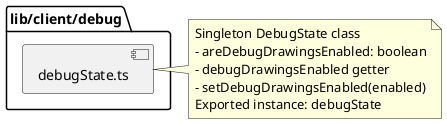

# lib/client/debug Package

## Overview
Provides centralized debug state management for the game client. Controls debug rendering features globally through a singleton pattern, allowing developers to toggle debug visualizations on/off at runtime.

## Responsibilities
- Manage global debug rendering state
- Provide a singleton instance for debug state access
- Control visibility of debug drawings (collision boxes, trajectories, etc.)
- Enable/disable debug features consistently across all renderers

## Decomposition



### Source Files
- [debugState.ts](../src/lib/client/debug/debugState.ts) - Debug state manager singleton

## Rationale
Using a centralized debug state manager provides:
- Single source of truth for debug settings
- Easy to toggle debug features globally
- Singleton pattern ensures consistency across all components
- Simplifies debug UI controls (one place to change, affects all renderers)
- Avoids prop drilling for debug flags

## Constraints, Assumptions, Consequences, Known Issues
**Assumptions:**
- Debug drawings are enabled by default (initialized to `true`)
- Single boolean flag is sufficient for all debug features
- All debug-aware components check this state before rendering debug info

**Consequences:**
- All debug features are controlled by a single flag (no fine-grained control)
- Changing debug state requires accessing the singleton instance
- Debug state is global and affects all game instances (if multiple exist)

**Known Issues:**
- n/a

## Details

### debugState.ts
**Role:** Implements a singleton DebugState class that manages debug rendering flags globally.

**Class: DebugState**
- **Private field:** `areDebugDrawingsEnabled: boolean` - Internal state (default: true)
- **Getter:** `debugDrawingsEnabled: boolean` - Read debug state
- **Method:** `setDebugDrawingsEnabled(enabled: boolean): void` - Update debug state

**Exported:** `debugState` - Singleton instance for application-wide use

**Top 5 Collaborations:**
1. **GameRenderer** (`src/lib/client/renderers/GameRenderer.ts`) - Checks debug state before rendering debug info
2. **SpaceObjectRenderers** (`src/lib/client/renderers/*Renderer.ts`) - Check debug state for collision boxes
3. **InterceptionLineRenderer** (`src/lib/client/renderers/InterceptionLineRenderer.ts`) - Uses for trajectory visualization
4. **Game component** (`src/app/game/GamePageClient.tsx`) - May control debug state via UI
5. **RadarRenderer** (`src/lib/client/renderers/RadarRenderer.ts`) - May use for debug visualization

**Pattern:** Singleton pattern for global state management

**Usage Example:**
```typescript
import { debugState } from '@/lib/client/debug/debugState';

// Check if debug drawings should be rendered
if (debugState.debugDrawingsEnabled) {
  // Render debug info
}

// Toggle debug state
debugState.setDebugDrawingsEnabled(false);
```

**Dependencies:** None

**Used By:** Renderer classes, game components, debug UI controls
