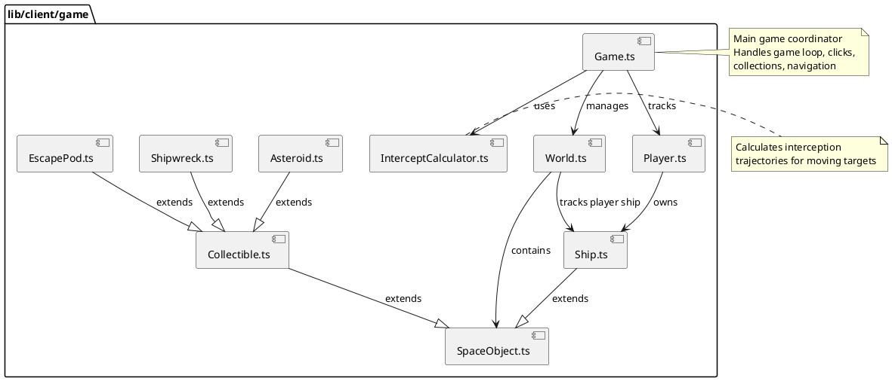

# lib/client/game Package

## Overview
Contains the core client-side game engine classes that manage game state, physics, and game object representations. This package implements the Model layer of the game's MVC architecture, handling game entities, world management, interception calculations, and game loop coordination.

## Responsibilities
- Represent game entities as client-side objects (ships, asteroids, collectibles)
- Manage the game world and object lifecycle
- Coordinate game loop and rendering updates
- Calculate interception trajectories for player targeting
- Handle player interactions (clicks, collections, navigation)
- Synchronize with server-side authoritative state
- Provide game state to renderers

## Decomposition

### Source Files
- [Game.ts](../src/lib/client/game/Game.ts) - Main game coordinator and controller
- [World.ts](../src/lib/client/game/World.ts) - World state and object management
- [Player.ts](../src/lib/client/game/Player.ts) - Player entity management
- [SpaceObject.ts](../src/lib/client/game/SpaceObject.ts) - Base class for all game objects
- [Ship.ts](../src/lib/client/game/Ship.ts) - Ship entity
- [Collectible.ts](../src/lib/client/game/Collectible.ts) - Base class for collectible objects
- [Asteroid.ts](../src/lib/client/game/Asteroid.ts) - Asteroid entity
- [Shipwreck.ts](../src/lib/client/game/Shipwreck.ts) - Shipwreck entity
- [EscapePod.ts](../src/lib/client/game/EscapePod.ts) - Escape pod entity
- [InterceptCalculator.ts](../src/lib/client/game/InterceptCalculator.ts) - Trajectory calculations

## Rationale
This package implements a **server-authoritative architecture** where:
- Server maintains the authoritative game state
- Client models represent the latest known server state
- No client-side physics simulation (removed to prevent desync)
- All state changes go through server API calls
- Client focuses on visualization and interaction

This design ensures:
- No client-server desynchronization issues
- Simplified client logic (no complex state reconciliation)
- Single source of truth (server)
- Easy to reason about and debug

## Constraints, Assumptions, Consequences, Known Issues

**Assumptions:**
- Server provides authoritative WorldData via API
- All angles are in degrees (0-360)
- Position updates come from server, not calculated client-side
- Toroidal world (objects wrap at boundaries)
- All game objects have unique IDs from server

**Consequences:**
- Network latency affects perceived responsiveness
- Client must poll or receive updates from server regularly
- Client-side prediction not implemented (trade-off for simplicity)
- Smoother experience requires efficient server polling

**Constraints:**
- Canvas-based rendering (HTML5 Canvas API)
- Must handle mouse coordinates correctly across different canvas scales
- Must synchronize with server time for consistent state

**Known Issues:**
- Client-side physics removed (see comments in code) - all physics now server-side
- Some legacy code marked with TODOs for cleanup
- World has static dimensions (WIDTH/HEIGHT) that may need to be dynamic

## Details

### Game.ts
**Role:** Main game coordinator that orchestrates the game loop, handles user input, manages rendering, and coordinates interactions between game entities.

**Key Responsibilities:**
- Initialize and manage World and Renderer instances
- Handle canvas click events for navigation and collection
- Calculate and display targeting/interception lines
- Trigger collection API calls when objects are in range
- Trigger navigation API calls for setting ship direction
- Manage game loop (start/stop/render)
- Update hover states for UI feedback
- Coordinate with server through service layer

**Top 5 Collaborations:**
1. **GameRenderer** (`renderers/GameRenderer.ts`) - Renders game state to canvas
2. **World** (`World.ts`) - Manages game world and objects
3. **navigationService** (`services/navigationService.ts`) - API calls for ship navigation
4. **collectionService** (`services/collectionService.ts`) - API calls for collecting objects
5. **InterceptCalculator** (`InterceptCalculator.ts`) - Calculates interception trajectories

**Key Methods:**
- `constructor(canvas)` - Initialize game with canvas
- `handleClick(event)` - Process player clicks for navigation/collection
- `handleCollection(object)` - Attempt to collect nearby object
- `handleInterception(object)` - Calculate and execute interception navigation
- `start()` - Start game loop
- `stop()` - Stop game loop
- `render(timestamp)` - Render frame

---

### World.ts
**Role:** Manages the game world state, including all space objects and world boundaries. Acts as a singleton container for the game state.

**Key Responsibilities:**
- Store and manage all SpaceObject instances
- Track player ship and other ships
- Update objects from server data (WorldData)
- Handle hover detection for mouse interactions
- Manage world dimensions (toroidal world bounds)
- Factory pattern for creating typed objects from server data

**Top 5 Collaborations:**
1. **Game** (`Game.ts`) - Provides world state
2. **GameRenderer** (`renderers/GameRenderer.ts`) - Provides objects to render
3. **SpaceObject subclasses** - Creates and manages instances
4. **worldDataService** (`services/worldDataService.ts`) - Receives server updates
5. **Player** (`Player.ts`) - Manages player entity

**Key Methods:**
- `getInstance()` - Get singleton instance
- `updateFromWorldData(worldData)` - Sync with server state
- `getSpaceObjects()` - Get all objects
- `findHoveredObject()` - Detect object under mouse
- `updateAllHoverStates(mouseX, mouseY)` - Update UI hover states

---

### SpaceObject.ts (SpaceObjectOld)
**Role:** Abstract base class for all game entities. Wraps server data (SharedSpaceObject) and provides consistent interface for accessing object properties.

**Key Responsibilities:**
- Wrap server data structure
- Provide getters/setters for position, angle, speed
- Convert between degrees and radians for angles
- Track hover state for UI interaction
- Update from server data

**Top 5 Collaborations:**
1. **Ship, Collectible** - Extended by all entity types
2. **World** (`World.ts`) - Managed as collection
3. **Server data types** (`@shared/types/gameTypes`) - Wraps SharedSpaceObject
4. **Renderers** - Provides data for rendering
5. **InterceptCalculator** - Provides data for calculations

**Key Properties:**
- `serverData: SharedSpaceObject` - Server-authoritative data
- `isHovered: boolean` - UI interaction state
- `HOVER_RADIUS = 20` - Detection radius for hover

---

### InterceptCalculator.ts
**Role:** Provides static utility methods for calculating interception trajectories. Solves the problem of "where should the ship aim to intercept a moving target?"

**Key Responsibilities:**
- Calculate interception angle for moving targets
- Handle toroidal world wrapping in calculations
- Find optimal interception point considering world wrap
- Calculate time to intercept
- Provide visualization data (global coordinates)

**Top 5 Collaborations:**
1. **Game** (`Game.ts`) - Called when player clicks on moving object
2. **SpaceObject** - Uses object position/velocity data
3. **angleUtils** (`@shared/utils/angleUtils`) - Converts between angle units
4. **World** - Uses world boundaries for toroidal calculations
5. **InterceptionLineRenderer** (`renderers/InterceptionLineRenderer.ts`) - Provides visualization data

**Key Method:**
- `calculateInterceptAngle(ship, target, maxSpeed?): InterceptResult` - Main calculation
  - Returns angle (degrees), intercept point, time to intercept, global coordinates
  - Handles 9 possible target wrap positions (toroidal world)
  - Finds closest valid interception point

---

### Player.ts
**Role:** Represents the player entity, managing the player's ship and providing player-specific functionality.

**Key Responsibilities:**
- Own and manage player's Ship
- Handle collection events (legacy - now server-side)
- Provide player-specific state

**Top 5 Collaborations:**
1. **Ship** (`Ship.ts`) - Owns player's ship
2. **World** (`World.ts`) - Player managed by world
3. **Game** (`Game.ts`) - Player tracked by game
4. **Collectible** - Interface for collection (legacy)
5. **collectionService** - Collection now handled by service

**Note:** Simple wrapper class, may be considered for refactoring as most logic moved to server.

---

### Ship.ts
**Role:** Represents a ship entity (player or NPC). Extends SpaceObject with ship-specific behavior.

**Currently:** Minimal implementation - placeholder for future ship-specific features.

**Top 5 Collaborations:**
1. **SpaceObject** (`SpaceObject.ts`) - Extends base class
2. **Player** (`Player.ts`) - Owned by player
3. **World** (`World.ts`) - Managed as special object type
4. **PlayerShipRenderer** (`renderers/PlayerShipRenderer.ts`) - Rendered specially
5. **navigationService** - Navigation commands target ship

---

### Collectible.ts
**Role:** Abstract base class for collectible objects (asteroids, shipwrecks, escape pods). Extends SpaceObject with value tracking.

**Key Responsibilities:**
- Store collectible value
- Provide value accessor
- Common base for all collectible types

**Top 5 Collaborations:**
1. **SpaceObject** (`SpaceObject.ts`) - Extends base class
2. **Asteroid, Shipwreck, EscapePod** - Extended by concrete types
3. **collectionService** - Collected via service
4. **Game** - Collection detection and triggering
5. **Renderers** - Rendered with type-specific renderers

---

### Asteroid.ts, Shipwreck.ts, EscapePod.ts
**Role:** Concrete collectible types. Simple extensions of Collectible with type-specific server data.

**Pattern:** Minimal subclasses that primarily serve as type markers and receive type-specific SharedObject data.

**Top 5 Collaborations:**
1. **Collectible** (`Collectible.ts`) - Extends base
2. **World** (`World.ts`) - Created by world factory
3. **Type-specific renderers** - Rendered with custom appearance
4. **Server data types** (`@shared/types/gameTypes`) - Use specific interfaces
5. **collectionService** - Collected with type information
