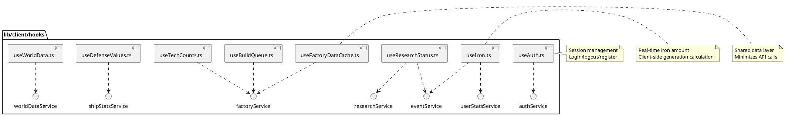

# lib/client/hooks Package

## Overview
Provides custom React hooks that encapsulate client-side state management, API integration, and real-time data synchronization. These hooks follow the React Hooks pattern to provide reusable, composable state logic for game features like authentication, resources, research, and factory systems.

## Responsibilities
- Manage authentication state and session lifecycle
- Poll server for real-time game data (iron, research, factory status)
- Provide optimistic UI updates with client-side calculations
- Handle loading states and error recovery
- Coordinate with event system for cross-component updates
- Implement retry logic for network failures
- Cache factory data to minimize API calls

## Decomposition

### Source Files
- [useAuth.ts](../src/lib/client/hooks/useAuth.ts) - Authentication and session management
- [useIron.ts](../src/lib/client/hooks/useIron.ts) - Iron resource tracking with real-time updates
- [useResearchStatus.ts](../src/lib/client/hooks/useResearchStatus.ts) - Research system state
- [useBuildQueue.ts](../src/lib/client/hooks/useBuildQueue.ts) - Factory build queue management
- [useTechCounts.ts](../src/lib/client/hooks/useTechCounts.ts) - Technology counts and catalog
- [useFactoryDataCache.ts](../src/lib/client/hooks/useFactoryDataCache.ts) - Shared factory data cache
- [useDefenseValues.ts](../src/lib/client/hooks/useDefenseValues.ts) - Defense values with regeneration
- [useWorldData.ts](../src/lib/client/hooks/useWorldData.ts) - Game world data polling

## Rationale
Custom hooks provide:
- **Reusability**: Same state logic across multiple components
- **Separation of Concerns**: Business logic separate from UI
- **Testability**: Hooks can be tested in isolation
- **Composability**: Hooks can use other hooks
- **Performance**: Shared data patterns reduce redundant API calls
- **Real-time Feel**: Client-side calculations between server polls

The architecture uses a polling-based approach with client-side optimistic updates:
1. Poll server at intervals (e.g., every 5 seconds)
2. Calculate intermediate values client-side (e.g., iron generation)
3. Display smooth, real-time updates to user
4. Re-sync with server on next poll

## Constraints, Assumptions, Consequences, Known Issues

**Assumptions:**
- Server endpoints are available and return expected data structures
- Network latency is reasonable (<1s typical)
- Browser supports modern React features (Hooks, useEffect, useRef)
- Component lifecycle managed properly (cleanup on unmount)

**Consequences:**
- Network failures require retry logic
- Polling creates periodic API load
- Client calculations must match server formulas
- More complex than simple fetch-and-display

**Constraints:**
- Must handle component unmount to prevent memory leaks
- Must prevent multiple simultaneous polls
- Must coordinate updates across multiple hook instances

**Known Issues:**
- Polling approach can miss immediate updates (trade-off vs WebSockets complexity)
- Clock drift between client/server may cause slight inaccuracies

## Details

### useAuth.ts
**Role:** Manages authentication state, login/logout/register operations, and session verification.

**State:**
- `isLoggedIn: boolean` - Authentication status
- `username: string | null` - Logged-in username
- `shipId: number | null` - User's ship ID
- `isLoading: boolean` - Loading state

**Key Functions:**
- `checkAuthStatus()` - Verify session with server
- `login(username, password)` - Authenticate user
- `register(username, password)` - Create new account
- `logout()` - End session

**Top 5 Collaborations:**
1. **authService** (`services/authService.ts`) - API calls
2. **Layout components** (`components/Layout/*`) - Auth state for UI
3. **Login page** (`app/login/page.tsx`) - Login form
4. **Navigation** (`components/Navigation/Navigation.tsx`) - Show/hide based on auth
5. **All protected pages** - Gate access based on auth state

**Pattern:** State management hook with async operations

---

### useIron.ts
**Role:** Tracks user's iron resource with real-time client-side updates between server polls.

**Strategy:**
1. Poll server every 5 seconds for authoritative iron amount and generation rate
2. Calculate intermediate values client-side: `iron = serverIron + (ironPerSecond * timeSinceLastUpdate)`
3. Update display every 100ms for smooth animation
4. Re-sync with server on each poll

**State:**
- `serverIronAmount` - Last known server value
- `ironPerSecond` - Generation rate from server
- `displayIronAmount` - Calculated client-side value
- `lastServerUpdate` - Timestamp of last server sync

**Top 5 Collaborations:**
1. **userStatsService** (`services/userStatsService.ts`) - Fetch iron data
2. **eventService** (`services/eventService.ts`) - Listen for iron change events
3. **StatusHeader** (`components/StatusHeader/StatusHeader.tsx`) - Display iron amount
4. **Factory/Research pages** - Show available resources
5. **Home page** - Display user stats

**Performance:** Display interval (100ms) separate from poll interval (5000ms)

---

### useResearchStatus.ts
**Role:** Tracks active research status, progress, and completion.

**State:**
- `isResearchActive: boolean` - Is research in progress
- `currentResearch` - Active research details
- `progress` - Completion percentage
- `estimatedTimeRemaining` - Time until completion

**Top 5 Collaborations:**
1. **researchService** (`services/researchService.ts`) - Fetch research state
2. **eventService** - Listen for research completion events
3. **Research page** (`app/research/*`) - Display research UI
4. **StatusHeader** - Show research indicator
5. **useIron** - Research consumes iron

**Pattern:** Polling hook with event-based updates

---

### useBuildQueue.ts
**Role:** Manages factory build queue state.

**State:**
- `buildQueue` - List of items being built
- `isLoading` - Loading state
- `error` - Error state

**Functions:**
- `buildItem(itemId)` - Add item to build queue
- `refetch()` - Manually refresh queue

**Top 5 Collaborations:**
1. **factoryService** (`services/factoryService.ts`) - API calls
2. **Factory page** (`app/factory/*`) - Display and manage queue
3. **useFactoryDataCache** - Uses shared cache
4. **eventService** - Emit queue change events
5. **useIron** - Building consumes iron

---

### useTechCounts.ts
**Role:** Tracks technology counts (weapons, defenses, etc.) and provides tech catalog.

**State:**
- `techCounts` - Current counts of each tech type
- `weapons` - Available weapons catalog
- `defenses` - Available defenses catalog

**Top 5 Collaborations:**
1. **factoryService** (`services/factoryService.ts`) - Fetch tech data
2. **useFactoryDataCache** - Uses shared cache
3. **Factory page** - Display available technologies
4. **Profile page** - Show user's tech inventory
5. **useDefenseValues** - Defense values depend on tech counts

---

### useFactoryDataCache.ts
**Role:** Shared data cache for factory-related data to minimize redundant API calls.

**Pattern:** Shared hook pattern
- Multiple components can use same cache instance
- Single API call serves multiple hooks
- Cache invalidation on mutations

**Data Cached:**
- Tech catalog (weapons, defenses)
- Tech counts
- Build status

**Top 5 Collaborations:**
1. **useTechCounts** - Reads from cache
2. **useBuildQueue** - Reads from cache
3. **factoryService** - Populates cache
4. **Factory page components** - Multiple components share cache
5. **eventService** - Invalidate cache on changes

**Performance Benefit:** Reduces API calls from N (per component) to 1 (shared)

---

### useDefenseValues.ts
**Role:** Calculates and displays defense values (hull, armor, shields) with client-side regeneration.

**State:**
- `hull` - Current/max hull values
- `armor` - Current/max armor values
- `shields` - Current/max shields values
- `regenRate` - Regeneration per second

**Strategy:**
- Fetch base values from server
- Calculate max values: `max = 100 * tech_count`
- Simulate regeneration client-side: `current += regenRate * deltaTime`
- Clamp to max values

**Top 5 Collaborations:**
1. **shipStatsService** (`services/shipStatsService.ts`) - Fetch defense data
2. **Home page** (`app/home/*`) - Display defense stats
3. **useTechCounts** - Tech counts affect max values
4. **StatusHeader** - May show defense indicator
5. **TechFactory** (`server/TechFactory.ts`) - Server-side calculations

**Note:** Currently uses hardcoded values (max/2, 1/sec regen) pending database persistence

---

### useWorldData.ts
**Role:** Polls game world data for the game canvas.

**State:**
- `worldData` - Current world state (objects, positions)
- `lastUpdateTime` - Timestamp of last update
- `isLoading` - Loading state

**Top 5 Collaborations:**
1. **worldDataService** (`services/worldDataService.ts`) - Fetch world state
2. **Game** (`game/Game.ts`) - Updates world from this data
3. **World** (`game/World.ts`) - Applies world updates
4. **Game page** (`app/game/*`) - Provides world to canvas
5. **navigationService** - Navigation changes world state

**Polling:** Continuous polling (every 1-2 seconds) for smooth game updates
