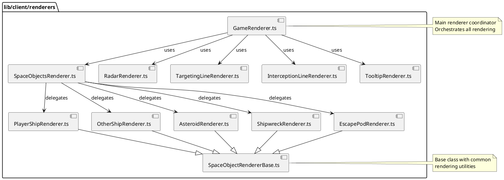

# lib/client/renderers Package

## Overview
Contains specialized renderer classes that handle drawing game elements to the HTML5 Canvas. Each renderer is responsible for a specific visual aspect of the game, following the Single Responsibility Principle. Uses composition to build the complete game visualization.

## Responsibilities
- Render game objects (ships, asteroids, collectibles) to canvas
- Draw UI elements (radar, tooltips, targeting lines)
- Handle coordinate transformations (world to screen, toroidal wrapping)
- Apply visual effects and debug visualizations
- Maintain consistent visual style across game elements
- Optimize rendering performance

## Decomposition

### Source Files
- [GameRenderer.ts](../src/lib/client/renderers/GameRenderer.ts) - Main rendering coordinator
- [SpaceObjectsRenderer.ts](../src/lib/client/renderers/SpaceObjectsRenderer.ts) - Object rendering dispatcher
- [SpaceObjectRendererBase.ts](../src/lib/client/renderers/SpaceObjectRendererBase.ts) - Base renderer class
- [PlayerShipRenderer.ts](../src/lib/client/renderers/PlayerShipRenderer.ts) - Player ship visualization
- [OtherShipRenderer.ts](../src/lib/client/renderers/OtherShipRenderer.ts) - NPC ship visualization
- [AsteroidRenderer.ts](../src/lib/client/renderers/AsteroidRenderer.ts) - Asteroid visualization
- [ShipwreckRenderer.ts](../src/lib/client/renderers/ShipwreckRenderer.ts) - Shipwreck visualization
- [EscapePodRenderer.ts](../src/lib/client/renderers/EscapePodRenderer.ts) - Escape pod visualization
- [RadarRenderer.ts](../src/lib/client/renderers/RadarRenderer.ts) - Radar/minimap display
- [TargetingLineRenderer.ts](../src/lib/client/renderers/TargetingLineRenderer.ts) - Click target visualization
- [InterceptionLineRenderer.ts](../src/lib/client/renderers/InterceptionLineRenderer.ts) - Intercept path visualization
- [TooltipRenderer.ts](../src/lib/client/renderers/TooltipRenderer.ts) - Hover tooltip display

## Rationale
Separating rendering into specialized classes provides:
- **Maintainability**: Each renderer has a single, clear purpose
- **Testability**: Renderers can be tested independently
- **Extensibility**: Easy to add new object types or visual effects
- **Performance**: Can optimize specific renderers without affecting others
- **Reusability**: Common patterns extracted to base class
- **Separation of Concerns**: Rendering logic separate from game logic

The architecture uses **composition over inheritance**:
- GameRenderer composes multiple specialized renderers
- Each renderer focuses on one visual aspect
- Base class provides common utilities, not extensive behavior

## Constraints, Assumptions, Consequences, Known Issues

**Assumptions:**
- Canvas 2D context is available
- World uses toroidal topology (wrapping edges)
- Coordinate system: (0,0) at top-left, positive Y downward
- All angles in degrees (converted to radians for Math functions)
- Debug mode controlled by global debugState

**Consequences:**
- Adding new object types requires new renderer class
- Coordinate transformation logic must be consistent across renderers
- Canvas state (save/restore) must be managed carefully
- Performance sensitive - called 60fps

**Constraints:**
- Must handle toroidal wrapping (objects visible at multiple screen positions)
- Must support various canvas sizes (responsive design)
- Must maintain visual consistency across object types

**Known Issues:**
- n/a

## Details

### GameRenderer.ts
**Role:** Main rendering coordinator that orchestrates all visual elements and manages the overall rendering pipeline.

**Key Responsibilities:**
- Clear canvas each frame
- Coordinate all sub-renderers
- Render background and grid (if debug)
- Delegate object rendering to SpaceObjectsRenderer
- Render UI overlays (radar, tooltips, targeting lines)
- Manage rendering order (background → objects → UI)

**Top 5 Collaborations:**
1. **Game** (`game/Game.ts`) - Called by game loop
2. **SpaceObjectsRenderer** - Delegates object rendering
3. **RadarRenderer** - Renders minimap
4. **TooltipRenderer** - Renders hover tooltips
5. **World** (`game/World.ts`) - Gets objects to render

**Rendering Order:**
1. Clear canvas
2. Draw background/grid
3. Render all game objects (via SpaceObjectsRenderer)
4. Render targeting lines
5. Render interception lines
6. Render radar
7. Render tooltips

---

### SpaceObjectsRenderer.ts
**Role:** Dispatcher that routes object rendering to appropriate specialized renderers based on object type.

**Pattern:** Strategy/Visitor pattern - selects renderer based on object type

**Key Responsibilities:**
- Maintain map of object types to renderers
- Dispatch rendering to appropriate renderer
- Handle unknown object types gracefully

**Top 5 Collaborations:**
1. **GameRenderer** - Called by main renderer
2. **Type-specific renderers** (PlayerShip, Asteroid, etc.) - Delegates to these
3. **SpaceObject** (`game/SpaceObject.ts`) - Renders these objects
4. **World** - Iterates over world objects
5. **Canvas context** - Provides to renderers

**Renderer Map:**
- `player_ship` → PlayerShipRenderer
- `asteroid` → AsteroidRenderer
- `shipwreck` → ShipwreckRenderer
- `escape_pod` → EscapePodRenderer

---

### SpaceObjectRendererBase.ts
**Role:** Abstract base class providing common rendering utilities and patterns for all object renderers.

**Key Utilities:**
- Coordinate transformation (world to screen)
- Toroidal wrapping calculations
- Common shape drawing (circles, rectangles)
- Debug visualization helpers
- Hover state rendering

**Top 5 Collaborations:**
1. **All object renderers** - Extended by all
2. **Canvas 2D context** - Drawing operations
3. **debugState** (`debug/debugState.ts`) - Checks debug mode
4. **World** - Uses world dimensions
5. **SpaceObject** - Renders these objects

**Common Patterns Provided:**
- `drawCircle(x, y, radius, fillStyle)`
- `drawRotatedShape(x, y, angle, drawFunc)`
- `drawHoverIndicator(x, y)`
- `drawDebugInfo(x, y, object)`

---

### PlayerShipRenderer.ts
**Role:** Renders the player's ship with distinctive visual style (triangle/arrow shape).

**Visual Style:**
- Triangle pointing in direction of travel
- Distinct color (e.g., blue/cyan)
- Larger than other objects
- Hover indication
- Optional debug info (position, angle, speed)

**Top 5 Collaborations:**
1. **SpaceObjectsRenderer** - Called by dispatcher
2. **BaseRenderer** - Extends for utilities
3. **Ship** (`game/Ship.ts`) - Renders ship objects
4. **Canvas context** - Drawing operations
5. **debugState** - Debug visualizations

---

### OtherShipRenderer.ts
**Role:** Renders NPC ships with different visual style from player ship.

**Visual Style:**
- Similar shape to player ship but different color
- Smaller or different visual indicators
- Shows movement direction

**Top 5 Collaborations:**
1. **SpaceObjectsRenderer** - Called by dispatcher
2. **BaseRenderer** - Extends for utilities
3. **Ship** - Renders non-player ships
4. **Canvas context** - Drawing operations
5. **World** - Coordinate system

---

### AsteroidRenderer.ts
**Role:** Renders asteroid objects with rocky appearance.

**Visual Style:**
- Irregular circle/polygon shape
- Gray/brown color scheme
- Size indicates value
- Rotation animation (optional)

**Top 5 Collaborations:**
1. **SpaceObjectsRenderer** - Called by dispatcher
2. **BaseRenderer** - Extends for utilities
3. **Asteroid** (`game/Asteroid.ts`) - Renders asteroids
4. **Canvas context** - Drawing operations
5. **Collectible** - Base type information

---

### ShipwreckRenderer.ts
**Role:** Renders shipwreck collectibles with damaged ship appearance.

**Visual Style:**
- Broken ship shape
- Dark/damaged colors
- Salvage indicator
- Larger than asteroids

**Top 5 Collaborations:**
1. **SpaceObjectsRenderer** - Called by dispatcher
2. **BaseRenderer** - Extends for utilities
3. **Shipwreck** (`game/Shipwreck.ts`) - Renders shipwrecks
4. **Canvas context** - Drawing operations
5. **Collectible** - Base type information

---

### EscapePodRenderer.ts
**Role:** Renders escape pod collectibles with rescue theme.

**Visual Style:**
- Small capsule/pod shape
- Bright color (orange/yellow for visibility)
- Pulsing or blinking animation
- Survivors count indicator

**Top 5 Collaborations:**
1. **SpaceObjectsRenderer** - Called by dispatcher
2. **BaseRenderer** - Extends for utilities
3. **EscapePod** (`game/EscapePod.ts`) - Renders escape pods
4. **Canvas context** - Drawing operations
5. **Collectible** - Base type information

---

### RadarRenderer.ts
**Role:** Renders minimap/radar display showing relative positions of all objects.

**Visual Style:**
- Small overlay in corner of screen
- Simplified representation of world
- Color-coded objects
- Player ship at center or in actual position
- Range indicators

**Top 5 Collaborations:**
1. **GameRenderer** - Composed into main renderer
2. **World** - Gets all object positions
3. **Canvas context** - Drawing operations
4. **Ship** - Centers on player ship
5. **debugState** - Debug information

**Features:**
- Scaled-down world view
- Wrapping visualization
- Distance indicators
- Object filtering (show only nearby)

---

### TargetingLineRenderer.ts
**Role:** Renders visual feedback line from ship to clicked target position.

**Visual Style:**
- Dashed or solid line
- Fades out over time (4 second duration)
- Color indicates interaction type
- Handles toroidal wrapping

**Top 5 Collaborations:**
1. **GameRenderer** - Composed into main renderer
2. **Game** (`game/Game.ts`) - Receives targeting data
3. **Canvas context** - Drawing operations
4. **World** - Coordinate transformations
5. **TargetingLine type** (`@shared/types/gameTypes`) - Data structure

**Animation:**
- Created on click
- Fades linearly over 4 seconds
- Alpha channel for transparency effect

---

### InterceptionLineRenderer.ts
**Role:** Renders interception trajectory visualization showing predicted intercept path.

**Visual Style:**
- Multiple lines: ship→intercept, target→intercept
- Different colors for each line
- Intercept point highlighted
- Time to intercept displayed
- Fades over time

**Top 5 Collaborations:**
1. **GameRenderer** - Composed into main renderer
2. **InterceptCalculator** (`game/InterceptCalculator.ts`) - Calculates paths
3. **Game** - Provides interception data
4. **Canvas context** - Drawing operations
5. **InterceptionLines type** (`@shared/types/gameTypes`) - Data structure

**Features:**
- Shows predicted intercept point
- Visualizes both ship and target paths
- Updates time remaining in real-time
- Handles toroidal coordinate wrapping

---

### TooltipRenderer.ts
**Role:** Renders hover tooltips with object information.

**Visual Style:**
- Small box near mouse cursor
- Object name and type
- Value/stats information
- Semi-transparent background
- Follows mouse with offset

**Top 5 Collaborations:**
1. **GameRenderer** - Composed into main renderer
2. **World** - Gets hovered object
3. **Canvas context** - Drawing operations
4. **SpaceObject** - Gets object data for display
5. **Mouse event handlers** (`Game.ts`) - Positioning

**Information Displayed:**
- Object type
- Value (for collectibles)
- Distance to player
- Additional stats (survivors for escape pods)

**UX Considerations:**
- Offset from cursor to avoid obscuring object
- Auto-hide after no hover for period
- Responsive to mouse movement
