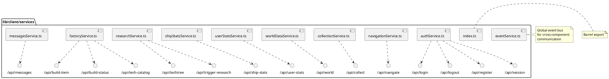

# lib/client/services Package

## Overview
Provides client-side API service layer that abstracts HTTP communication with backend API routes. Each service handles a specific domain (authentication, navigation, resources, etc.) and provides type-safe interfaces for API calls with error handling and consistent response formats.

## Responsibilities
- Abstract fetch API calls to backend endpoints
- Provide type-safe interfaces for API communication
- Handle HTTP errors and network failures
- Format request/response data consistently
- Include credentials (cookies) for authenticated requests
- Provide centralized error handling
- Support both development and production API URLs

## Decomposition



### Source Files
- [authService.ts](../src/lib/client/services/authService.ts) - Authentication API calls
- [navigationService.ts](../src/lib/client/services/navigationService.ts) - Ship navigation API
- [collectionService.ts](../src/lib/client/services/collectionService.ts) - Resource collection API
- [worldDataService.ts](../src/lib/client/services/worldDataService.ts) - Game world data API
- [userStatsService.ts](../src/lib/client/services/userStatsService.ts) - User stats API
- [shipStatsService.ts](../src/lib/client/services/shipStatsService.ts) - Ship stats API
- [researchService.ts](../src/lib/client/services/researchService.ts) - Research system API
- [factoryService.ts](../src/lib/client/services/factoryService.ts) - Factory/build system API
- [messagesService.ts](../src/lib/client/services/messagesService.ts) - Messages/notifications API
- [eventService.ts](../src/lib/client/services/eventService.ts) - Client-side event bus
- [index.ts](../src/lib/client/services/index.ts) - Package exports

## Rationale
Centralizing API calls in service layer provides:
- **Single Responsibility**: Each service handles one domain
- **DRY Principle**: No duplicated fetch logic
- **Type Safety**: TypeScript interfaces for all requests/responses
- **Testability**: Services can be mocked in tests
- **Maintainability**: API changes isolated to service layer
- **Error Handling**: Consistent error handling across all API calls
- **Environment Switching**: Easy development/production URL switching

**Pattern:** Service Layer pattern separating API communication from business logic and UI.

## Constraints, Assumptions, Consequences, Known Issues

**Assumptions:**
- Backend API follows RESTful conventions
- All endpoints return JSON
- Authentication uses HTTP-only cookies (credentials: 'include')
- Network available (with graceful failure handling)
- API base URL determined by NODE_ENV

**Consequences:**
- All API calls go through these services (enforces consistency)
- Changing API contracts requires updating service interfaces
- Network errors must be handled at call site or in services
- Services are client-side only (not used by server)

**Constraints:**
- Must handle CORS correctly (credentials: 'include')
- Must respect HTTP status codes
- Must parse JSON responses safely
- Should handle network timeouts

**Known Issues:**
- No retry logic (except in specific hooks like useIron)
- No request cancellation (potential memory leaks if component unmounts)
- No request caching (handled at hook level instead)

## Details

### authService.ts
**Role:** Handles all authentication-related API calls including login, logout, registration, and session verification.

**API Endpoints:**
- `POST /api/register` - Create new user account
- `POST /api/login` - Authenticate user
- `POST /api/logout` - End session
- `GET /api/session` - Check auth status

**Functions:**
- `register(credentials): Promise<AuthResponse>`
- `login(credentials): Promise<AuthResponse>`
- `logout(): Promise<void>`
- `checkSession(): Promise<SessionResponse>`

**Types:**
- `AuthResponse: { success?: boolean; error?: string }`
- `SessionResponse: { loggedIn: boolean; username?: string; shipId?: number }`
- `LoginCredentials: { username: string; password: string }`

**Top 5 Collaborations:**
1. **useAuth hook** (`hooks/useAuth.ts`) - Primary consumer
2. **Login page** (`app/login/page.tsx`) - Form submission
3. **Navigation component** (`components/Navigation/Navigation.tsx`) - Logout
4. **Layout** (`app/layout.tsx`) - Session check
5. **All protected routes** - Authentication verification

**Error Handling:** Returns error messages in response, catches network errors

---

### navigationService.ts
**Role:** Handles ship navigation commands sent to server.

**API Endpoints:**
- `POST /api/navigate` - Set ship direction
- `POST /api/navigate-typed` - Set ship direction (typed lock version)

**Functions:**
- `setShipDirection(angle, speed): Promise<void>`
- `interceptTarget(targetId, interceptAngle, maxSpeed): Promise<void>`

**Top 5 Collaborations:**
1. **Game** (`game/Game.ts`) - Sends navigation commands
2. **InterceptCalculator** (`game/InterceptCalculator.ts`) - Provides interception angles
3. **useWorldData hook** - Triggers world refresh after navigation
4. **API route** (`app/api/navigate/route.ts`) - Backend endpoint
5. **World class** - World state updated by server

**Pattern:** Fire-and-forget API calls (don't wait for response in some cases)

---

### collectionService.ts
**Role:** Handles resource collection from game objects.

**API Endpoints:**
- `POST /api/collect` - Collect object by ID

**Functions:**
- `collectObject(objectId): Promise<CollectionResponse>`

**Types:**
- `CollectionResponse: { success: boolean; iron?: number; error?: string }`

**Top 5 Collaborations:**
1. **Game** (`game/Game.ts`) - Triggers collection
2. **useIron hook** - Refetch iron after collection
3. **eventService** - Emits collection events
4. **Player** (`game/Player.ts`) - Collection logic
5. **API route** (`app/api/collect/route.ts`) - Backend endpoint

**Pattern:** Returns success/failure with updated iron amount

---

### worldDataService.ts
**Role:** Fetches current game world state from server.

**API Endpoints:**
- `GET /api/world` - Get world data (objects, positions)

**Functions:**
- `getWorldData(): Promise<WorldData>`

**Types:**
- `WorldData: { worldSize, spaceObjects, currentTime }` (from shared types)

**Top 5 Collaborations:**
1. **useWorldData hook** - Polls world data
2. **World class** (`game/World.ts`) - Updates from world data
3. **Game** (`game/Game.ts`) - Displays world state
4. **API route** (`app/api/world/route.ts`) - Backend endpoint
5. **Physics calculations** (`@shared/physics`) - Uses for position updates

**Polling:** Called frequently (1-2s intervals) for real-time game updates

---

### userStatsService.ts
**Role:** Fetches user statistics including iron amount and generation rate.

**API Endpoints:**
- `GET /api/user-stats` - Get user iron and generation rate

**Functions:**
- `getUserStats(): Promise<UserStatsResponse>`

**Types:**
- `UserStatsResponse: { iron: number; ironPerSecond: number } | { error: string }`

**Top 5 Collaborations:**
1. **useIron hook** - Primary consumer
2. **StatusHeader** (`components/StatusHeader/StatusHeader.tsx`) - Displays iron
3. **Factory/Research pages** - Show available resources
4. **API route** (`app/api/user-stats/route.ts`) - Backend endpoint
5. **eventService** - Emits iron change events

**Polling:** Called frequently (5s intervals) for real-time iron updates

---

### shipStatsService.ts
**Role:** Fetches ship statistics including defense values.

**API Endpoints:**
- `GET /api/ship-stats` - Get ship defense values

**Functions:**
- `getShipStats(): Promise<ShipStatsResponse>`

**Types:**
- `ShipStatsResponse: { defenseValues: DefenseValues } | { error: string }`
- `DefenseValues: { hull, armor, shields }` (from shared types)

**Top 5 Collaborations:**
1. **useDefenseValues hook** - Primary consumer
2. **Home page** (`app/home/HomePageClient.tsx`) - Displays defense stats
3. **TechFactory** (`server/TechFactory.ts`) - Server calculations
4. **API route** (`app/api/ship-stats/route.ts`) - Backend endpoint
5. **useTechCounts hook** - Tech counts affect defense values

**Polling:** Called less frequently than iron (e.g., 10s intervals)

---

### researchService.ts
**Role:** Handles research system API calls.

**API Endpoints:**
- `GET /api/techtree` - Get tech tree state and available research
- `POST /api/trigger-research` - Start new research

**Functions:**
- `getTechTree(): Promise<TechTreeResponse>`
- `triggerResearch(techId): Promise<ResearchResponse>`

**Types:**
- `TechTreeResponse: { techTree, availableResearch }`
- `ResearchResponse: { success: boolean; error?: string }`

**Top 5 Collaborations:**
1. **useResearchStatus hook** - Polls research state
2. **Research page** (`app/research/ResearchPageClient.tsx`) - Research UI
3. **eventService** - Emits research events
4. **useIron hook** - Research costs iron
5. **API routes** (`app/api/techtree/`, `app/api/trigger-research/`) - Backend endpoints

---

### factoryService.ts
**Role:** Handles factory/build system API calls.

**API Endpoints:**
- `GET /api/tech-catalog` - Get available weapons/defenses
- `GET /api/build-status` - Get build queue and tech counts
- `POST /api/build-item` - Add item to build queue
- `POST /api/complete-build` - Complete first build (cheat mode)

**Functions:**
- `getTechCatalog(): Promise<TechCatalogResponse>`
- `getBuildStatus(): Promise<BuildStatusResponse>`
- `buildItem(itemId): Promise<BuildResponse>`
- `completeBuild(): Promise<void>`

**Top 5 Collaborations:**
1. **useBuildQueue, useTechCounts hooks** - Primary consumers
2. **useFactoryDataCache hook** - Caches factory data
3. **Factory page** (`app/factory/FactoryPageClient.tsx`) - Factory UI
4. **API routes** (`app/api/build-*`, `app/api/tech-catalog`) - Backend endpoints
5. **useIron hook** - Building costs iron

---

### messagesService.ts
**Role:** Handles user messages and notifications.

**API Endpoints:**
- `GET /api/messages` - Get user messages
- `POST /api/messages` - Send message

**Functions:**
- `getMessages(): Promise<Message[]>`
- `sendMessage(content): Promise<void>`

**Top 5 Collaborations:**
1. **Messages components/pages** - Display messages
2. **API route** (`app/api/messages/route.ts`) - Backend endpoint
3. **eventService** - Emit message events
4. **StatusHeader** - May show message notifications
5. **Admin page** - Admin messages

**Note:** Currently basic implementation, may be extended for notifications

---

### eventService.ts
**Role:** Provides client-side event bus for cross-component communication without prop drilling.

**Pattern:** Observer/PubSub pattern

**Events:**
- `IRON_CHANGED` - Iron amount updated
- `RESEARCH_COMPLETED` - Research finished
- `COLLECTION_SUCCESS` - Object collected
- `BUILD_COMPLETED` - Factory build finished
- `NAVIGATION_CHANGED` - Ship navigation updated

**API:**
- `globalEvents.emit(event, data)` - Emit event
- `globalEvents.on(event, handler)` - Subscribe to event
- `globalEvents.off(event, handler)` - Unsubscribe

**Top 5 Collaborations:**
1. **All hooks** - Subscribe to relevant events
2. **Service functions** - Emit events after API calls
3. **Game components** - Coordinate updates
4. **StatusHeader** - React to game events
5. **Factory/Research pages** - Update on completion events

**Benefits:**
- Decouples components
- No prop drilling needed
- Multiple listeners per event
- Easy to add new events

**Pattern:** Singleton EventEmitter instance exported as `globalEvents`

---

### index.ts
**Role:** Barrel export file for convenient service imports.

**Exports:** All service modules

**Usage:**
```typescript
import { authService, navigationService } from '@/lib/client/services';
```

**Top 5 Collaborations:**
1. **All components** - Import services
2. **All hooks** - Import services
3. **Page components** - Import services
4. **Service modules** - Re-exported from here
5. **Test files** - Import for mocking
