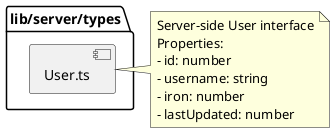

# lib/server/types Package

## Overview
Contains server-specific type definitions that are used exclusively by server-side code. Currently defines the User interface for server-side user management and authentication.

## Responsibilities
- Define server-side type definitions
- Provide type safety for server-side user operations
- Keep server-specific types separate from shared types

## Decomposition

### Source Files
- [User.ts](../src/lib/server/types/User.ts) - Server-side User type definition

## Rationale
Having a server-specific types package allows:
- Server-side code to have its own type definitions separate from shared types
- Potential for server-specific extensions without affecting client
- Clear organization of server-side concerns

**Note:** This User type is similar to the one in `shared/src/types/index.ts`, suggesting potential for consolidation.

## Constraints, Assumptions, Consequences, Known Issues
**Assumptions:**
- Server-side User type has same structure as shared User type
- `lastUpdated` uses milliseconds timestamp

**Consequences:**
- Type duplication with shared types (currently)
- Potential maintenance burden keeping types in sync

**Known Issues:**
- Duplicate User type definition exists in `shared/src/types/index.ts` - consider consolidating

## Details

### User.ts
**Role:** Defines the User interface for server-side user management operations.

**Interface: User**
- `id: number` - Unique user identifier
- `username: string` - User's login name
- `iron: number` - User's iron resource amount
- `lastUpdated: number` - Timestamp of last update (milliseconds)

**Top 5 Collaborations:**
1. **userRepo** (`src/lib/server/userRepo.ts`) - Uses this type for database operations
2. **User domain class** (`src/lib/server/user.ts`) - May use this type for type safety
3. **Session management** (`src/lib/server/session.ts`) - Uses for session data
4. **API routes** (`src/app/api/*/route.ts`) - Uses for type-safe user operations
5. **Authentication handlers** - Uses for user data validation

**Dependencies:** None (pure type definition)

**Used By:** Server-side user management, authentication, and database operations
