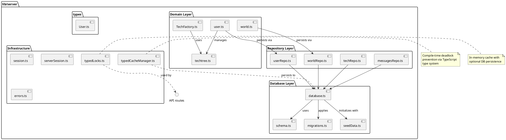

# lib/server Package

## Overview
Contains all server-side business logic, database operations, and domain models for the Spacewars game. Implements the authoritative game state, handles persistence, manages concurrent access with typed locks, provides caching, and enforces game rules on the server.

## Responsibilities
- Manage SQLite database connection and initialization
- Provide domain models (User, World) with business logic
- Handle data persistence through repository pattern
- Implement research and technology systems
- Calculate defense values and tech specifications
- Manage concurrent access with deadlock-free typed lock system
- Provide in-memory caching with database persistence
- Handle database migrations and schema evolution
- Seed initial game data
- Manage sessions and authentication

## Decomposition

### Source Files

**Database Layer:**
- [database.ts](../src/lib/server/database.ts) - Database connection and initialization
- [schema.ts](../src/lib/server/schema.ts) - Table definitions and schema
- [migrations.ts](../src/lib/server/migrations.ts) - Schema migrations
- [seedData.ts](../src/lib/server/seedData.ts) - Default data seeding

**Repository Layer:**
- [userRepo.ts](../src/lib/server/userRepo.ts) - User data access
- [worldRepo.ts](../src/lib/server/worldRepo.ts) - World/space object data access
- [techRepo.ts](../src/lib/server/techRepo.ts) - Technology data access
- [messagesRepo.ts](../src/lib/server/messagesRepo.ts) - Messages data access

**Domain Layer:**
- [user.ts](../src/lib/server/user.ts) - User domain model and business logic
- [world.ts](../src/lib/server/world.ts) - World physics and collision detection
- [techtree.ts](../src/lib/server/techtree.ts) - Research system logic
- [TechFactory.ts](../src/lib/server/TechFactory.ts) - Tech calculations and specifications

**Infrastructure:**
- [typedLocks.ts](../src/lib/server/typedLocks.ts) - Type-safe locking system
- [typedCacheManager.ts](../src/lib/server/typedCacheManager.ts) - Caching system
- [session.ts](../src/lib/server/session.ts) - Session configuration
- [serverSession.ts](../src/lib/server/serverSession.ts) - Server-side session utilities
- [errors.ts](../src/lib/server/errors.ts) - Custom error types

**Types:**
- [types/User.ts](../src/lib/server/types/User.ts) - User type definition

## Rationale

**Architecture Decisions:**

1. **Server-Authoritative Model**: All game state maintained and validated on server
   - Prevents cheating
   - Single source of truth
   - Simplified client logic
   
2. **Typed Lock System**: Compile-time deadlock prevention
   - Locks ordered by TypeScript type system
   - Cannot acquire locks in wrong order (compile error)
   - Eliminates deadlock category of bugs
   
3. **Repository Pattern**: Separation of data access from business logic
   - Domain models focus on business rules
   - Repositories handle persistence
   - Easy to test and modify

4. **Caching Layer**: In-memory cache with DB backing
   - Reduces database load
   - Fast reads for frequent operations
   - Persistence ensures durability

5. **Domain Model Pattern**: Rich domain objects with behavior
   - User class contains iron calculation logic
   - World class contains physics
   - Encapsulates business rules

## Constraints, Assumptions, Consequences, Known Issues

**Assumptions:**
- Single SQLite database file (no sharding)
- Reasonable player count (<1000 concurrent)
- Network latency acceptable for polling model
- Node.js event loop sufficient for concurrency
- File system access for database persistence

**Consequences:**
- All game logic must be in server code
- Database is performance bottleneck
- Typed locks require strict ordering discipline
- Schema changes require migrations
- Testing requires test database setup

**Constraints:**
- SQLite limitations (single writer)
- Must handle concurrent requests safely
- Must maintain backwards compatibility for deployed clients
- Memory usage for caching must be bounded

**Known Issues:**
- Test database uses synchronous seeding (not ideal but works)
- Some duplicate type definitions between server and shared
- Cache eviction policy not yet implemented (unbounded growth potential)

## Details

### database.ts
**Role:** Manages SQLite database connection, initialization, and provides access to both production and test databases.

**Key Responsibilities:**
- Create database file and directory if not exists
- Initialize schema using CREATE_TABLES
- Seed initial data (users, space objects)
- Apply migrations for schema evolution
- Provide separate test database (in-memory)
- Handle initialization locking (prevent race conditions)

**Key Functions:**
- `getDatabase()`: Promise<sqlite3.Database> - Get prod DB
- `getTestDatabase()`: Promise<sqlite3.Database> - Get test DB
- `clearTestDatabase()`: Promise<void> - Reset test DB

**Top 5 Collaborations:**
1. **schema.ts** - Uses CREATE_TABLES for initialization
2. **seedData.ts** - Seeds default data
3. **migrations.ts** - Applies schema updates
4. **All repositories** - Provides DB connection
5. **API routes** - Indirect through repositories

**Pattern:** Singleton with lazy initialization

---

### schema.ts
**Role:** Defines database schema as CREATE TABLE SQL statements.

**Tables:**
- `users` - User accounts and game stats
- `space_objects` - Game world objects (ships, asteroids, etc.)
- `tech_counts` - Technology inventory per user
- `build_queue` - Factory build queue
- `messages` - User messages/notifications

**Top 5 Collaborations:**
1. **database.ts** - Executes CREATE TABLE statements
2. **All repositories** - Query these tables
3. **migrations.ts** - Modifies schema
4. **seedData.ts** - Inserts into tables
5. **Test setup** - Creates test schema

---

### user.ts
**Role:** Domain model for User entity with business logic for iron generation, research, and stats updates.

**Key Responsibilities:**
- Calculate iron generation based on tech tree
- Update iron and research progress over time
- Handle research completion and tech tree updates
- Provide max ship speed based on research
- Manage save callback for persistence

**Key Methods:**
- `updateStats(now)` - Update iron and research progress
- `getIronPerSecond()` - Calculate generation rate
- `calculateIronIncrement(elapsed)` - Calculate iron for time period
- `getMaxShipSpeed()` - Get speed based on research

**Top 5 Collaborations:**
1. **techtree.ts** - Manages tech tree state
2. **userRepo.ts** - Persistence through save callback
3. **TechFactory.ts** - Tech specifications
4. **API routes** - Updated by routes, returned in responses
5. **typedLocks.ts** - Protected by locks during updates

**Pattern:** Domain model with callback-based persistence

---

### world.ts
**Role:** Server-side world physics, collision detection, and object management.

**Key Responsibilities:**
- Update object positions based on physics
- Detect collisions between objects
- Handle toroidal world wrapping
- Validate collection attempts (distance checks)
- Manage space object lifecycle

**Key Functions:**
- `updateObjectPositions(objects, elapsed)` - Physics updates
- `checkCollisions(objects)` - Collision detection
- `canCollect(ship, target)` - Validate collection distance

**Top 5 Collaborations:**
1. **worldRepo.ts** - Persist world state
2. **Physics module** (`@shared/physics`) - Shared calculations
3. **API routes** (`/api/navigate`, `/api/collect`) - World mutations
4. **SpaceObject types** (`@shared/types/gameTypes`) - Object data structures
5. **typedLocks.ts** - Protected by locks

**Pattern:** Stateless utility functions operating on world data

---

### techtree.ts
**Role:** Research system logic including tech tree state, research progression, and effect calculations.

**Key Responsibilities:**
- Define research types and their effects
- Track active research and progress
- Calculate research costs and durations
- Update tech tree state over time
- Determine research effects (iron generation, ship speed)

**Research Types:**
- IronHarvesting - Increases iron generation
- ShipSpeed - Increases max ship speed

**Top 5 Collaborations:**
1. **user.ts** - User manages tech tree
2. **API routes** (`/api/techtree`, `/api/trigger-research`) - Research operations
3. **userRepo.ts** - Persist tech tree as JSON
4. **TechFactory.ts** - Tech specifications
5. **typedLocks.ts** - Protected by locks

**Pattern:** Immutable updates with functional style

---

### TechFactory.ts
**Role:** Centralized technology specifications, calculations, and catalog management.

**Key Responsibilities:**
- Define all weapons and defenses with stats
- Calculate defense values based on tech counts
- Provide tech catalog for UI
- Calculate costs and requirements
- Maintain tech specifications

**Key Functions:**
- `calculateDefenseValues(techCounts)` - Calculate hull/armor/shields
- `getWeaponsCatalog()` - Get available weapons
- `getDefensesCatalog()` - Get available defenses

**Top 5 Collaborations:**
1. **API routes** (`/api/tech-catalog`, `/api/ship-stats`) - Provide catalog
2. **user.ts** - User has tech counts
3. **techRepo.ts** - Persist tech counts
4. **Factory page** - Display catalog
5. **useDefenseValues hook** - Calculate defense values

**Pattern:** Factory pattern with static specifications

---

### userRepo.ts
**Role:** Data access layer for User entities.

**Key Responsibilities:**
- CRUD operations for users
- Load users with tech tree and counts
- Update user stats (iron, last_updated)
- Find by username or ID
- Create User domain objects

**Top 5 Collaborations:**
1. **database.ts** - Uses DB connection
2. **user.ts** - Creates User instances
3. **techtree.ts** - Deserialize tech tree
4. **API routes** - Called by routes
5. **typedLocks.ts** - Operations require locks

---

### worldRepo.ts
**Role:** Data access layer for space objects.

**Key Responsibilities:**
- CRUD for space objects
- Batch updates for positions
- Delete collected objects
- Find objects by ID or type
- Update ship navigation

**Top 5 Collaborations:**
1. **database.ts** - Uses DB connection
2. **world.ts** - Provides world data
3. **API routes** (`/api/world`, `/api/navigate`, `/api/collect`) - Called by routes
4. **SpaceObject types** - Data structures
5. **typedLocks.ts** - Operations require locks

---

### techRepo.ts
**Role:** Data access layer for technology system.

**Key Responsibilities:**
- Manage tech counts per user
- Manage build queue
- Add/complete builds
- Load tech inventory

**Top 5 Collaborations:**
1. **database.ts** - Uses DB connection
2. **TechFactory.ts** - Tech specifications
3. **API routes** (`/api/build-*`) - Called by routes
4. **user.ts** - User has tech counts
5. **typedLocks.ts** - Operations require locks

---

### messagesRepo.ts
**Role:** Data access layer for messages.

**Key Responsibilities:**
- CRUD for messages
- Get messages by user
- Create new messages

**Top 5 Collaborations:**
1. **database.ts** - Uses DB connection
2. **API route** (`/api/messages`) - Called by route
3. **Messages UI** - Display messages
4. **typedLocks.ts** - Operations require locks
5. **Admin functionality** - Admin messages

---

### typedLocks.ts
**Role:** Implements compile-time safe lock ordering system that prevents deadlocks.

**Key Innovation:** Uses TypeScript's type system to enforce lock acquisition order at compile time.

**Lock Types (ordered):**
1. `GameLock` - Protects world state
2. `UserLock` - Protects user data
3. `TechLock` - Protects tech/factory data

**API:**
- `withLocks<T extends LockKey[]>(keys, fn)` - Acquire multiple locks in order
- Compile error if locks acquired in wrong order

**Top 5 Collaborations:**
1. **All API routes** - Use locks for concurrency control
2. **userRepo, worldRepo, techRepo** - Operations require locks
3. **Type system** - Enforces correctness at compile time
4. **Concurrency tests** - Verify deadlock-free behavior
5. **Documentation** (`README.md`) - Architecture highlight

**Pattern:** Type-level programming for compile-time safety

---

### typedCacheManager.ts
**Role:** In-memory caching system with optional database persistence.

**Key Responsibilities:**
- Store key-value pairs in memory
- Persist to database on write (configurable)
- Load from database on startup
- Support multiple cache instances
- Provide type-safe operations

**Top 5 Collaborations:**
1. **database.ts** - Persist cache entries
2. **API routes** - Cache frequently accessed data
3. **Factory data** - Cache tech catalog
4. **Session data** - May cache session info
5. **typedLocks.ts** - Cache operations protected by locks

**Pattern:** Singleton cache manager with persistence adapter

---

### session.ts
**Role:** iron-session configuration for secure session management.

**Configuration:**
- Cookie name
- Cookie password (from env)
- Cookie options (httpOnly, secure, sameSite)
- Session TTL

**Top 5 Collaborations:**
1. **API routes** - Use session for auth
2. **serverSession.ts** - Session utilities
3. **useAuth hook** - Client-side session check
4. **Authentication routes** - Set/clear session
5. **iron-session library** - Configuration for library

---

### serverSession.ts
**Role:** Server-side session utilities and authentication helpers.

**Key Functions:**
- `getServerAuthState(request)` - Get auth state from request
- `requireAuth(request)` - Throw if not authenticated

**Top 5 Collaborations:**
1. **API routes** - Check authentication
2. **session.ts** - Uses session config
3. **userRepo.ts** - Load user from session
4. **Page components** - Server-side auth checks
5. **iron-session** - Session management

---

### migrations.ts
**Role:** Database schema migration system.

**Key Responsibilities:**
- Track applied migrations
- Apply new migrations in order
- Add new columns/tables
- Modify existing schema

**Top 5 Collaborations:**
1. **database.ts** - Called during initialization
2. **schema.ts** - Evolves schema
3. **Tech system** - Added tech_counts, build_queue tables
4. **Production deployments** - Ensures schema compatibility
5. **Test database** - Migrations applied to test DB

---

### seedData.ts
**Role:** Provides default data for database initialization.

**Default Data:**
- Default user 'a' with password 'a'
- Initial space objects (asteroids, shipwrecks, escape pods)
- Player ship for default user
- Initial tech tree state

**Top 5 Collaborations:**
1. **database.ts** - Called during initialization
2. **schema.ts** - Inserts into tables
3. **Testing** - Consistent test data
4. **Development** - Quick start without manual setup
5. **Default tech tree** (`techtree.ts`) - Initial research state

---

### errors.ts
**Role:** Custom error types for domain-specific errors.

**Error Types:**
- `NotFoundError` - Resource not found
- `ValidationError` - Invalid input
- `AuthenticationError` - Auth failure
- (Additional custom errors as needed)

**Top 5 Collaborations:**
1. **API routes** - Throw and catch custom errors
2. **Domain models** - Throw validation errors
3. **Repositories** - Throw not found errors
4. **Error handling middleware** - Handle custom errors
5. **Tests** - Assert specific error types

**Pattern:** Custom error classes extending Error

---

### types/User.ts
**Role:** Server-side User type definition (see lib-server-types.md for details).
