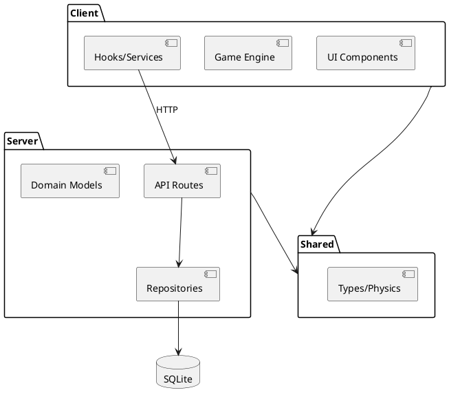

# Spacewars: Ironcore - Architecture Overview

## Executive Summary

Full-stack 2D space game built with Next.js 15, TypeScript, and React. Server-authoritative architecture with SQLite database.

**Stack:** Next.js 15 (App Router), TypeScript, React, SQLite

## Key Features
- Canvas-based rendering
- Toroidal world with resource collection
- Research and factory systems
- Server-authoritative game state

## System Architecture



### Layers
1. **Presentation** - `src/app/`, `src/components/` - Next.js pages, React components
2. **Client Logic** - `src/lib/client/` - Game engine, rendering, hooks, services
3. **Server Logic** - `src/lib/server/` - Domain models, repositories, typed locks
4. **Shared** - `src/shared/` - Types, physics, utilities
5. **Data** - SQLite database

## Technology Stack

**Frontend:** Next.js 15, TypeScript, React 18, HTML5 Canvas  
**Backend:** Node.js, Next.js API Routes, SQLite, iron-session, bcrypt  
**Testing:** Vitest  
**Development:** ESLint, TypeScript

## Package Structure

```
src/
├── app/                        # Next.js App Router
│   ├── api/                   # API endpoints (19 routes)
│   │   ├── login, logout, register, session
│   │   ├── world, user-stats, ship-stats
│   │   ├── navigate, collect
│   │   ├── techtree, trigger-research
│   │   ├── tech-catalog, build-status, build-item
│   │   └── admin/
│   ├── home, game, research, factory, profile, about, login, admin
│   ├── layout.tsx             # Root layout
│   ├── page.tsx               # Root page
│   └── globals.css            # Global styles
│
├── components/                # Reusable UI components
│   ├── Navigation/            # Navigation bar
│   ├── StatusHeader/          # Status display
│   ├── Layout/                # Layout wrappers
│   ├── LoginPageComponent.tsx
│   └── index.ts
│
├── lib/                       # Business logic
│   ├── client/               # Client-side logic
│   │   ├── game/            # Game engine (10 files)
│   │   ├── renderers/       # Canvas rendering (12 files)
│   │   ├── hooks/           # React hooks (8 hooks)
│   │   ├── services/        # API services (11 services)
│   │   ├── data/            # Static data
│   │   └── debug/           # Debug utilities
│   │
│   └── server/              # Server-side logic
│       ├── database.ts      # DB connection
│       ├── schema.ts        # Schema definitions
│       ├── userRepo.ts      # User data access
│       ├── worldRepo.ts     # World data access
│       ├── techRepo.ts      # Tech data access
│       ├── user.ts          # User domain model
│       ├── world.ts         # World physics
│       ├── techtree.ts      # Research system
│       ├── TechFactory.ts   # Tech specifications
│       ├── typedLocks.ts    # Concurrency control
│       ├── typedCacheManager.ts
│       └── types/
│
└── shared/                   # Shared code
    ├── src/
    │   ├── types/           # Type definitions
    │   ├── utils/           # Utility functions
    │   └── physics.ts       # Physics calculations
    └── defenseValues.ts
```

## Package Documentation

- **[shared/](shared.md)** - Shared types, physics, utilities
- **[lib/](lib.md)** - Business logic
  - [lib/client/](lib-client.md) - Client-side (game, renderers, hooks, services)
  - [lib/server/](lib-server.md) - Server-side (database, repositories, domain models)
- **[components/](components.md)** - UI components
- **[app/](app.md)** - Application layer
  - [app/api/](app-api.md) - API endpoints (19 routes)
  - [app/pages/](app-pages.md) - User pages (8 pages)

## Key Architectural Patterns

- **Server-Authoritative:** Server maintains game state; client visualizes
- **Repository Pattern:** Data access separated from business logic
- **Polling Sync:** Client polls server at intervals (no WebSockets)
- **Canvas Rendering:** HTML5 Canvas for 2D graphics
- **Next.js App Router:** Unified frontend/backend with SSR


## Development

**Setup:**
```bash
npm install
npm run dev      # Development server at localhost:3000
```

**Commands:**
- `npm run build` - Production build
- `npm test` - Run tests
- `npm run lint` - Lint code
