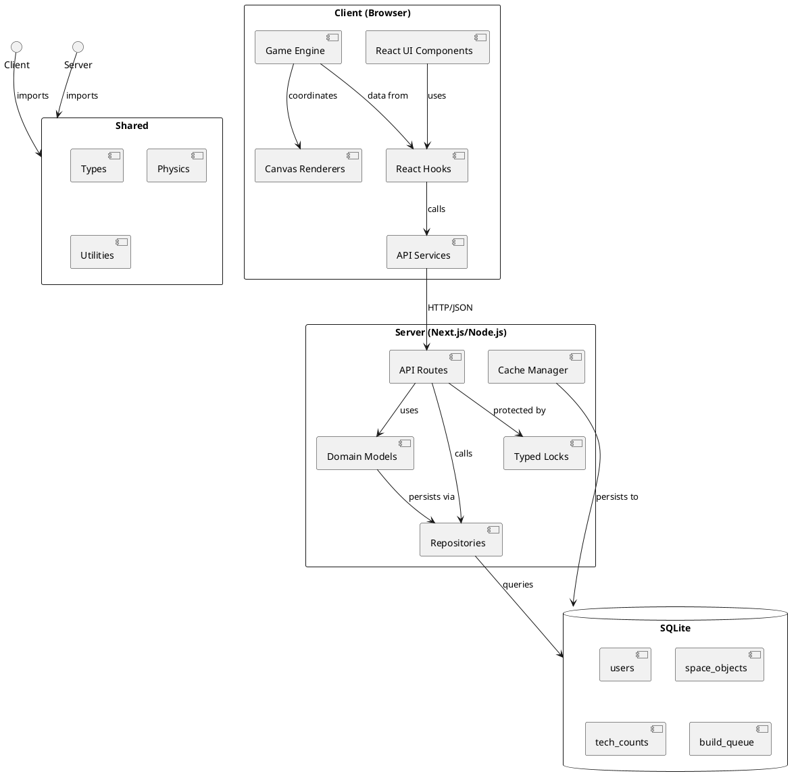

# Spacewars: Ironcore - Architecture Overview

## Executive Summary

Spacewars: Ironcore is a full-stack 2D space exploration game built with Next.js 15, TypeScript, and React. The application features a server-authoritative architecture with real-time gameplay, a research system, a factory/build system, and sophisticated concurrency control using a compile-time deadlock-free typed lock system.

**Key Metrics:**
- **Language:** TypeScript
- **Framework:** Next.js 15 (App Router)
- **Architecture:** Client-Server with Server-Authoritative Model
- **Database:** SQLite
- **Testing:** 196/196 tests passing (100% coverage)
- **Lines of Code:** ~111 source files (excluding tests)
- **Deployment:** Production-ready (Vercel, Render, local)

## Project Overview

### Purpose
Provide an engaging 2D space game where players:
- Navigate a toroidal (wrap-around) world
- Collect resources (asteroids, shipwrecks, escape pods)
- Research technologies to improve capabilities
- Build weapons and defenses
- Compete with other players (future feature)

### Target Audience
- Software developers (as reference implementation)
- Game enthusiasts
- Educational purposes (architecture study)

### Key Features
- **Real-time Gameplay:** Canvas-based rendering at 60fps
- **Interception Mechanics:** Calculate trajectories to intercept moving targets
- **Resource Management:** Collect iron, manage generation rates
- **Research System:** Tech tree with progressive upgrades
- **Factory System:** Build queue for weapons and defenses
- **Toroidal World:** Seamless wrap-around at edges
- **Deadlock-Free Concurrency:** Typed lock system with compile-time safety

## System Architecture

### High-Level Architecture



### Architectural Layers

1. **Presentation Layer** (`src/app/`, `src/components/`)
   - Next.js pages and layouts
   - React UI components
   - Client-side routing
   - Server-side rendering

2. **Client Business Logic** (`src/lib/client/`)
   - Game engine and entities
   - Canvas rendering
   - React hooks for state management
   - API service layer

3. **Server Business Logic** (`src/lib/server/`)
   - Domain models (User, World)
   - Repository pattern for data access
   - Typed lock concurrency control
   - Caching system

4. **Shared Code** (`src/shared/`)
   - Common type definitions
   - Physics calculations
   - Utility functions

5. **Data Layer**
   - SQLite database
   - Schema definitions
   - Migrations

## Technology Stack

### Frontend
- **Framework:** Next.js 15 (App Router, RSC)
- **Language:** TypeScript 5.x
- **UI Library:** React 18
- **Rendering:** HTML5 Canvas API
- **State Management:** React Hooks
- **Styling:** CSS Modules + Global CSS

### Backend
- **Runtime:** Node.js
- **API:** Next.js API Routes
- **Database:** SQLite 3.x
- **Authentication:** iron-session (HTTP-only cookies)
- **Password Hashing:** bcrypt
- **Concurrency:** Custom typed lock system

### Development & Testing
- **Testing:** Vitest (196 tests, 100% passing)
- **Test Environments:** jsdom (client), node (server)
- **Linting:** ESLint
- **Type Checking:** TypeScript compiler
- **CI/CD:** GitHub Actions compatible

### Deployment
- **Hosting:** Vercel, Render, self-hosted
- **Build:** Next.js optimized production build
- **Database:** SQLite file on server
- **Static Assets:** Next.js automatic optimization

## Package Structure

```
src/
├── app/                        # Next.js App Router
│   ├── api/                   # API endpoints (19 routes)
│   │   ├── login, logout, register, session
│   │   ├── world, user-stats, ship-stats
│   │   ├── navigate, collect
│   │   ├── techtree, trigger-research
│   │   ├── tech-catalog, build-status, build-item
│   │   └── admin/
│   ├── home, game, research, factory, profile, about, login, admin
│   ├── layout.tsx             # Root layout
│   ├── page.tsx               # Root page
│   └── globals.css            # Global styles
│
├── components/                # Reusable UI components
│   ├── Navigation/            # Navigation bar
│   ├── StatusHeader/          # Status display
│   ├── Layout/                # Layout wrappers
│   ├── LoginPageComponent.tsx
│   └── index.ts
│
├── lib/                       # Business logic
│   ├── client/               # Client-side logic
│   │   ├── game/            # Game engine (10 files)
│   │   ├── renderers/       # Canvas rendering (12 files)
│   │   ├── hooks/           # React hooks (8 hooks)
│   │   ├── services/        # API services (11 services)
│   │   ├── data/            # Static data
│   │   └── debug/           # Debug utilities
│   │
│   └── server/              # Server-side logic
│       ├── database.ts      # DB connection
│       ├── schema.ts        # Schema definitions
│       ├── userRepo.ts      # User data access
│       ├── worldRepo.ts     # World data access
│       ├── techRepo.ts      # Tech data access
│       ├── user.ts          # User domain model
│       ├── world.ts         # World physics
│       ├── techtree.ts      # Research system
│       ├── TechFactory.ts   # Tech specifications
│       ├── typedLocks.ts    # Concurrency control
│       ├── typedCacheManager.ts
│       └── types/
│
└── shared/                   # Shared code
    ├── src/
    │   ├── types/           # Type definitions
    │   ├── utils/           # Utility functions
    │   └── physics.ts       # Physics calculations
    └── defenseValues.ts
```

## Detailed Package Documentation

### Core Packages
- **[shared/](shared.md)** - Shared types, physics, and utilities
  - [shared/src/types/](shared-src-types.md) - Type definitions
  - [shared/src/utils/](shared-src-utils.md) - Utility functions

- **[lib/](lib.md)** - Business logic layer
  - [lib/client/](lib-client.md) - Client-side logic
    - [lib/client/game/](lib-client-game.md) - Game engine
    - [lib/client/renderers/](lib-client-renderers.md) - Canvas rendering
    - [lib/client/hooks/](lib-client-hooks.md) - React hooks
    - [lib/client/services/](lib-client-services.md) - API services
    - [lib/client/debug/](lib-client-debug.md) - Debug utilities
    - [lib/client/data/worlds/](lib-client-data-worlds.md) - World configs
  - [lib/server/](lib-server.md) - Server-side logic
    - [lib/server/types/](lib-server-types.md) - Server types

- **[components/](components.md)** - Reusable UI components

- **[app/](app.md)** - Application layer
  - [app/api/](app-api.md) - API endpoints
  - [app/pages/](app-pages.md) - User-facing pages

## Key Architectural Decisions

### 1. Server-Authoritative Model
**Decision:** Server maintains the authoritative game state; client is a view.

**Rationale:**
- Prevents cheating
- Single source of truth
- Simpler client logic
- No client-server desync issues

**Trade-off:** Network latency affects perceived responsiveness

### 2. Typed Lock System
**Decision:** Use TypeScript's type system to enforce lock ordering at compile time.

**Rationale:**
- Eliminates entire category of deadlocks
- No runtime overhead for ordering checks
- Compile errors instead of runtime failures
- Mathematically proven deadlock-free

**Implementation:**
```typescript
// Locks must be acquired in order: GameLock → UserLock → TechLock
await withLocks(['GameLock', 'UserLock'], async () => {
  // Protected code - cannot deadlock
});
```

### 3. Polling-Based Synchronization
**Decision:** Client polls server at regular intervals instead of WebSockets.

**Rationale:**
- Simpler implementation
- Easier debugging
- Works with standard HTTP/HTTPS
- Good enough for current game pace
- No complex connection management

**Trade-off:** Slight delay in updates, periodic API load

### 4. Repository Pattern
**Decision:** Separate data access (repositories) from business logic (domain models).

**Rationale:**
- Testability (mock repositories)
- Flexibility (swap data sources)
- Clear responsibilities
- Easier to understand

### 5. Canvas Rendering
**Decision:** Use HTML5 Canvas instead of DOM or WebGL.

**Rationale:**
- High performance for 2D
- Full control over rendering
- Lower complexity than WebGL
- Good browser support

### 6. Next.js App Router
**Decision:** Use Next.js App Router with Server Components.

**Rationale:**
- Unified frontend and backend
- Server-side rendering for SEO
- Automatic code splitting
- Modern React patterns
- Easy deployment

## Concurrency Architecture

### Typed Lock System

The application features a **compile-time deadlock-free lock system** that uses TypeScript's type system to prevent deadlocks.

**Lock Hierarchy:**
1. `GameLock` - Protects world state
2. `UserLock` - Protects user data  
3. `TechLock` - Protects tech/factory data

**Enforcement:**
```typescript
// ✅ Correct - locks in order
await withLocks(['GameLock', 'UserLock'], async () => { ... });

// ❌ Compile error - wrong order
await withLocks(['UserLock', 'GameLock'], async () => { ... });
//                          ^^^^^^^^^^ Type error!
```

**Benefits:**
- No deadlocks possible (proven by type system)
- Compile-time verification
- Zero runtime overhead
- Clear lock ordering visible in code

### Caching System

**TypedCacheManager** provides in-memory caching with optional database persistence:
- Fast reads (memory)
- Durable writes (database)
- Type-safe operations
- Singleton instance

## Data Flow Patterns

### User Action Flow
```
User Click → Game.handleClick()
           → navigationService.setShipDirection()
           → POST /api/navigate
           → withLocks(['GameLock', 'UserLock'])
           → worldRepo.updateShip()
           → SQLite UPDATE
           → Response 200 OK
           → useWorldData refetch
           → World.updateFromWorldData()
           → GameRenderer.render()
           → Canvas updated
```

### Real-time Iron Updates
```
useIron hook (every 5s):
  → userStatsService.getUserStats()
  → GET /api/user-stats
  → userRepo.findById()
  → user.updateStats(now)
  → Response { iron, ironPerSecond }
  → Hook calculates client-side: serverIron + (rate × elapsed)
  → Display updates every 100ms with calculated value
  → Repeat every 5s to resync with server
```

## Security Model

### Authentication
- **Method:** iron-session with HTTP-only cookies
- **Storage:** Secure, signed, encrypted cookies
- **Validation:** Server-side on every protected request
- **Session Management:** Automatic expiry, logout

### Authorization
- **Protected Routes:** Server-side auth checks, redirect if unauthenticated
- **Protected APIs:** 401 response if unauthenticated
- **Admin Routes:** Additional username check

### Data Security
- **Password Storage:** bcrypt hashing (10 rounds)
- **SQL Injection:** Parameterized queries
- **XSS Prevention:** React automatic escaping
- **CSRF:** Cookie SameSite attribute

## Performance Characteristics

### Client Performance
- **Rendering:** 60fps target
- **Initial Load:** ~100kB JavaScript
- **Update Rate:** World polls every 1-2s, iron every 5s
- **Optimization:** Code splitting, lazy loading

### Server Performance
- **Database:** SQLite (single writer, multiple readers)
- **Caching:** In-memory cache for frequent reads
- **Concurrency:** Typed locks prevent contention issues
- **Scalability:** Suitable for <1000 concurrent users

### Network
- **API Latency:** Typically <100ms
- **Polling Overhead:** ~5-10 requests/minute per client
- **Payload Size:** JSON responses typically <10KB

## Testing Strategy

### Test Categories

1. **Unit Tests** (Pure Functions)
   - Physics calculations
   - Domain model logic
   - Utility functions
   - Fast execution (<1ms each)

2. **Repository Tests** (Test Database)
   - Database operations
   - Data integrity
   - Query correctness
   - In-memory SQLite

3. **API Integration Tests** (Test Database)
   - Full request/response cycle
   - Authentication flows
   - Error handling
   - Environment-based DB selection

4. **Service Tests** (Mocked Network)
   - Client service functions
   - HTTP request handling
   - Error handling
   - Mocked fetch

**Test Execution:**
- All tests: `npm test`
- Single run: `npm test -- --run`
- UI mode: `npm run test:ui`
- Coverage: 196/196 tests passing (100%)

### Database Isolation

**Production Database:**
- Location: `database/users.db`
- Created automatically if missing
- Persistent across restarts

**Test Database:**
- Location: In-memory (`:memory:`)
- Created per test session
- Automatically seeded with default data
- Isolated from production

**Environment Detection:**
```typescript
if (process.env.NODE_ENV === 'test') {
  // Use test database
} else {
  // Use production database
}
```

## Deployment Architecture

### Build Process
```
npm run build
  → Next.js build
  → TypeScript compilation
  → CSS optimization
  → Code splitting
  → Static page generation
  → API route bundling
```

### Deployment Targets

**Vercel (Recommended):**
- Automatic deployments from Git
- Edge network for static assets
- Serverless functions for API
- Zero configuration needed

**Render:**
- Docker container deployment
- Persistent disk for database
- Environment variable support
- Production-ready

**Self-Hosted:**
- Node.js server required
- SQLite file persistence
- Reverse proxy recommended (nginx)
- PM2 for process management

### Environment Variables
```
NODE_ENV=production
SESSION_SECRET=<random-string>
```

## Development Workflow

### Getting Started
```bash
# Install dependencies
npm install

# Run development server
npm run dev

# Open browser
http://localhost:3000
```

### Development Commands
```bash
npm run dev      # Start dev server
npm run build    # Production build
npm start        # Run production build
npm test         # Run tests (watch mode)
npm test -- --run # Run tests (single run)
npm run lint     # Lint code
npm run ci       # Lint + test + build
```

### Project Structure Guidelines

1. **Server components by default** - Only use 'use client' when needed
2. **Colocation** - Keep related files together (page + client + styles)
3. **Type safety** - Define interfaces for all data structures
4. **Testing** - Write tests for all business logic
5. **Documentation** - Update docs when making changes

## Known Issues and Technical Debt

### Current Issues
- Some legacy files (page_new.tsx) exist but unused
- Both regular and -typed API routes during migration
- No rate limiting implemented
- Cache eviction policy not yet implemented (unbounded growth)

### Planned Improvements
- Complete migration to typed lock system
- Remove legacy routes
- Implement WebSocket support for real-time updates
- Add rate limiting to API routes
- Implement cache eviction policy
- Add horizontal scaling support

### Migration in Progress
- Moving from regular to -typed API routes
- Gradually removing client-side physics (completed)
- Consolidating duplicate type definitions

## Future Roadmap

### Short Term
- Complete typed lock migration
- Implement cache eviction
- Add admin controls for database management
- Improve error handling and user feedback

### Medium Term
- WebSocket support for real-time updates
- Multiplayer features (combat, trading)
- Enhanced research tree
- More collectible types
- Achievement system

### Long Term
- Redis caching layer
- Horizontal scaling
- Multiple world instances
- Mobile app (React Native)
- Leaderboards and rankings

## Contributing Guidelines

### Code Style
- Follow existing patterns
- Use TypeScript for all code
- Write tests for new features
- Update documentation
- Use ESLint configuration

### Testing Requirements
- Unit tests for business logic
- Integration tests for API routes
- Test naming: `whatIsTested_scenario_expectedOutcome`
- Maintain 100% test passing rate

### Documentation
- Update relevant .md files
- Add inline comments for complex logic
- Update architecture docs for significant changes
- Keep README.md current

## Resources and References

### Documentation
- [Testing Strategy](testing.md) - Comprehensive testing guide
- [Hook Architecture](hookArchitecture.md) - React hooks design
- Technical Debt tracking: `TechnicalDebt.md`
- Implementation TODOs: `TODO-*.md` files

### External Resources
- [Next.js Documentation](https://nextjs.org/docs)
- [React Documentation](https://react.dev)
- [TypeScript Documentation](https://www.typescriptlang.org/docs)
- [Vitest Documentation](https://vitest.dev)

## Architecture Benefits

### Maintainability
- Clear separation of concerns
- Well-documented codebase
- Consistent patterns throughout
- Easy to locate and modify code

### Reliability
- Comprehensive test coverage
- Type safety prevents errors
- Deadlock-free concurrency
- Single source of truth (server)

### Performance
- Optimized rendering pipeline
- Efficient database queries
- Client-side calculations reduce server load
- Code splitting reduces bundle size

### Scalability
- Modular architecture
- Clear extension points
- Repository pattern for data flexibility
- Horizontal scaling possible

### Developer Experience
- Hot module replacement
- TypeScript IntelliSense
- Clear error messages
- Good documentation

## Contact and Support

### Repository
- GitHub: MarkDrei/Spacewars3
- Documentation: `/doc` folder
- Issues: GitHub Issues

### Development
- Primary Language: TypeScript
- Target Node.js: 18.x or higher
- Target Browsers: Modern evergreen browsers

---

**Document Version:** 1.0  
**Last Updated:** 2024  
**Architecture Status:** Production-Ready  

This overview provides a comprehensive understanding of the Spacewars: Ironcore architecture. For detailed information about specific packages, refer to the linked documentation files.
