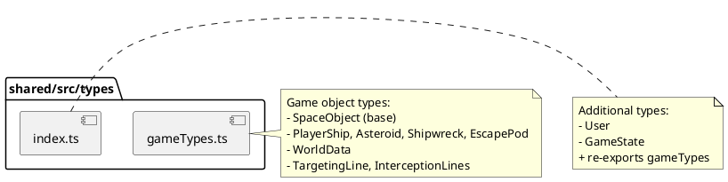

# shared/src/types Package

## Overview
Defines TypeScript interfaces and types that are shared between client and server components. Provides the data contracts for game objects, world state, user data, and game mechanics, ensuring type safety across the full-stack application.

## Responsibilities
- Define common data structures for game objects (ships, asteroids, collectibles)
- Provide type definitions for world state and synchronization
- Define user and game state interfaces
- Enable type-safe communication between client and server
- Support both game logic and UI rendering with consistent types

## Decomposition

### Source Files
- [gameTypes.ts](../src/shared/src/types/gameTypes.ts) - Game object type definitions
- [index.ts](../src/shared/src/types/index.ts) - User/game state types and barrel export

## Rationale
Centralizing type definitions ensures:
- Type safety across client-server boundary
- Single source of truth for data structures
- Compile-time error detection for data mismatches
- Better IDE support with autocomplete and type checking
- Easier refactoring when types change

## Constraints, Assumptions, Consequences, Known Issues
**Assumptions:**
- All game objects share a common base structure (SpaceObject)
- Object types are discriminated by the `type` field
- Angles are stored in degrees (0-360) for consistency
- Timestamps use milliseconds since epoch

**Consequences:**
- Changes to types affect both client and server
- Adding new object types requires updating discriminated unions
- Type changes require coordinated updates across the codebase

**Known Issues:**
- n/a

## Details

### gameTypes.ts
**Role:** Defines the core data structures for all game objects and world state, using TypeScript's discriminated unions for type safety.

**Key Types:**

**SpaceObject** (Base interface):
- Properties: `id`, `type`, `x`, `y`, `speed`, `angle`, `last_position_update_ms`
- Used as base for all game entities

**WorldData:**
- Contains `worldSize` (width/height), `spaceObjects` array, and `currentTime`
- Used for client-server synchronization

**Game Entity Types:**
- `PlayerShip` - extends SpaceObject with `userId`
- `Asteroid` - extends SpaceObject with `value`
- `Shipwreck` - extends SpaceObject with `value`
- `EscapePod` - extends SpaceObject with `value` and `survivors`
- `Collectible` - union type for collectible objects

**UI State Types:**
- `TargetingLine` - visual feedback for player clicks (start/target positions, timing)
- `InterceptionLines` - visual feedback for intercept calculations (ship-to-intercept, target-to-intercept positions)

**Top 5 Collaborations:**
1. **World classes** (`src/lib/client/game/World.ts`, `src/lib/server/world.ts`) - Uses WorldData for state management
2. **SpaceObject classes** (`src/lib/client/game/*.ts`) - Implement these interfaces
3. **API routes** (`src/app/api/*/route.ts`) - Use these types for request/response payloads
4. **Renderers** (`src/lib/client/renderers/*.ts`) - Use these types for rendering game objects
5. **Physics module** (`src/shared/src/physics.ts`) - Uses PhysicsObject-compatible interfaces

**Dependencies:** None (pure type definitions)

---

### index.ts
**Role:** Provides additional shared types and acts as barrel export for the types package.

**Key Types:**

**User:**
- Properties: `id`, `username`, `iron`, `lastUpdated`
- Used for user state management

**GameState:**
- Properties: `score`, `shipStats`, `inventory`
- Comprehensive game state structure (may be legacy/unused)

**Top 5 Collaborations:**
1. **Authentication hooks** (`src/lib/client/hooks/useAuth.ts`) - Uses User type
2. **User repositories** (`src/lib/server/userRepo.ts`) - Implements User interface
3. **Session management** (`src/lib/server/session.ts`) - Uses User type
4. **Main shared package** (`src/shared/src/index.ts`) - Re-exported from here
5. **API routes** - Use these types for type-safe responses

**Dependencies:** 
- `./gameTypes`

**Pattern:** Barrel export with additional type definitions
