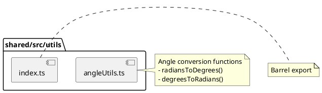

# shared/src/utils Package

## Overview
Provides utility functions for mathematical operations used throughout the application. Currently focused on angle conversions between radians and degrees, which are essential for the game's physics calculations and rendering.

## Responsibilities
- Convert angles between radians and degrees
- Provide reusable mathematical utility functions
- Enable consistent angle handling across client and server

## Decomposition

### Source Files
- [angleUtils.ts](../src/shared/src/utils/angleUtils.ts) - Angle conversion utilities
- [index.ts](../src/shared/src/utils/index.ts) - Package exports

## Rationale
Separating angle utilities into a shared package ensures:
- Consistent angle conversions across the entire application
- Avoids duplication of mathematical constants (Math.PI calculations)
- Provides a single source of truth for angle-related operations
- Makes it easy to add more mathematical utilities in the future

## Constraints, Assumptions, Consequences, Known Issues
**Assumptions:**
- All angle conversions use JavaScript's Math.PI constant
- Input angles are in standard mathematical notation (counterclockwise from positive x-axis)

**Consequences:**
- Any changes to angle conversion logic affect both client and server
- Must maintain backwards compatibility as these are fundamental utilities

**Known Issues:**
- n/a

## Details

### angleUtils.ts
**Role:** Provides pure functions for angle unit conversion between radians and degrees.

**Key Functions:**
- `radiansToDegrees(radians: number): number` - Converts radians to degrees using the formula: `radians * (180 / Math.PI)`
- `degreesToRadians(degrees: number): number` - Converts degrees to radians using the formula: `degrees * (Math.PI / 180)`

**Top 5 Collaborations:**
1. **InterceptCalculator** (`src/lib/client/game/InterceptCalculator.ts`) - Uses conversions for trajectory calculations
2. **Ship/SpaceObject classes** (`src/lib/client/game/*.ts`) - Uses conversions for angle manipulations
3. **Physics module** (`src/shared/src/physics.ts`) - Uses conversions for position updates
4. **Renderers** (`src/lib/client/renderers/*.ts`) - Uses conversions for canvas rendering
5. **World** (`src/lib/server/world.ts`) - Uses conversions for server-side physics

**Dependencies:** None (pure utility functions)

**Used By:** Physics calculations, game objects, renderers throughout the application

---

### index.ts
**Role:** Barrel export file that re-exports all utility functions for easier imports.

**Exports:**
- All functions from `angleUtils.ts`

**Top 5 Collaborations:**
1. Main shared package (`src/shared/src/index.ts`)
2. Client-side game logic
3. Server-side physics calculations
4. Rendering components
5. Test files

**Dependencies:** 
- `./angleUtils`

**Pattern:** Standard barrel export pattern for package organization
