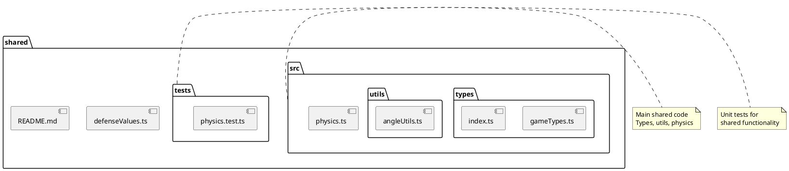

# shared Package

## Overview
Contains code, types, and utilities shared between client and server. This package ensures consistency across the full-stack application by providing common data structures, physics calculations, and utility functions that work identically on both sides.

## Responsibilities
- Provide shared type definitions for game objects and state
- Implement physics calculations used by both client and server
- Offer utility functions for common operations
- Ensure type safety across client-server boundary
- Enable code reuse between frontend and backend

## Decomposition



### Sub-Packages

**See detailed documentation:**
- [shared/src/utils](shared-src-utils.md) - Angle conversion utilities
- [shared/src/types](shared-src-types.md) - Shared type definitions

### Source Files

**Core:**
- [src/index.ts](../src/shared/src/index.ts) - Main package entry point
- [src/physics.ts](../src/shared/src/physics.ts) - Shared physics calculations
- [defenseValues.ts](../src/shared/defenseValues.ts) - Defense value types
- [README.md](../src/shared/README.md) - Package documentation

**Sub-packages:**
- src/types/ - Type definitions
- src/utils/ - Utility functions
- tests/ - Unit tests

## Rationale

Centralizing shared code provides:
- **DRY Principle**: Write once, use everywhere
- **Consistency**: Same calculations on client and server
- **Type Safety**: Shared types ensure compatible interfaces
- **Single Source of Truth**: Changes affect both sides equally
- **Simplified Testing**: Test shared logic once
- **Reduced Bundle Size**: No duplicate code in client

**Key Decision:** Physics calculations in shared package
- Server uses for authoritative state
- Client uses for prediction/interpolation
- Identical calculations ensure consistency
- Toroidal world logic shared

## Constraints, Assumptions, Consequences, Known Issues

**Assumptions:**
- Code must work in both Node.js and browser environments
- No platform-specific APIs (no window, no fs)
- Types must be compatible with both environments
- Functions must be pure (no side effects)

**Consequences:**
- Cannot use browser-only or Node-only APIs
- Must test in both environments
- Changes affect both client and server
- Breaking changes require coordinated updates

**Constraints:**
- No external dependencies (currently)
- Must be framework-agnostic
- Must support ES modules

**Known Issues:**
- Some type duplication with server-specific types (User)

## Details

### src/index.ts
**Role:** Main entry point that exports all shared functionality.

**Exports:**
- All types from src/types/
- All utilities from src/utils/
- Physics functions from src/physics.ts

**Usage:**
```typescript
import { SpaceObject, WorldData, updateObjectPosition } from '@shared';
```

---

### src/physics.ts
**Role:** Implements physics calculations for object movement and collision detection in the toroidal world.

**Key Functions:**

**updateObjectPosition(obj, currentTime, worldBounds, factor)**
- Calculates new position based on elapsed time
- Handles toroidal world wrapping
- Used by both client and server
- Factor parameter for speed adjustment

**updateObjectPositionWithTimeCorrection(obj, clientTime, responseTime, roundTripTime, worldBounds, factor)**
- Client-specific version with network latency compensation
- Estimates server time based on round-trip time
- Provides smoother client-side prediction

**updateAllObjectPositions(objects, currentTime, worldBounds, factor)**
- Batch update for multiple objects
- Returns updated array of objects

**calculateToroidalDistance(pos1, pos2, worldBounds)**
- Calculates shortest distance considering world wrapping
- Critical for collision detection and collection range

**isColliding(obj1, obj2, worldBounds)**
- Collision detection using toroidal distance
- Uses object radii for detection range

**Top 5 Collaborations:**
1. **World classes** (client/server) - Use for position updates
2. **Game rendering** - Client-side position interpolation
3. **Server world** - Authoritative position updates
4. **Collision detection** - Both client and server
5. **Type definitions** - Uses PhysicsObject interface

**Physics Model:**
- Speed in units per minute
- Angle in degrees (converted to radians for calculations)
- Time in milliseconds
- Toroidal topology (wrapping at boundaries)

---

### defenseValues.ts
**Role:** Type definitions for defense values (hull, armor, shields).

**Types:**
```typescript
export interface DefenseValues {
  hull: { current: number; max: number };
  armor: { current: number; max: number };
  shields: { current: number; max: number };
}
```

**Top 5 Collaborations:**
1. **TechFactory** (server) - Calculates defense values
2. **useDefenseValues hook** (client) - Fetches and displays
3. **ship-stats API** - Returns defense values
4. **Home page** - Displays defense stats
5. **Tech system** - Defense values depend on tech counts

---

### tests/physics.test.ts
**Role:** Unit tests for physics calculations.

**Test Coverage:**
- Position update calculations
- Toroidal wrapping behavior
- Distance calculations
- Collision detection
- Time correction logic

**Top 5 Collaborations:**
1. **physics.ts** - Tests these functions
2. **Vitest** - Test framework
3. **CI/CD pipeline** - Runs on commit
4. **Type definitions** - Uses PhysicsObject
5. **Test database** - May use for integration tests

---

### README.md
**Role:** Package documentation and usage instructions.

**Contents:**
- Package overview
- Features list
- Development commands
- Installation instructions

---

## Integration Points

### Client-Side Usage
```typescript
// Client-side game logic
import { updateObjectPosition, WorldData } from '@shared';

const newPos = updateObjectPosition(
  ship,
  Date.now(),
  { width: 500, height: 500 },
  50
);
```

### Server-Side Usage
```typescript
// Server-side world update
import { updateAllObjectPositions } from '@shared';

const updatedObjects = updateAllObjectPositions(
  objects,
  Date.now(),
  worldBounds,
  50
);
```

### Type Safety
```typescript
// Both client and server use same types
import { SpaceObject, WorldData } from '@shared';

function processWorld(data: WorldData): SpaceObject[] {
  return data.spaceObjects;
}
```

## Testing Strategy

**Unit Tests:**
- Pure function testing
- No external dependencies
- Fast execution
- Run in CI/CD

**Integration Tests:**
- Test in client environment (browser)
- Test in server environment (Node.js)
- Ensure consistency across platforms

## Package Organization

The shared package follows a clear structure:
```
shared/
├── src/              # Main source code
│   ├── types/        # Type definitions
│   ├── utils/        # Utility functions
│   ├── physics.ts    # Physics calculations
│   └── index.ts      # Main export
├── tests/            # Unit tests
├── defenseValues.ts  # Additional types
└── README.md         # Documentation
```

This organization:
- Separates concerns (types, utils, physics)
- Provides clear entry points
- Supports tree-shaking
- Easy to navigate
