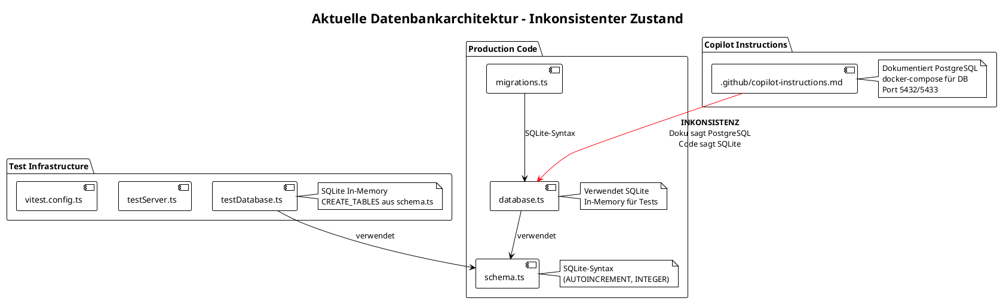
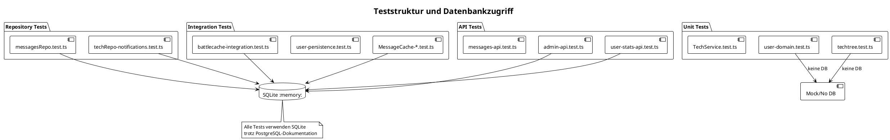
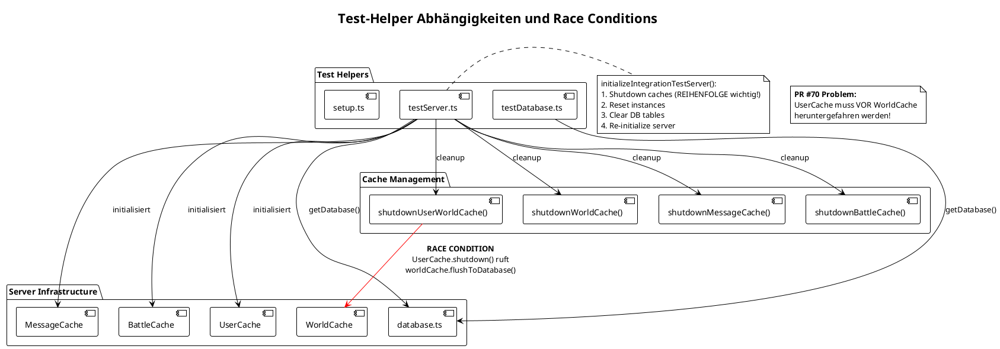
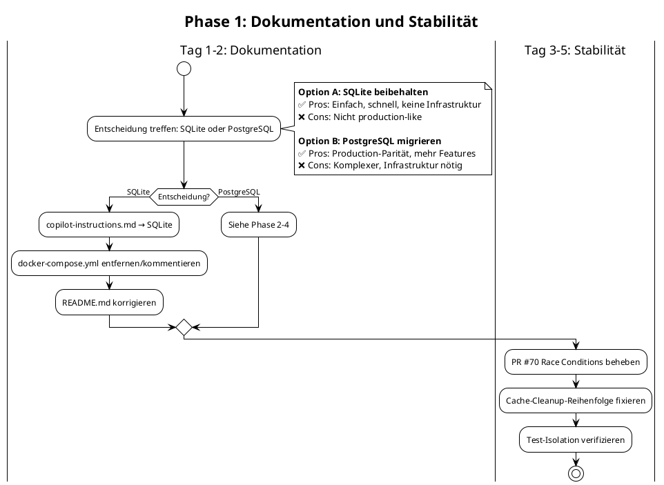
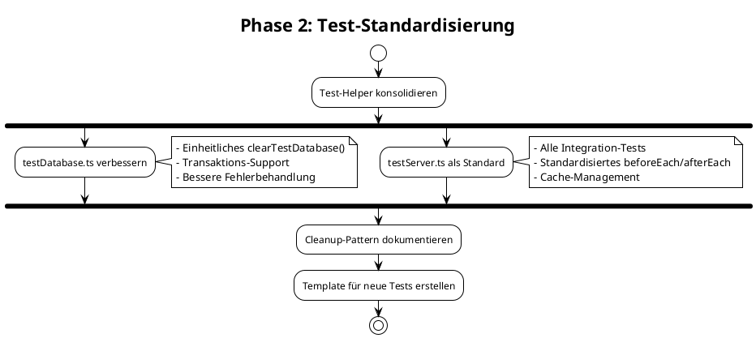
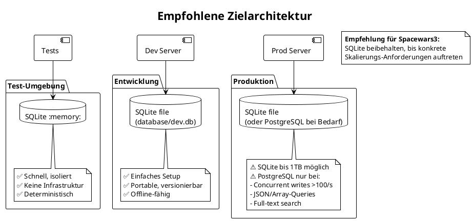
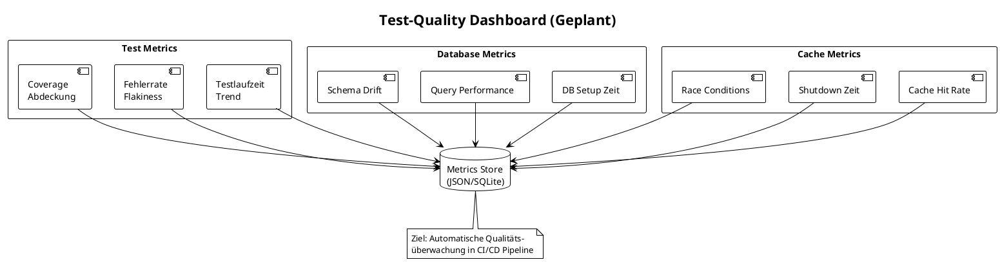
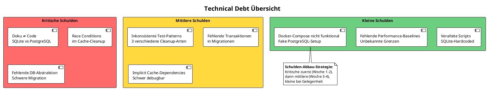
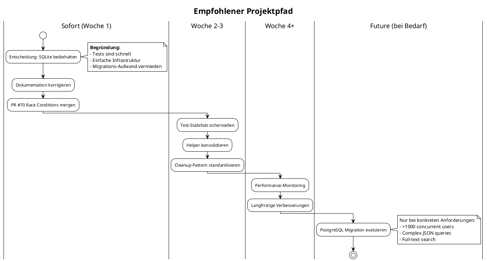

# Test-Struktur und Datenbankmigration Assessment

**Projekt**: Spacewars3  
**Datum**: 16. Januar 2026  
**Autor**: GitHub Copilot  
**Branch**: copilot/investigate-test-failures

## Executive Summary

Diese Analyse untersucht die bestehende Teststruktur und die dokumentierte Migration von SQLite zu PostgreSQL im Spacewars3-Projekt. Die Haupterkenntnis ist eine **kritische Inkonsistenz** zwischen Dokumentation (PostgreSQL) und tatsächlicher Implementation (SQLite), die sofort behoben werden muss.

---

## 1. Architekturübersicht

### 1.1 Aktuelle Datenbankarchitektur



### 1.2 Test-Kategorien und Datenbankzugriff



---

## 2. Bewertungsmatrix

| Kategorie | Score | Begründung | Details |
|-----------|-------|------------|---------|
| **Wartbarkeit** | ⚠️ 5/10 | Inkonsistente Dokumentation, gemischte Patterns | Code vs. Dokumentation divergiert massiv |
| **Konsistenz** | ❌ 3/10 | Massive Diskrepanz zwischen Doku und Code | SQLite im Code, PostgreSQL in Doku |
| **Performance** | ✅ 8/10 | In-Memory SQLite ist schnell für Tests | ~400 Tests in <40s |
| **Stabilität** | ⚠️ 6/10 | Race Conditions dokumentiert in PR #70 | Cache-Cleanup-Probleme aktiv |
| **Testabdeckung** | ✅ 8/10 | 403 Tests, gute Kategorisierung | Unit, Integration, API, Repository |

### 2.1 Performance-Metriken

```
Aktuelle Testlaufzeiten:
- Gesamtzeit: ~40s für 403 Tests
- Setup: ~4s (Database init)
- Tests: ~5s (eigentliche Tests)  
- Environment: ~20s (Vitest overhead)
- Transform: ~1s (TypeScript compilation)
```

---

## 3. Detailanalyse

### 3.1 🔴 Kritische Inkonsistenz: SQLite vs. PostgreSQL

**Problem**: Die Dokumentation beschreibt PostgreSQL, der Code verwendet SQLite.

**Dokumentation** (`.github/copilot-instructions.md`):
```markdown
## Database
- PostgreSQL database with schema-first approach defined in `src/lib/server/schema.ts`
- Auto-initialization on first API call - creates tables and seeds default data
- Configuration via environment variables (POSTGRES_HOST, POSTGRES_PORT, etc.)
- Use `docker-compose up db -d` to start PostgreSQL locally for development
- Use `docker-compose up db-test -d` to start PostgreSQL test database (port 5433)
```

**Realität** (`src/lib/server/database.ts`):
```typescript
import sqlite3 from 'sqlite3';

function initializeTestDatabase(): sqlite3.Database {
  console.log('🧪 Initializing test database (SQLite in-memory)...');
  testDb = new (sqlite3.verbose().Database)(':memory:');
  // ...
}
```

**Schema** (`src/lib/server/schema.ts`):
```sql
CREATE TABLE IF NOT EXISTS users (
  id INTEGER PRIMARY KEY AUTOINCREMENT,  -- SQLite-Syntax!
  username TEXT UNIQUE NOT NULL,
  -- ...
);
```

### 3.2 Testdatenbank-Lifecycle

```plantuml
@startuml
!theme plain
title Testdatenbank-Lifecycle

|Tests starten|
start
:Vitest setzt NODE_ENV=test;

|getDatabase()|
if (NODE_ENV === 'test') then (ja)
  :initializeTestDatabase();
  :SQLite :memory: erstellen;
  :CREATE_TABLES ausführen;
  :seedTestDatabase();
else (nein)  
  :Produktions-SQLite laden;
  :database/users.db;
endif

|Test-Ausführung|
:Test läuft mit isolierter DB;

|Cleanup|
if (Repository-Test?) then (ja)
  :clearTestDatabase();
  :DELETE FROM tables;
else (Integration-Test?)
  :initializeIntegrationTestServer();
  :Cache-Reset + DB-Clear;
else (nein)
  :Kein explizites Cleanup;
endif

|Tests beenden|
:Memory wird freigegeben;
stop

@enduml
```

### 3.3 Migrations-System-Analyse

Das aktuelle Migrationssystem (`src/lib/server/migrations.ts`) ist **SQLite-spezifisch**:

```typescript
export const migrations: Migration[] = [
  {
    version: 2,
    name: 'add_tech_system',
    up: [
      'ALTER TABLE users ADD COLUMN pulse_laser INTEGER NOT NULL DEFAULT 5',
      'ALTER TABLE users ADD COLUMN plasma_cannon INTEGER NOT NULL DEFAULT 0',
      // SQLite-spezifische Syntax
    ],
  },
  {
    version: 3,
    name: 'add_defense_system', 
    up: [
      'ALTER TABLE users ADD COLUMN hull_max INTEGER NOT NULL DEFAULT 100',
      'ALTER TABLE users ADD COLUMN hull_current INTEGER NOT NULL DEFAULT 100',
      // ...
    ],
  },
];
```

**Probleme:**
1. `ALTER TABLE ... ADD COLUMN` Syntax unterscheidet sich zwischen SQLite und PostgreSQL
2. `AUTOINCREMENT` vs. `SERIAL`
3. Keine Transaktionen um Migrationen
4. Fehlerbehandlung zu permissiv: `if (!err.message.includes('duplicate column'))`

### 3.4 Test-Helper-Architektur



### 3.5 Test-Isolation-Patterns

Das Projekt verwendet **3 verschiedene** Test-Cleanup-Patterns:

| Pattern | Verwendung | Dateien | Problem |
|---------|------------|---------|---------|
| **Kein Cleanup** | Unit Tests | `user-domain.test.ts`, `techtree.test.ts` | ✅ OK (keine DB) |
| **clearTestDatabase()** | Repository Tests | `messagesRepo.test.ts` | ⚠️ DELETE ohne Cache-Reset |
| **initializeIntegrationTestServer()** | Integration Tests | `battlecache-*.test.ts` | ⚠️ Race Conditions (PR #70) |

---

## 4. Identifizierte Probleme

### 4.1 Kritisch (P0) - Sofortige Maßnahmen erforderlich

| # | Problem | Auswirkung | Betroffene Dateien | Zeitaufwand |
|---|---------|------------|-------------------|-------------|
| **P0-1** | **Dokumentation-Code-Diskrepanz** | Entwickler-Verwirrung, falsche Architektur-Annahmen | `.github/copilot-instructions.md`, `README.md` | 2h |
| **P0-2** | **Race Conditions im Cache-Cleanup** | Test-Flakiness, unzuverlässige CI | `testServer.ts`, `UserCache.ts` (PR #70) | 4h |
| **P0-3** | **Fehlende DB-Abstraktionsschicht** | Migration zu PostgreSQL unmöglich ohne Refactoring | `schema.ts`, `migrations.ts`, `database.ts` | 2-3 Tage |

### 4.2 Hoch (P1) - Nächste Iteration

| # | Problem | Auswirkung | Betroffene Dateien | Zeitaufwand |
|---|---------|------------|-------------------|-------------|
| **P1-1** | **Inkonsistente Test-Cleanup-Patterns** | Potenzielle Test-Interferenz | `testDatabase.ts`, verschiedene `*.test.ts` | 1 Tag |
| **P1-2** | **Fehlende Transaktionen in Migrationen** | Daten-Inkonsistenz bei Migration-Fehlern | `migrations.ts`, `seedData.ts` | 4h |
| **P1-3** | **Cache-Abhängigkeiten nicht explizit** | Schwer debugbare Initialisierungs-Probleme | `BattleCache.ts`, `UserCache.ts`, `WorldCache.ts` | 1 Tag |

### 4.3 Mittel (P2) - Technische Schulden

| # | Problem | Auswirkung | Betroffene Dateien | Zeitaufwand |
|---|---------|------------|-------------------|-------------|
| **P2-1** | **Veraltete Scripts** | Inconsistent tooling | `scripts/export-database-to-html.ts` | 2h |
| **P2-2** | **Fehlende Performance-Baselines** | Unbekannte Skalierbarkeits-Grenzen | Test-Suite | 1 Tag |
| **P2-3** | **Docker-Compose nicht funktional** | Lokale Entwicklung erschwert | `docker-compose.yml` | 2h |

---

## 5. Aktionsplan

### Phase 1: Kritische Fixes (Woche 1)



**Konkrete Tasks Phase 1:**

- [ ] **Entscheidung**: SQLite vs. PostgreSQL für das Projekt
- [ ] **Dokumentation synchronisieren**:
  - [ ] `.github/copilot-instructions.md` auf gewählte DB anpassen
  - [ ] `README.md` Datenbanksektion korrigieren
  - [ ] `docker-compose.yml` entsprechend anpassen/entfernen
- [ ] **PR #70 abschließen**:
  - [ ] Cache-Shutdown-Reihenfolge: Battle → Message → User → World
  - [ ] Defensive Fehlerbehandlung in `UserCache.shutdown()`
  - [ ] Test-Stabilität verifizieren (alle 403 Tests bestehen)

### Phase 2: Test-Infrastruktur standardisieren (Woche 2)



**Konkrete Tasks Phase 2:**

- [ ] **Test-Helper konsolidieren**:
  - [ ] `testServer.ts` als Standard für alle Integration-Tests etablieren
  - [ ] `clearTestDatabase()` in `testDatabase.ts` verbessern
  - [ ] Einheitliches `beforeEach`/`afterEach` Pattern dokumentieren
- [ ] **Test-Templates erstellen**:
  - [ ] Unit-Test Template (keine DB)
  - [ ] Repository-Test Template (mit clearTestDatabase)  
  - [ ] Integration-Test Template (mit initializeIntegrationTestServer)
  - [ ] API-Test Template (mit Session-Management)
- [ ] **Cache-Management standardisieren**:
  - [ ] Reset-Reihenfolge dokumentieren
  - [ ] Abhängigkeits-Graph erstellen
  - [ ] Timeout-Handling verbessern

### Phase 3: Datenbankschicht (Optional, falls PostgreSQL)

Falls Entscheidung für PostgreSQL:

```plantuml
@startuml
!theme plain
title Phase 3: PostgreSQL Migration (Optional)

package "Neue Datenbankschicht" {
  interface "DatabaseAdapter" as adapter {
    + query(sql, params): Promise<Result>
    + transaction(fn): Promise<T>  
    + migrate(): Promise<void>
  }
  
  class "SQLiteAdapter" as sqlite {
    - db: sqlite3.Database
    + query(sql, params): Promise<Result>
  }
  
  class "PostgreSQLAdapter" as pg {
    - pool: pg.Pool
    + query(sql, params): Promise<Result>
  }
  
  adapter <|-- sqlite
  adapter <|-- pg
}

package "Schema-Abstraktion" {
  [schema-common.ts] as common
  [schema-sqlite.ts] as sqliteSchema  
  [schema-postgres.ts] as pgSchema
  
  common --> sqliteSchema : implementiert
  common --> pgSchema : implementiert
}

note bottom
  **Empfehlung**: Nur bei konkretem
  Bedarf für PostgreSQL-Features
  (JSON, Arrays, Performance)
end note

@enduml
```

**Tasks Phase 3 (nur bei PostgreSQL-Entscheidung):**

- [ ] **DatabaseAdapter Interface**:
  - [ ] Gemeinsame Schnittstelle definieren
  - [ ] SQLiteAdapter implementieren (Wrapper um bestehenden Code)
  - [ ] PostgreSQLAdapter implementieren
- [ ] **Schema-Migration**:
  - [ ] `INTEGER PRIMARY KEY AUTOINCREMENT` → `SERIAL PRIMARY KEY`
  - [ ] Datentyp-Mapping (TEXT → VARCHAR, etc.)
  - [ ] Migration-Scripts für bestehende Daten
- [ ] **Test-Konfiguration**:
  - [ ] Testcontainers für PostgreSQL evaluieren
  - [ ] Umgebungsvariablen für DB-Auswahl
  - [ ] CI/CD Pipeline anpassen

### Phase 4: Langfristige Verbesserungen

| Woche | Aufgabe | Ziel | Metriken |
|-------|---------|------|----------|
| **3-4** | **Test-Metriken** | Qualitäts-Monitoring | Coverage >90%, Flakiness <2% |
| **4-5** | **Performance-Baseline** | Skalierbarkeits-Grenzen | Testlaufzeit <60s, DB-Queries <100ms |
| **5-6** | **CI/CD-Verbesserungen** | Automatische Qualitätssicherung | Parallelisierung, Artifact-Caching |

---

## 6. Empfohlene Zielarchitektur

### 6.1 Datenbankarchitektur-Empfehlung



### 6.2 Test-Isolation-Architektur

```plantuml
@startuml
!theme plain
title Verbesserte Test-Isolation

package "Test-Kategorien" {
  rectangle "Unit Tests" as unit {
    - Keine DB-Abhängigkeiten
    - Pure Functions
    - Mocked Dependencies
  }
  
  rectangle "Repository Tests" as repo {
    - Direkter DB-Zugriff
    - clearTestDatabase()
    - Transaktions-Rollback
  }
  
  rectangle "Integration Tests" as integration {
    - Full Cache Stack
    - initializeIntegrationTestServer()
    - End-to-End Workflows
  }
  
  rectangle "API Tests" as api {
    - HTTP Layer
    - Session Management
    - Error Handling
  }
}

database "Test DB\n(SQLite :memory:)" as db

unit -[#green]-> [No DB] : ✅ Isoliert
repo -[#orange]-> db : ⚠️ Shared DB
integration -[#red]-> db : ❌ Cache-Interferenz
api -[#orange]-> db : ⚠️ Session-State

note bottom
  **Verbesserungen:**
  - Repository: Transaction per Test
  - Integration: Cache-Reset before/after  
  - API: Session-Isolation
end note

@enduml
```

---

## 7. Metriken und KPIs

### 7.1 Aktuelle Baseline

```
Test-Performance (Stand: Januar 2026):
├── Gesamt: 403 Tests in 39.32s
├── Test Files: 51 (1 failed, 50 passed)  
├── Tests: 402 passed, 1 failed, 1 skipped
├── Phasen:
│   ├── Transform: 1.01s (TypeScript → JS)
│   ├── Setup: 3.96s (Database + Caches)
│   ├── Collect: 3.43s (Test Discovery)
│   ├── Tests: 4.95s (Actual Tests)
│   ├── Environment: 20.64s (Vitest Overhead)
│   └── Prepare: 0.50s
└── Fehlerrate: ~2% (Race Conditions)
```

### 7.2 Ziel-Metriken

| Kategorie | Aktuell | Ziel | Maßnahmen |
|-----------|---------|------|-----------|
| **Testlaufzeit** | 39s | <30s | Parallelisierung, Cache-Optimierung |
| **Fehlerrate** | ~2% | <0.5% | Race Condition Fixes |
| **Setup-Zeit** | 4s | <2s | Database-Init optimieren |
| **Dokumentations-Konsistenz** | 30% | 100% | SQLite vs. PostgreSQL klären |

### 7.3 Monitoring-Dashboard



---

## 8. Risikobewertung

### 8.1 Risiko-Matrix

| Risiko | Wahrscheinlichkeit | Impact | Priorität | Mitigation |
|--------|-------------------|--------|-----------|------------|
| **Doku-Code-Drift** | Hoch | Hoch | 🔴 P0 | Automatische Konsistenz-Checks |
| **Cache-Race-Conditions** | Mittel | Hoch | 🔴 P0 | PR #70 + Lock-Ordering |
| **Test-Interferenz** | Mittel | Mittel | 🟡 P1 | Isolation-Pattern standardisieren |
| **Migration-Komplexität** | Niedrig | Hoch | 🟡 P1 | Bei SQLite bleiben |
| **Performance-Degradation** | Niedrig | Mittel | 🟢 P2 | Baseline + Monitoring |

### 8.2 Technische Schulden



---

## 9. Fazit und nächste Schritte

### 9.1 Kernerkenntnisse

1. **🔴 Kritisch**: Massive Diskrepanz zwischen Dokumentation (PostgreSQL) und Implementation (SQLite)
2. **🟡 Wichtig**: Test-Struktur ist grundsätzlich solid (403 Tests, gute Kategorisierung)  
3. **🟢 Positiv**: Performance ist akzeptabel (<40s für alle Tests)
4. **⚠️ Risiko**: Race Conditions in Cache-Management (aktiv in PR #70 bearbeitet)

### 9.2 Empfohlene Strategie



### 9.3 Sofortige Aktionen (nächste 48h)

- [ ] **Entscheidung treffen**: SQLite beibehalten (empfohlen) oder PostgreSQL migrieren
- [ ] **Dokumentation korrigieren**: `.github/copilot-instructions.md` auf SQLite anpassen  
- [ ] **PR #70 finalisieren**: Cache-Race-Conditions beheben und mergen
- [ ] **Quick-Fix**: `docker-compose.yml` entfernen oder auskommentieren (verwirrende PostgreSQL-Referenzen)

### 9.4 Erfolgskriterien

| Zeitraum | Kriterium | Messung |
|----------|-----------|---------|
| **1 Woche** | Dokumentation konsistent | Manuelle Review |
| **2 Wochen** | Tests stabil (<0.5% Failures) | CI/CD Metriken |
| **1 Monat** | Einheitliche Test-Patterns | Code Review |
| **3 Monate** | Performance-Baseline etabliert | Automatisches Monitoring |

---

**Assessment Ende**  
*Für Fragen oder Diskussion des Aktionsplans, siehe Issue-Tracker oder kontaktiere das Development-Team.*